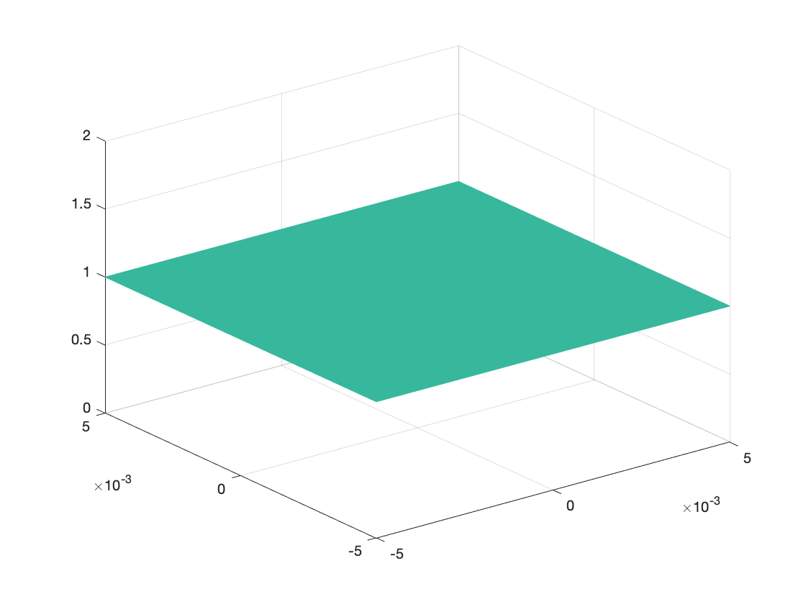
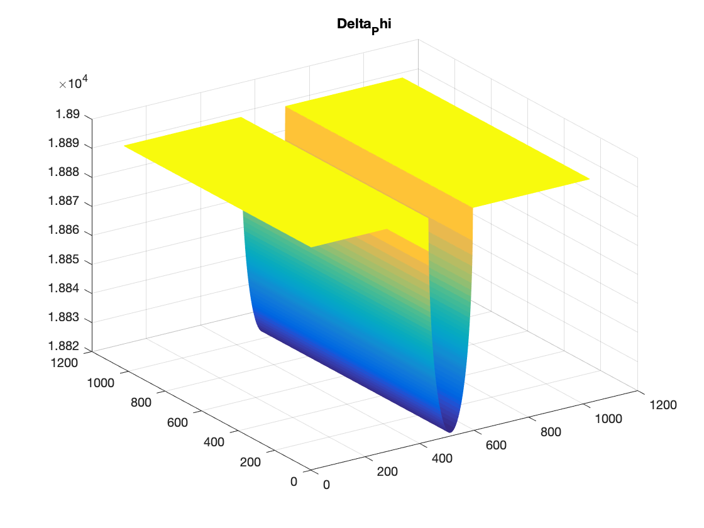
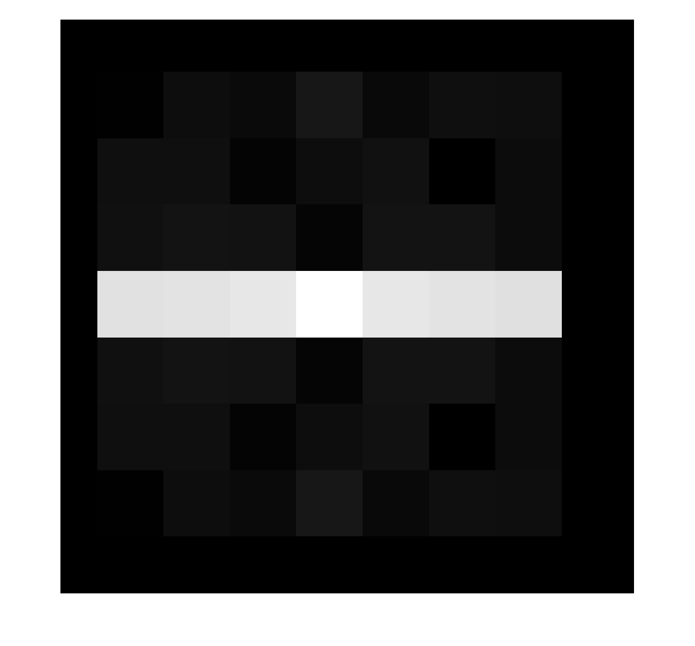
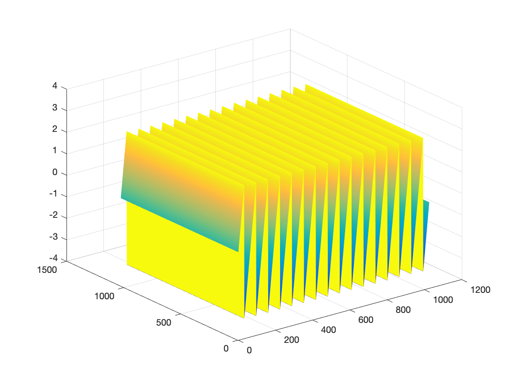
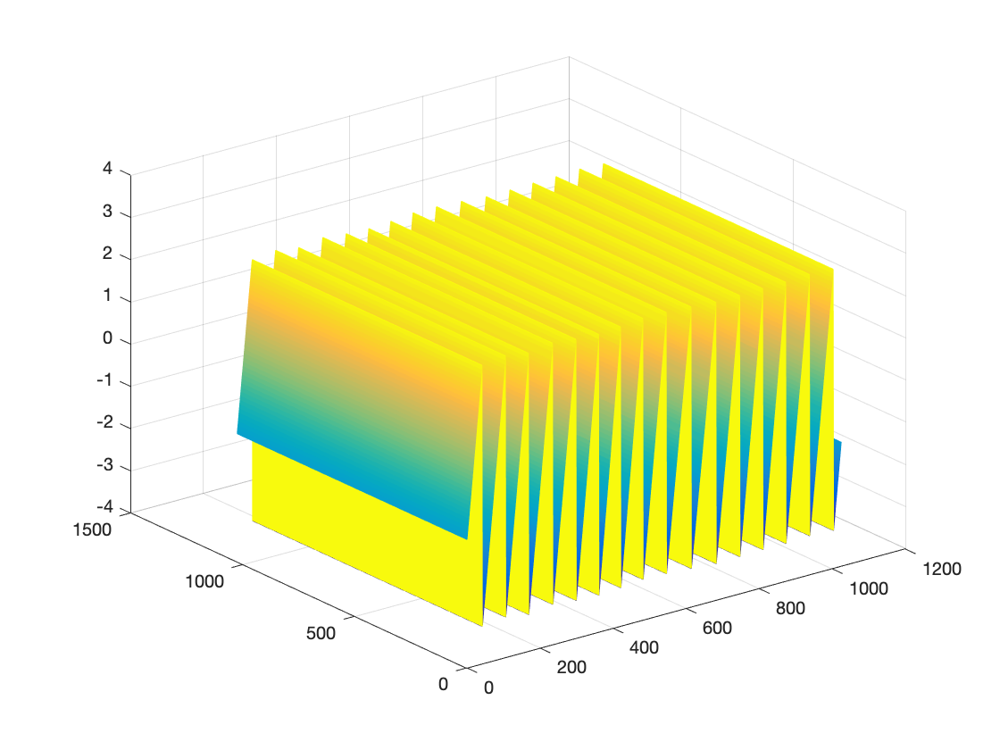
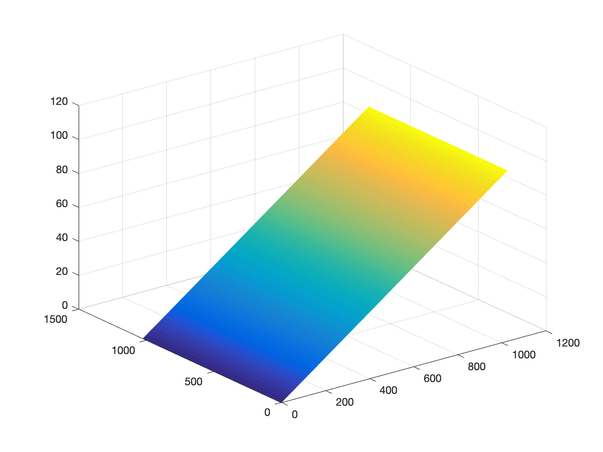
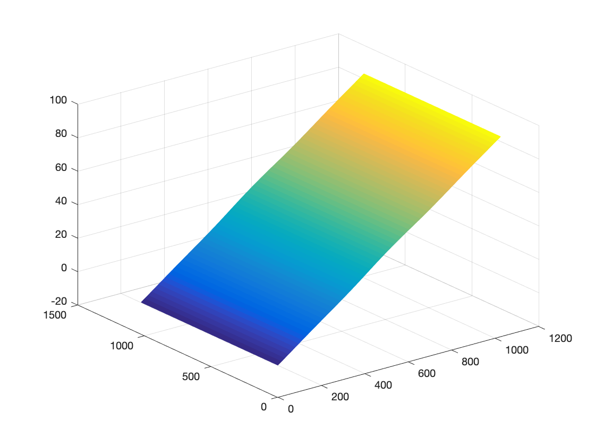
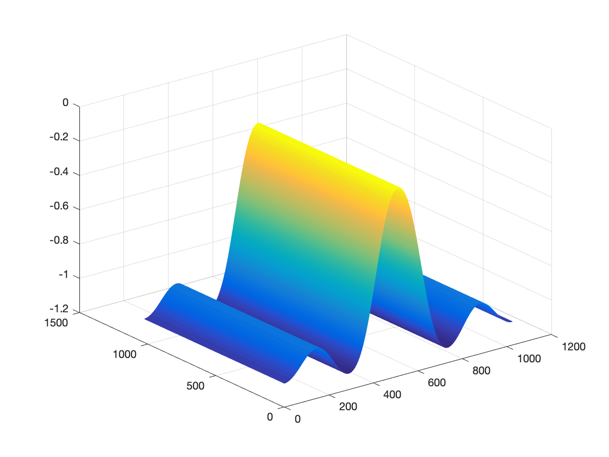
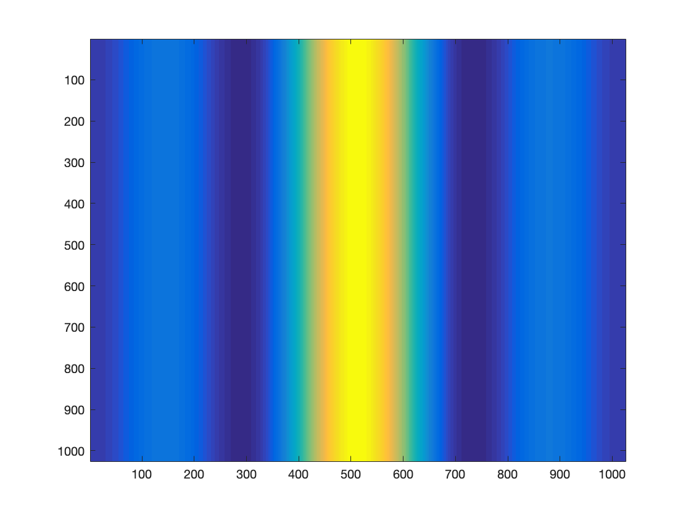

# Double frequency grating Schlieren Simple Model

> 进行**双频光栅纹影**装置模型的公式推导，也可称其为**双频光栅纹影剪切干涉法**。

## Set up(装置)

双频光栅纹影装置，可以简化为下图所示：


<center><font color="red">图1 含被测对象的双频光栅纹影装置示意图</font><cebnter>


> 视觉角度：主视图；
>
> 坐标说明：x-世界坐标系水平方向，y-世界坐标系垂直方向，z-光轴方向。
>
> 图示：1-激光器（532nm），2-扩束透镜组1，3-扩束透镜组2，4-物平面，5-凸透镜，6-双频光栅，7-凸透镜，8-像平面，9-被测对象。


## Model(模型)

> 结合装置示意图，进行双频光栅纹影光路的理论推导。

### Laser Source（激光光源）

由于双频光栅纹影装置需要将光源扩束准直为**直径大于被测对象直径**的光束，而在实际的理论推导中，忽略点光源被扩束准直的过程，直接设置光源为扩束之后的平行光，接着就是光线进入被测对象内部，可以查看下面的装置示意图：


<center><font color="red">图2 双频光栅纹影装置示意图（仿真）</font><cebnter>


>视觉角度：主视图；
>
>坐标说明：x-世界坐标系水平方向，y-世界坐标系垂直方向，z-光轴方向。
>
>图示：1-物平面，2-被测对象，3-凸透镜，4-双频光栅，5-凸透镜，6-像平面。

所以，我们可以将平行光设置为一个常量值，表示为：
$$
E_0(x,y) = C
$$
其中，C表示为一个常数。

也可以将其设置为高斯光源，详细内容参考：ModelDetails.md 中，Laser Source（激光光源）节。


### Test Object（被测对象）

当平行光束通过被测对象的时候，其相位会发生变化，产生的相位偏移表达式可以表示为：
$$
\Delta \Phi (x, y)=
k_{TestObject} \cdot \Delta z
$$
其中，$k_{TestObject}$ 表示光线经过被测对象的波数，可表示为 $k_{TestObject} = \frac{2 \pi }{\lambda} \cdot n_{TestObject}$ , $\Delta z$ 表示光线沿光轴方向穿过被测对象的距离。

其中，相位的偏移表达式也可以表示为：
$$
\Delta \Phi (x, y)=
\int _{z_1} ^{z_2}
\frac{2 \pi }{\lambda} \cdot n_{TestObject}(x, y, z)
\cdot dz
$$
其中，$z_1$ 表示为被测对象靠近光源的位置，$z_2$ 表示为被测对象远离光源的位置，其中$z_2 > z_1$，并且$z_2 - z_1$ 就是光线沿光轴方向穿过被测对象的距离。$n_{TestObject}(x, y, z)$ 表示被测对象在空间上的折射率。

所以，我们可以得到光线经过被测对象之后的光场表达式：
$$
E_1(x,y) 
= E_0(x,y)\cdot \exp \{i \cdot \Delta \Phi(x, y) \}
= C \cdot \exp \{i \cdot \Delta \Phi(x, y) \}
$$
**注**：由于需要测试被测对象的温度参数，还需要进行折射率到温度的推导。


### First Len（第一个凸透镜）

光线继续沿着光轴传播，穿过第一个凸透镜的时候，由于透镜具有傅里叶特性，根据傅里叶变化，可以得到双频光栅纹影装置中光线经过第一个凸透镜之后的光场信息为：
$$
F (\xi, \eta)
=
\mathcal{F} \{ E_1 (x,y) \}
 \quad \quad \quad \quad  \quad \quad \quad \quad  \quad \quad \quad \quad  \quad \quad \quad \quad  \quad \quad \quad \quad  \quad \quad \quad \quad 
\\
=
\iint _{-\infty}^{+\infty}
E_1 (x,y) 
\exp \{  - i  ( 2 \pi \xi +  2 \pi  \eta) \}
dx dy
 \quad \quad \quad \quad  \quad \quad \quad \quad 
\\
=
\iint _{-\infty}^{+\infty}
C \cdot \exp \{ i \cdot \Delta \Phi(x, y) \}
\exp \{ - i  ( 2 \pi \xi +  2 \pi  \eta) \}
dx dy
 \quad \quad \quad 
\\
=
\iint _{-\infty}^{+\infty}
C \cdot \exp \{ i \cdot (  \Delta \Phi(x, y)  -  2 \pi \xi -  2 \pi  \eta) \}
dx dy
 \quad \quad \quad \quad  \quad
$$
其中，$F (\xi, \eta) $ 是$E_1 (x, y)$ 的准确傅里叶变换，常数相位因子无关紧要。


### Double frequency grating（双频光栅）

**双频光栅**是一块在干板上记录着两个空间频率相差不大的正弦光栅。

双频光栅的两个**周期**，分别表示为：
$$
d_1 = \lambda / sin \theta_1 
\\
d_2 = \lambda / sin \theta_2
$$
角度差 $\Delta \theta = | \theta_1 - \theta_2 |$ ，表示为双频光栅的**分裂角**。

双频光栅的**一级平均衍射角**为：$\theta = (\theta_1 + \theta_2) / 2$ 。

双频光栅的**拍周期**表示为：
$$
\frac{1}{d'} = | \frac{1}{d_1} - \frac{1}{d_2} | = | \frac{sin \theta_1  - sin \theta_2 }{\lambda} |
$$
在实际的实验的时候，将双频光栅片**放置**在普通纹影仪的刀口位置附近，取代刀口。

其中穿过被测对象的每一平行光线，将在双频光栅的一级衍射角方向上分裂为一对夹角为$\Delta \theta$ 的光线。经过双频光栅后，匹配对的光线将发生**干涉**。

综上，可以表示双频光栅的方程为：
$$
g(x) = cos(2 \pi f_1 x) + cos(2 \pi f_2 x)
$$
上式中，$f_1$ 和 $f_2$ 表示为双频光栅的频率。

当频谱面与双频光栅作用的时候，由于 $g(x) $ 是周期函数，可以写成傅里叶级数的形式，并基于**欧拉公式**，化简余弦函数，如下所示：
$$
G(\xi) 
=
cos(2 \pi f_1 \xi) + cos(2 \pi f_2 \xi)
\quad \quad \quad \quad \quad \quad \quad \quad \quad \quad 
\\
= 
\frac{1}{2} (e^{i 2 \pi f_1 \xi }+ e^{ - i 2 \pi f_1 \xi})
+
\frac{1}{2} (e^{i 2 \pi f_2 \xi }+ e^{ - i 2 \pi f_2 \xi})
\\
= 
\frac{1}{2} (e^{i 2 \pi f_1 \xi }+ e^{ - i 2 \pi f_1 \xi}
+
e^{i 2 \pi f_2 \xi }+ e^{ - i 2 \pi f_2 \xi})
$$
其中，$\xi$ 与$x$ 相对应。

所以，可以得到**刀口后的电场**表达式，并利用**空间滤波器滤除+1级频谱**，基于**傅里叶变换的时移特性**：
$$
E_3 (\xi, \eta)  
= 
F (\xi, \eta) \cdot G(\xi， \eta)
\\
(代入G(\xi， \eta))
\\
=
F (\xi, \eta) \cdot 
\frac{1}{2} (e^{i 2 \pi f_1 \xi }+ e^{ - i 2 \pi f_1 \xi}
+
e^{i 2 \pi f_2 \xi }+ e^{ - i 2 \pi f_2 \xi})
\\
(进行空间滤波)
\\
=
F (\xi, \eta) \cdot 
\frac{1}{2} ( e^{ - i 2 \pi f_1 \xi} + e^{ - i 2 \pi f_2 \xi})
\\
(化简)
\\
=
\frac{1}{2} F (\xi, \eta) \cdot  e^{ - i 2 \pi f_1 \xi} + 
\frac{1}{2} F (\xi, \eta) \cdot e^{ - i 2 \pi f_2 \xi}
\\
$$


### Second  Len（第二个凸透镜）

光线经过第二个透镜的时候，由于透镜具有傅里叶特性，根据傅里叶变化，可以得到双频光栅纹影装置中光线经过第二个凸透镜之后的光场信息为：

$$
E_4 (x,y) 
= 
\mathcal{F}^{-1} \{ E_3 (\xi, \eta)  \}
$$
其中，$E_4 (x, y) $ 是$E_3 (\xi, \eta)$ 的准确傅里叶变换，常数相位因子无关紧要。

进行化简如下：
$$
E_4 (x,y) 
= 
\mathcal{F}^{-1} \{ E_3 (\xi, \eta)  \} 
\\
=
\mathcal{F}^{-1} \{ 
\frac{1}{2} F (\xi, \eta) \cdot  e^{ - i 2 \pi f_1 \xi} + 
\frac{1}{2} F (\xi, \eta) \cdot e^{ - i 2 \pi f_2 \xi}  \} 
\\
(傅里叶变换的时移特性)
\\
=
\frac{1}{2} E_1 (\xi - 2 \pi f_1, \eta)
+
\frac{1}{2} E_1 (\xi - 2 \pi f_2, \eta)
\\
(带入E_1(x,y) )
\\
=
\frac{1}{2} C \cdot  e^{ i \Delta \varphi (x - 2 \pi f_1 , y) } + 
\frac{1}{2} C \cdot  e^{ i \Delta \varphi (x - 2 \pi f_2 , y) }
\\
(化简 )
\\
=
\frac{1}{2} C \cdot [ e^{ i \Delta \varphi (x - 2 \pi f_1 , y) } + e^{ i \Delta \varphi (x - 2 \pi f_2 , y) }]
$$

其中，$E_4 (x, y)$ 是$E_3 (x, y)$ 的准确傅里叶变换，常数相位因子无关紧要。


### Light intensity（光强）

已知光线经过第二个凸透镜，到达像平面的光场，其表示为 $E_4 (x,y) $ 。

所以，可以得到**光电探测器的强度**表示为：
$$
I(x,y) = < E_4 (x,y) \cdot E_4 ^* (x,y) >
$$
其中， $ < \cdot > $ 表示时间平均。

也即，
$$
I(x,y) 
=  E_4 (x,y) \cdot E_4 ^* (x,y)
$$

其中复共轭 $E_4 ^* (x,y)$ 可以表示为：
$$
E_4 ^* (x,y)
=
\frac{1}{2} C \cdot [ e^{ -i \Delta \varphi (x - 2 \pi f_1 , y) } + e^{ - i \Delta \varphi (x - 2 \pi f_2 , y) }]
$$
所以，最后光电探测器上光场强度可以表示为：
$$
I(x,y) 
=  E_4 (x,y) \cdot E_4 ^* (x,y)
\quad \quad \quad \quad \quad \quad \quad \quad \quad \quad \quad \quad \quad \quad \quad \quad \quad \quad \quad \quad \quad \quad \quad \quad \quad \quad \quad \quad \quad \quad \quad \quad \quad \quad \quad \quad \quad
\\
=
\frac{1}{2} C \cdot [ e^{ i \Delta \varphi (x - 2 \pi f_1 , y) } + e^{ i \Delta \varphi (x - 2 \pi f_2 , y) }]
\cdot
\frac{1}{2} C \cdot [ e^{ -i \Delta \varphi (x - 2 \pi f_1 , y) } + e^{ - i \Delta \varphi (x - 2 \pi f_2 , y) }]
 \quad \quad \quad \quad \quad \quad \quad \quad \quad \quad \quad 
\\
=
\frac{1}{4} C^2 + \frac{1}{4} C^2 + 
\frac{1}{4} C^2 \cdot e^{ i \Delta \varphi (x - 2 \pi f_1 , y) }  \cdot e^{ -i \Delta \varphi (x - 2 \pi f_2 , y) } + 
\frac{1}{4} C^2 \cdot e^{ i \Delta \varphi (x - 2 \pi f_2 , y) }  \cdot e^{ -i \Delta \varphi (x - 2 \pi f_1 , y) }
 \quad \quad \quad \quad \quad 
\\
=
\frac{1}{2} C^2 + 
\frac{1}{4} C^2 \cdot e^{ i [ \Delta \varphi (x - 2 \pi f_1 , y) - \Delta \varphi (x - 2 \pi f_2 , y) ]} + 
\frac{1}{4} C^2 \cdot e^{ i [ \Delta \varphi (x - 2 \pi f_2 , y) - \Delta \varphi (x - 2 \pi f_1 , y) ] }
 \quad \quad \quad \quad \quad  \quad \quad \quad \quad \quad  \quad 
\\
= ... ?
 \quad \quad \quad \quad \quad  \quad \quad \quad \quad \quad  \quad \quad \quad \quad \quad  \quad \quad \quad  \quad \quad \quad  \quad \quad   \quad \quad \quad \quad \quad  \quad \quad \quad \quad \quad  \quad \quad \quad \quad \quad  \quad  \quad  \quad 
\\
=
\frac{1}{2} C^2 + 
\frac{1}{4} C^2 \cdot \{2 cos [\Delta \varphi (x - 2 \pi f_1 , y) - \Delta \varphi (x - 2 \pi f_2 , y) ] \}
 \quad \quad \quad \quad \quad  \quad \quad \quad \quad \quad  \quad \quad \quad \quad \quad  \quad \quad \quad 
\\
=
\frac{1}{2} C^2 + 
\frac{1}{2} C^2 \cdot cos \{ 
\frac{\Delta \varphi (x - 2 \pi f_1 , y) - \Delta \varphi (x , y)}{-2 \pi f_1} \cdot ( -2 \pi f_1)
+
\frac{\Delta \varphi (x , y) - \Delta \varphi (x - 2 \pi f_2 , y) }{2 \pi f_2} \cdot ( 2 \pi f_2)
\}
\\
=
\frac{1}{2} C^2 + 
\frac{1}{2} C^2 \cdot cos 
\{ 
\frac {\partial \Delta \varphi (x , y) }{\partial x} \cdot  2 \pi (f_2 - f_1)
\}
 \quad \quad \quad \quad \quad  \quad \quad \quad \quad \quad  \quad \quad \quad \quad \quad  \quad \quad \quad  \quad \quad \quad  \quad \quad  
\\
$$


## Reference（参考）

### 欧拉公式


### 傅里叶变换的时移特性


### 导数的定义


## Simulation Logic(仿真逻辑)

> 介绍仿真的时候，每一部分的取舍。

光源：

> 取一个常数，光场是 $E_0(x,y) = C$ 。

被测对象：

> 取一个圆柱形被测物，内部折射率小于空气折射率（小于1），并且圆柱的高远大于仿真的测试区域。
>
> 被测对象带来的相位变化表达式：
>
> $\Delta \Phi (x)=
> \begin{cases} 
> k(air) \cdot 2R
> \quad \quad \quad\quad \quad \quad\quad \quad \quad\quad \quad \quad\quad \quad \quad\quad \quad \quad \quad \quad   ,|x|>R 
> \\ 
> \\
> k(air) \cdot (2R - 2 \cdot \Delta z(x)) + k(plasma) \cdot 2 \cdot \Delta  z(x)  
> \quad \quad \quad \quad   ,|x| \leq R
> \end{cases}$ 
>
> 上式中， $k(air) = \frac{2 \pi n(air)}{\lambda}$ ， $k(plasma) = \frac{2 \pi n(plasma)}{\lambda}$ 。
>
> 经过被测对象后的光场信息为：
>
> $E_1(x,y) 
> = E_0(x,y)\cdot \exp \{i \cdot \Delta \Phi(x, y) \}
> = C \cdot \exp \{i \cdot \Delta \Phi(x, y) \}$ 

第一个透镜：

> 进行光场的傅里叶变化，得到的频域表达式，表示为：
>
> $F (\xi, \eta)
> =
> \mathcal{F} \{ E_1 (x,y) \}$ 
>
> 其中，$F (\xi, \eta) $ 是$E_1 (x, y)$ 的准确傅里叶变换。

双频光栅：

> 双频光栅的表达式为：
>
> $G(\xi) 
> =
> cos(2 \pi f_1 \xi) + cos(2 \pi f_2 \xi)$ 
>
> 上式中，$f_1$ 和 $f_2$ 表示为双频光栅的频率，$\xi$ 表示为至于$x$ 方向相关。 
>
> $E_3 (\xi, \eta)  
> = 
> F (\xi, \eta) \cdot G(\xi， \eta)$ 
>
> 并进行**空间滤波，滤除+1级频谱**。

第二个透镜：

> 进行光场的逆傅里叶变化，得到时域的表达式，表示为：
>
> $E_4 (x,y) 
> = 
> \mathcal{F}^{-1} \{ E_3 (\xi, \eta)  \}$ 
>
> 其中，$E_4 (x, y)$ 是$E_3 (x, y)$ 的准确傅里叶变换。

光强：


## Code（代码）

> 将上述模型内容实现成为代码。

```matlab
%%%%%%%%%%%%%%%%%%%%%%%%%%%%%%%%%%%%%%%%%%%%%%%%%%%%%%%%%%%%%%%%%%%%%%%%%%%
%
% Double Frequency Grating Schlieren MATLAB Code
% 
% %%%%%%%%%%%%%%%%%%%%%%%%%%%%%%%%%%%%%%%%%%%%%%%%%%%%%%%%%%%%%%%%%%%%%%%%%

clear; 
clc;  
clf;
close all;


%% Laser Source （激光光源）

% Field size and sampling
% Set 5 * 5 mm field
% Sampling 1025 pixel
L = 5e-3;
N = 1024 + 1;
x = L * linspace(-1, 1, N);  
y = L * linspace(-1, 1, N);
[X, Y] = meshgrid(x, y); 
center = N / 2;

% Wave length
% Green
% Variable lambda
lambda = 532e-9;

% Pixel Size
Pixel_Size = L / N;

% Constant Laser
% The uniform light intensity is 1
Laser_Intensity = 1;
E0 = Laser_Intensity + zeros(N, N);

% Figure
figure(1);
mesh(X, Y, E0);

if (mod(N, 2)==0)
	halfNy = N / 2;
else
	halfNy = (N + 1) / 2;
end
figure(2);
plot(x, E0(halfNy, :), 'c');
grid on;

figure(3);
imagesc(E0);


%% Test Object of the Cylinder （圆柱形被测对象）

E1 = E0;
Delta_Phi = zeros(N, N);

r = 0.8e-3;  % Cylinder radius 0.8mm
n_Air = 1;  % air Refractive
n_Plasma = 1 - 4 * 10^(-3);  % Cylinder Refractive

% A formula to calculate
kAir = 2 * pi * n_Air / lambda;
kPlasma = 2 * pi * n_Plasma / lambda;
for i = 1 : size(E0, 2)
    if abs(X(1, i)) >= r
        E1(:, i) = E0(:, i) .* exp(1i * kAir * 2 * r);

    else
        Delta = sqrt(r^2 - X(1, i)^2);
        E1(:, i) = E0(:, i) .* exp(1i * (kAir * 2 * ( r - Delta) + kPlasma * 2 * Delta));

    end
end

% Figure
% for i = 1: size(E1, 1)
%     ComplexDouble = E1(i, :);
%     ComplexDouble(imag(ComplexDouble) ~= 0) = abs(ComplexDouble(imag(ComplexDouble)~=0));
%     E1(i, :) = ComplexDouble;
% end 
% figure(11);
% mesh(X, Y, E1);

figure(12);
imshow(E1);
title('E1');


% Cylinder object influence
for i = 1 : size(E0, 2)
    if abs(X(1, i)) >= r
        Delta_Phi(:, i) = kAir * 2 * r;

    else
        Delta = sqrt(r^2 - X(1, i)^2);
        Delta_Phi(:, i) = kAir * 2 * ( r - Delta) + kPlasma * 2 * Delta;

    end
end

figure(14);
imshow(Delta_Phi);
title('Delta_Phi');

figure(15);
mesh(Delta_Phi);
title('Delta_Phi');

figure(16);
surf(Delta_Phi);
title('Delta_Phi');


%% First Len Properties

F1 = fftshift(fft2(E1));

F1_ = log(abs(F1).^2)-2;
max_F1 = max(max(F1_));
F1_ = F1_ / max_F1;

figure(21);
imshow(F1_);
title('F1_');


%% Double frequency grating

G = zeros(N, N);

f1 = 1 / (32 * Pixel_Size);  % Period
f2 = 1 / (64 * Pixel_Size);

for i = 1 : N
    for j = 1 : N
        Delta_x = (j - center) * Pixel_Size;
        Delta_y = (center - i) * Pixel_Size;
        
        G(i, j) = cos(2 * pi * f1 * Delta_x) + cos(2 * pi * f2 * Delta_x);
    end
end

E3 = G .* F1;

E3_ = log(abs(E3).^2) - 2;
max_E3 = max(max(E3_));
E3_ = E3_ / max_E3;


figure(31);
imshow(G);
title('G');

figure(32);
imshow(E3);
title('E3');

figure(33);
imshow(E3_);
title('E3_');


%% Fourier transform 

E4 = fftshift(fft2(E3));

E4_ = log(abs(E4).^2) - 2;
max_E4 = max(max(E4_));
E4_ = E4_ / max_E4;

figure(43);
imshow(E4);
title('E4');

figure(44);
imshow(log(abs(E4)), []);

figure(45);
imshow(E4_);
title('E4_');


% Reference
% Reference_E4 = fftshift(fft2(Reference_E3));
% 
% Reference_E4_ = log(abs(Reference_E4).^2) - 2;
% max_Reference_E4 = max(max(Reference_E4_));
% Reference_E4_ = Reference_E4_ / max_Reference_E4;
% figure(41);
% imshow(Reference_E4_);
% title('Reference_E4_');
% 
% figure(42);
% imshow(log(abs(Reference_E4)), []);
% 
% 
% % Test
% Test_E4 = fftshift(fft2(Test_E3));
% 
% Test_E4_ = log(abs(Test_E4).^2) - 2;
% max_Test_E4 = max(max(Test_E4_));
% Test_E4_ = Test_E4_ / max_Test_E4;
% figure(43);
% imshow(Test_E4_);
% title('Test_E4_');
% 
% figure(44);
% imshow(log(abs(Test_E4)), []);
% 

%% Filter frequency +1
% % Reference
% Reference_Frequence = zeros(N, N);
% 
% line = 513;
% column = 529;
% Reference_Frequence(line-3: line+3, column-3: column+3) = Reference_E4(line-3: line+3, column-3: column+3);
% 
% Reference_Frequence_ = log(abs(Reference_Frequence).^2) - 2;
% max_Reference_Frequence = max(max(Reference_Frequence_));
% Reference_Frequence_ = Reference_Frequence_ / max_Reference_Frequence;
% figure(51);
% imshow(Reference_Frequence_);
% title('Reference_Frequence_');
% 
% figure(52);
% imshow(log(abs(Reference_Frequence)), []);   
% 
% 
% % Test
% Test_Frequence = zeros(N, N);
% 
% Test_Frequence(line-3: line+3, column-3: column+3) = Test_E4(line-3: line+3, column-3: column+3);
% 
% Test_Frequence_ = log(abs(Test_Frequence).^2) - 2;
% max_Test_Frequence = max(max(Test_Frequence_));
% Test_Frequence_ = Test_Frequence_ / max_Test_Frequence;
% figure(53);
% imshow(Test_Frequence_);
% title('Test_Frequence_');
% 
% figure(54);
% imshow(log(abs(Test_Frequence)), []);
% 
% 
% %% Inverse Fourier transform
% % Reference
% Reference_E5 = ifft2(ifftshift(Reference_Frequence));
% 
% figure(61);
% imshow(Reference_E5);
% title('Reference_E5');
% 
% 
% % Test
% Test_E5 = ifft2(ifftshift(Test_Frequence));
% 
% figure(62);
% imshow(Test_E5);
% title('Test_E5');
% 
% 
% %% The phase field
% % Reference
% Reference_E6 = zeros(N, N);
% 
% for i = 1: N
%     for j = 1: N
%         Reference_E6(i, j) = atan2(imag(Reference_E5(i, j)), real(Reference_E5(i, j)));  % Calculate the phase principal
%     end
% end
% 
% figure(71);
% mesh(Reference_E6);
% 
% figure(72);
% imshow(Reference_E6);
% title('Reference_E6');
% 
% 
% % Test
% Test_E6 = zeros(N, N);
% 
% for i = 1: N
%     for j = 1: N
%         Test_E6(i, j) = atan2(imag(Test_E5(i, j)), real(Test_E5(i, j)));  % Calculate the phase principal
%     end
% end
% 
% figure(73);
% mesh(Test_E6);
% 
% figure(74);
% imshow(Test_E6);
% title('Test_E6');
% 
% 
% %% Phase unwrapping
% % Reference
% Reference_Phase = zeros(N, N);
% 
% for i = 1: N
%     Reference_Phase(i, :) = unwrap(Reference_E6(i, :));   %相位解包裹
% end
% 
% figure(81);
% mesh(Reference_Phase);
% 
% 
% % Test
% Test_Phase = zeros(N, N);
% 
% for i = 1: N
%     Test_Phase(i, :) = unwrap(Test_E6(i, :));   %相位解包裹
% end
% 
% figure(82);
% mesh(Test_Phase);
% 
% 
% 
% %% Interference in the results
% Interference_result = Test_Phase - Reference_Phase;
% 
% figure(91);
% mesh(Interference_result);
% 
% 
% figure(92);
% imagesc(Interference_result);
% 
% 
% %% Abel inverse transformation
% % N0 = n_Air;          % 环境折射率
% % lamda = lambda;     % 激光的波长为532nm 绿光
% % 
% % diff_D = Interference_result;
% % 
% % for m = 1: size(diff_D, 1)
% %     for n = fix(size(diff_D, 2) / 2): (size(diff_D, 2) - 1)     %将n分成两部分求
% %         k = 0;
% %         sqrt_nr = [];
% %         for n2 = n: size(diff_D, 2)       %       for循环
% %             k = k + 1;
% %             sqrt_nr(k) = sqrt((n2+1)^2 - n^2);
% %         end
% %         len = length(diff_D(m, n: end));
% %         Nr(m,n) = (-lamda/ (2* pi^2)) * (sum(diff_D(m,n:end) ./ sqrt_nr(1: len))) + N0;
% %     end
% %     
% %     for n = 1: fix(size(diff_D, 2) /2)                      % fix就是向0取整数
% %         k = 0;
% %         sqrt_nr = [];
% %         for n2 = n: size(diff_D, 2)
% %             k = k + 1;
% %             sqrt_nr(k) = sqrt((n2 + 1)^2 - n^2);
% %         end
% %         len = length(diff_D(m, n: end));
% %         Nr(m, n) = (-lamda/ (2* pi^2)) * (sum(diff_D(m, n: end) ./ sqrt_nr(1: len))) + N0;
% %     end
% % end
% % figure(101);
% % imagesc(Nr);title('折射率俯视图');
% % 
% % figure(102);
% % mesh(Nr);title('折射率三维图');
% % 
% % % figure(103);surf(Nr, 'LineStyle', 'none');title('折射率截面');
% % 
% % [u, v, channels] = size(Nr);
% % v = 512;
% % figure(104);
% % title('折射率截面');
% % plot(Nr(:, v), 'c'); %青色-300的列矩阵
% % grid on;
% % 
% 
% 
% %% Abel New
% PRO = radon(Interference_result, 0);
% figure(111);
% plot(PRO);
% 
% PRO_dif = diff(PRO);
% figure(112);
% plot(PRO_dif);
% 
% 
% delta0=1;
% 
% %% CT参数设置
% tNum = 18; %投影方向数,180个投影方向(最好是18的倍数)
% pNum = size(PRO_dif, 1);  % 每方向采样数(不是"十"，是"l")
% EsNum = pNum * delta0;   % 每方向投影宽度，m
% sAreax = EsNum / sqrt(2); % 重建区域尺寸，m
% gNum = 200;  % 重建区域网格划分
% shijichicun = delta0 * pNum;   % 重建实际尺寸 
% % Re0=1.000270396017465497;  % 参考折射率(532nm)
% 
% %%%%%%%%%%%%%%%%%%%%%%%%%%%%%%%%%%%%%%%%%%%%%%%%%%%%%%%%%%%%%%%%%%%%%%%%%%%%%%
% SrcImg = zeros(tNum, pNum);
% for i = 1: pNum
%     SrcImg(:, i) = PRO_dif(i);
% end  %投影数据
% 
% ResImg = zeros(gNum, gNum); % 重建面大小
% Delta = sAreax / gNum;  % 重建网格间距
% 
% tDelta = pi/ tNum;   % 投影方向间隔
% pDelta = EsNum/ pNum;  % 单方向投影采样间隔
% 
% px0 = -Delta * (gNum-1) / 2;
% py0 = px0;
% 
% tTheta = zeros(tNum);
% for i = 1: tNum
%     tTheta(i) = (i-1) * tDelta;
% end
% 
% FMax = 1 / (2 * pDelta);
% 
% for i = 1: gNum
%     for j = 1: gNum
%         ResImg(i,j) = 0;
%         
%         cx = px0 + (j-1) * Delta;
%         cy = py0 + (gNum-i) * Delta;
%         
%         for m = 1: tNum
%             sumv = 0;
%             rx = cx * cos(tTheta(m)) + cy*sin(tTheta(m));
%             for n = 1: pNum
%                 Index = rx-((n-1) * pDelta-EsNum / 2);
%                 % 消除倾斜
%                 % sumv=sumv+(SrcImg(m,n)*CalK(Index,FMax))*(1-10*Index^2/0.05^2)*pDelta;   %原来此句话是这样的 sumv=sumv+(SrcImg(m,n)*CalK(Index,FMax))*(1-4*Index^2/0.05^2)*pDelta;
%                 % sumv=sumv+(SrcImg(m,n)*CalK(Index,FMax))*(1-4*Index^2/0.05^2)*pDelta;
%                 % 不消除倾斜
%                 sumv = sumv + (SrcImg(m, n) * CalK(Index, FMax)) * pDelta;
%             end
%             ResImg(i, j) = ResImg(i, j) + sumv * tDelta;
%         end
%         ResImg(i, j) = -ResImg(i, j);
%     end
% end
% 
% figure(113);
% mesh(ResImg);
% 
% % for i=1:gNum
% %     for j=1:gNum
% %         ResImg(i,j)=Re0-ResImg(i,j);
% %     end
% % end
% % figure,mesh(ResImg-1);
% 
% 
% 

```


## Result（结果）

### 光源

figure 1




### 被测对象带来的相位变化

Figure 15




### 经过被测对象后光场

Figure 12


### 经过第一个透镜之后

Figure21


### 双频光栅


### 穿过双频光栅之后


### 经过双频光栅

#### 参考光场(直条纹)

figure 31


#### 测试光场(弯曲条纹)

figure 32


### 傅里叶变换

#### 参考光场(直条纹)

figure 41


#### 测试光场(弯曲条纹)

figure 43


### 保留频谱的+1级

保留+1级频谱，是模拟带通滤波器将零级和负一级滤掉。


#### 参考光场(直条纹)

figure 52


放大版本




#### 测试光场(弯曲条纹)

figure 54


放大版本


### 逆傅里叶变换

将滤波后的信号进行傅里叶变化。

#### 参考光场(直条纹)

figure 61


#### 测试光场(弯曲条纹)

figure 62


### 相位场

条纹图像的相位场可以利用反正切函数得到：
$$
\phi(x,y) = tan^{-1} \{ \frac{I_{imag} [c(x,y)]} {I_{real} [c(x,y)]} \}
$$
其中， $c(x,y) $ 是傅里叶变化后得到的，相位分布在区间$(-\pi , \pi)$ 内，需要进行相位解包裹得到其在整个相位场的值，$I_{imag} [c(x,y)]$ 表示虚部，$I_{real} [c(x,y)]$ 表示实部。


#### 参考光场(直条纹)

figure 71




#### 测试光场(弯曲条纹)

figure 73




### 相位解包裹

#### 参考光场(直条纹)

figure 81




#### 测试光场(弯曲条纹)

figure 82




### 相位差

figure 91




figure 92




### 折射率


