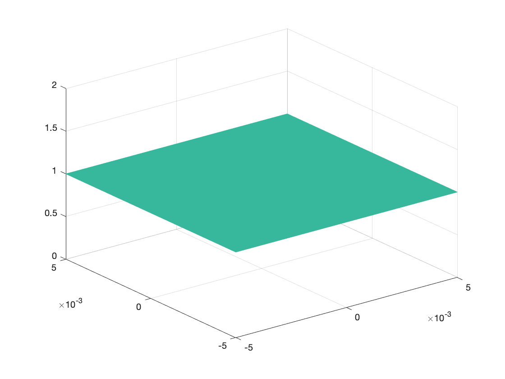
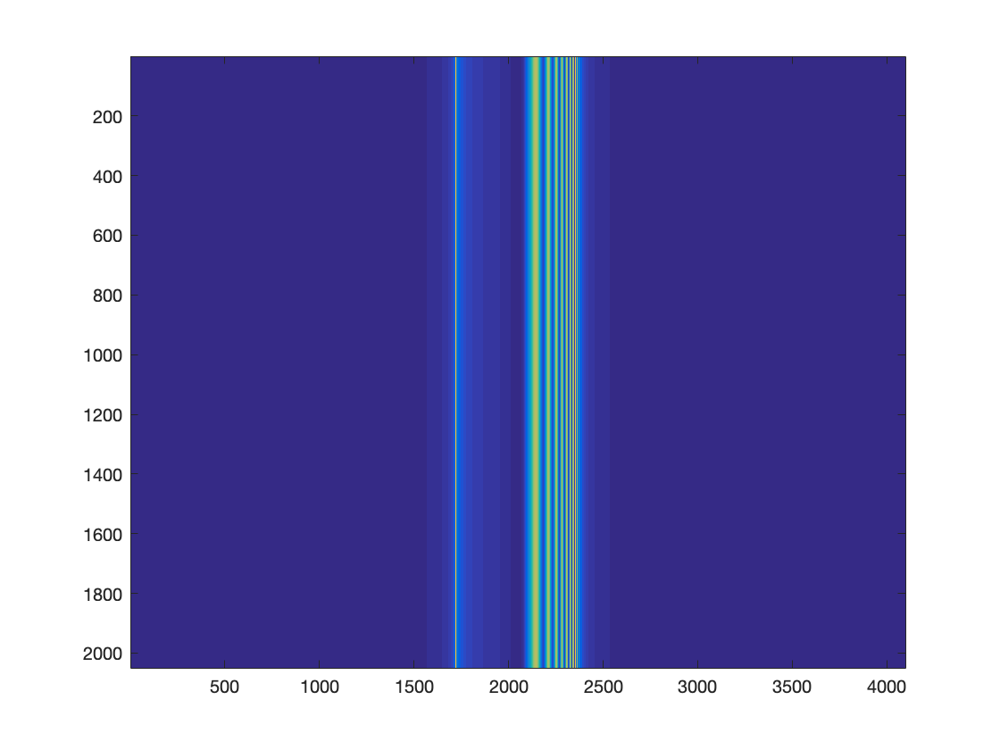

# Knife-edge Knife-edge Schlieren Simple Model

> 进行纹影装置模型的公式推导。

## Set up(装置)

纹影装置，可以简化为下图所示：


<center><font color="red">图1 含被测对象的纹影装置示意图</font><cebnter>

> 视觉角度：俯视图；
>
> 坐标说明：x-世界坐标系水平方向，y-世界坐标系垂直方向，z-光轴方向。
>
> 图示：1-激光器（532nm），2-扩束透镜组1，3-扩束透镜组2，4-物平面，5-凸透镜，6-刀口（刀口实物图见附录），7-凸透镜，8-像平面，9-被测对象。

拍周期从大到小的双频光栅片


## Model(模型)

> 结合装置示意图，进行纹影光路的理论推导。

### Laser Source（激光光源）

由于纹影装置需要将光源扩束准直为**直径大于被测对象直径**的光束，而在实际的理论推导中，忽略点光源被扩束准直的过程，直接设置光源为扩束之后的平行光，接着光线进入被测对象内部，可以查看下面的装置示意图：


<center><font color="red">图2 纹影法装置示意图（仿真）</font><cebnter>

>视觉角度：俯视图；
>
>坐标说明：x-世界坐标系水平方向，y-世界坐标系垂直方向，z-光轴方向。
>
>图示：1-物平面，2-被测对象，3-凸透镜，4-刀口（刀口实物图见附录），5-凸透镜，6-像平面。

所以，我们可以将平行光设置为一个常量值，表示为：
$$
E_0(x,y) = C
$$
其中，C表示为一个常数。

也可以将其设置为高斯光源，详细内容参考：ModelDetails.md 中，Laser Source（激光光源）节。


### Test Object（被测对象）

当平行光束通过被测对象的时候，其相位会发生变化，产生的相位偏移表达式可以表示为：
$$
\Delta \Phi (x, y)=
k_{TestObject} \cdot \Delta z
$$
其中，$k_{TestObject}$ 表示光线经过被测对象的波数，可表示为 $k_{TestObject} = \frac{2 \pi }{\lambda} \cdot n_{TestObject}$ , $\Delta z$ 表示光线沿光轴方向穿过被测对象的距离。

其中，相位的偏移表达式也可以表示为：
$$
\Delta \Phi (x, y)=
\int _{z_1} ^{z_2}
\frac{2 \pi }{\lambda} \cdot n_{TestObject}(x, y, z)
\cdot dz
$$
其中，$z_1$ 表示为被测对象靠近光源的位置，$z_2$ 表示为被测对象远离光源的位置，其中$z_2 > z_1$，并且$z_2 - z_1$ 就是光线沿光轴方向穿过被测对象的距离。$n_{TestObject}(x, y, z)$ 表示被测对象在空间上的折射率。

所以，我们可以得到光线经过被测对象之后的光场表达式：
$$
E_1(x,y) 
= E_0(x,y)\cdot \exp \{i \cdot \Delta \Phi(x, y) \}
= C \cdot \exp \{i \cdot \Delta \Phi(x, y) \}
$$
**注**：由于需要测试被测对象的温度参数，还需要进行折射率到温度的推导，演算如下。

由，Gladstone-Dale Formula（格拉斯通-戴尔公式）可以得到**密度与折射率**之间的关系，表示如下：
$$
n - 1= K \cdot \rho
$$
其中，$K$ 为格拉斯通-戴尔常数（Gladstone-Dale常数），$n$ 为折射率，$\rho$ 为密度。

由，Ideal Gas Law（理想气体状态方程）可以得到**温度与密度**之间的关系，表示如下：
$$
P M = \rho \mathsf{R} T
$$
其中，$M$表示物质的摩尔质量，$P$ 为压强，$\rho$ 为密度，$\mathsf{R}$ 为普适气体常数，其取值与状态参量的单位有关，$T$ 为气体的温度。

所以，可以得到被测对象的温度参数与折射率之间关系，表示为：
$$
T = \frac {PM K}{\mathsf{R} \cdot (n - 1)}\\n =K \frac{PM}{\mathsf{R} \cdot T} + 1
$$
所以，可以得到关于**温度**的变化，相位的偏移表达式也可以表示为：
$$
\Delta \Phi (x, y)=\int _{z_1} ^{z_2}\frac{2 \pi }{\lambda} \cdot \{ K \frac{PM}{\mathsf{R} \cdot T(x, y, z)} + 1 \}\cdot dz
$$
其中，$\lambda$ 是光源的波长，$K$ 为格拉斯通-戴尔常数（Gladstone-Dale常数），$M$表示物质的摩尔质量，$P$ 为压强，$\mathsf{R}$ 为普适气体常数，其取值与状态参量的单位有关，$T(x, y, z)$ 为气体的温度。


### First Len（第一个凸透镜）

光线继续沿着光轴传播，穿过第一个凸透镜的时候，由于透镜具有傅里叶特性，根据傅里叶变化，可以得到纹影装置中光线经过第一个凸透镜之后的光场信息为：
$$
F (\xi, \eta)
=
\mathcal{F} \{ E_1 (x,y) \}
 \quad \quad \quad \quad  \quad \quad \quad \quad  \quad \quad \quad \quad  \quad \quad \quad \quad  \quad \quad \quad \quad  \quad \quad \quad \quad 
\\
=
\iint _{-\infty}^{+\infty}
E_1 (x,y) 
\exp \{  - i  ( 2 \pi \xi +  2 \pi  \eta) \}
dx dy
 \quad \quad \quad \quad  \quad \quad \quad \quad 
\\
=
\iint _{-\infty}^{+\infty}
C \cdot \exp \{ i \cdot \Delta \Phi(x, y) \}
\exp \{ - i  ( 2 \pi \xi +  2 \pi  \eta) \}
dx dy
 \quad \quad \quad 
\\
=
\iint _{-\infty}^{+\infty}
C \cdot \exp \{ i \cdot (  \Delta \Phi(x, y)  -  2 \pi \xi -  2 \pi  \eta) \}
dx dy
 \quad \quad \quad \quad  \quad
$$
其中，$F (\xi, \eta) $ 是$E_1 (x, y)$ 的准确傅里叶变换，常数相位因子无关紧要。


### Knife-edge （刀口）

光线在纹影装置的刀口之前和刀口之后的光场信息是不一样的，根据纹影原理，需要调节刀口，使得刀口遮挡住一半的频谱面，例如：$\xi < 0$ 的部分。此时可以在像平面获得纹影像。

所以此时使用阶梯函数表示刀口的作用，描述为：被刀口阻挡的频谱面全部变成0，没有被阻挡的频谱面不变。

在频谱面上遮去一半的信息，即利用阶梯函数$H(\xi, \eta)$滤波。所以可以得到：
$$
H(\xi) = 
\begin{cases} 
0  \quad \quad \quad \quad ，\xi < 0
\\ 
1 \quad \quad \quad \quad ， \xi \geq 0
\end{cases}
$$
其中，$\xi$ 表示世界坐标系水平方向，$\xi=0$ 表示刀口遮挡住从主光轴开始，沿$\xi$ 方向一半的频谱。

注：为什么是$\xi $ 而不是 $ \eta$ 呢？ 因为在装置中规定了刀口的位置，为世界坐标系水平方向，也即$x$ 轴方向，故在进行傅里叶变换之后使用的是$\xi$ 。

所以，可以得到**刀口后的电场**表达式：
$$
E_3 (\xi, \eta)  
= 
H(\xi, \eta) \cdot F (\xi, \eta)
$$


### Second  Len（第二个凸透镜）

光线经过第二个透镜的时候，由于透镜具有傅里叶特性，根据傅里叶变化，可以得到纹影装置中光线经过第二个凸透镜之后的光场信息为：

$$
E_4 (x,y) 
= 
\mathcal{F}^{-1} \{ E_3 (\xi, \eta)  \} 
=
\mathcal{F}^{-1} \{  F (\xi, \eta) \cdot H(\xi, \eta)   \}
$$
其中，$E_4 (x, y) $ 是$E_3 (\xi, \eta)$ 的准确傅里叶变换，常数相位因子无关紧要。

根据，
$$
\mathcal{F}^{-1} \{ H(x, y)  \}
=
\delta(y) \cdot (\frac{1}{2} \delta(x) - \frac{1}{2 i \pi x})
$$
和卷积定理，
$$
\mathcal{F}^{-1} \{ G(x, y) \cdot H (x, y)  \} 
=
\iint _{-\infty}^{+\infty} 
g(\xi, \eta) \cdot h(x - \xi, y - \eta)  d\xi d\eta
$$
可以得到：
$$
E_4 (x,y) 
= 
\mathcal{F}^{-1} \{ E_3 (\xi, \eta)  \} 
\quad \quad \quad \quad \quad \quad \quad \quad \quad \quad \quad \quad \quad \quad \quad \quad \quad \quad \quad \quad \quad 
\\
\\
=
\mathcal{F}^{-1} \{  F (\xi, \eta) \cdot H(\xi, \eta)   \}
\quad \quad \quad \quad \quad \quad \quad \quad \quad \quad \quad \quad \quad \quad 
\\
=
\iint _{-\infty}^{+\infty} 
f(x, y) \cdot \delta( \eta - y )  \cdot \{ \frac{1}{2} \delta(\xi - x ) - \frac{1}{2 i \pi (\xi - x ) } \}
dx dy
\\
=
\int _{-\infty}^{+\infty} 
f(\xi , y)  \cdot \{ \frac{1}{2} \delta(\xi - x ) - \frac{1}{2 i \pi (\xi - x ) } \}
 dx
 \quad \quad \quad \quad \quad \quad 
\\
=
\frac{1}{2} f(\xi, \eta) - \frac{1}{2} i \int _{-\infty}^{+\infty} \frac{-1}{\pi} \frac{f(\xi, y)}{\xi - x}  dx
\quad \quad \quad \quad \quad \quad \quad \quad \quad \quad 
\\
=
\frac{1}{2} \{ f(\xi, \eta) + i h(\xi, \eta)  \}
\quad \quad \quad \quad \quad \quad \quad \quad \quad \quad \quad \quad \quad \quad \quad
$$
其中，$h(\xi, \eta) = \int _{-\infty}^{+\infty} \frac{1}{\pi} \frac{f(\xi, y)}{\xi - x}  dx $ ，表示为原光场在 $\xi$ 方向上的希尔伯特（Hilbert）变换，可以认为是给像面光场引入自生参考光，使得相移信息转换为光强信息。


### Light intensity（光强）

已知光线经过第二个凸透镜，到达像平面的光场，其表示为 $E_4 (x,y) $ 。

所以，可以得到**光电探测器的强度**表示为：
$$
I(x,y) = < E_4 (x,y) \cdot E_4 ^* (x,y) >
$$
其中， $ < \cdot > $ 表示时间平均。

也即，
$$
I(x,y) 
=  E_4 (x,y) \cdot E_4 ^* (x,y)   
\quad \quad \quad \quad \quad \quad \quad \quad \quad \quad \quad \quad \quad \quad \quad \quad \quad \quad \quad \quad \quad \quad \quad \quad \quad \quad \quad \quad \quad \quad
\\
$$


## Code（代码）

> 将上述模型内容实现成为代码。

```matlab
%%%%%%%%%%%%%%%%%%%%%%%%%%%%%%%%%%%%%%%%%%%%%%%%%%%%%%%%%%%%%%%%%%%%%%%%%%%
%
% Schlieren MATLAB code
% 
% %%%%%%%%%%%%%%%%%%%%%%%%%%%%%%%%%%%%%%%%%%%%%%%%%%%%%%%%%%%%%%%%%%%%%%%%%

clear; 
clc;  
clf;
close all;


%% Laser Source（激光光源）

% Field size and sampling
% Set 5 * 5 mm field
% Sampling 4096+ pixel
L0 = 5e-3;
Nx = 4096 + 1;
Ny = 2048 + 1;
x = L0 * linspace(-1, 1, Nx);  
y = L0 * linspace(-1, 1, Ny);
[X, Y] = meshgrid(x, y); 

% Wave length
% Green
% Variable lambda
lambda = 532e-9;

% Constant Laser
% The uniform light intensity is 1
Laser_Intensity = 1;
E0 = Laser_Intensity + zeros(Ny, Nx);


%% Test Object of the Cylinder

E1 = E0;
r = 0.8e-3;  % Cylinder radius 0.8mm
n1 = 1;  % air Refractive
n2 = 1 - 4 * 10^(-3); % Cylinder Refractive

% Used temperature calculate Refractive
% temperature = 3000;  % Temperature
% K = ;
% P = ;
% M = ;
% R = 8.31;
% constant = K * P * M / R;
% n2 = constant / temperature + 1;

% A formula to calculate
kAir = 2 * pi * n1 / lambda;
kPlasma = 2 * pi * n2 / lambda;
for i = 1 : size(E0, 2)
    if abs(X(1, i)) >= r
        E1(:, i) = E0(:, i) .* exp(1i * kAir * 2 * r);

    else
        Delta = sqrt(r^2 - X(1, i)^2);
        E1(:, i) = E0(:, i) .* exp(1i * (kAir * 2 * ( r - Delta) + kPlasma * 2 * Delta));

    end
end

figure(12);
imshow(E1);
title('E1');


%% First Len Properties

F1 = fftshift(fft2(E1));

F1_ = log(abs(F1).^2)-2;
max_F1 = max(max(F1_));
F1_ = F1_ / max_F1;

figure(21);
imshow(F1_);
title('F1_');


%% Knife Edge
[p, q] = size(F1);
filter = 1 + zeros(p, q);

% filter
for i = 1: round(q / 2)
    for j = 1: p
        filter(j, i) = 0;
    end
end

figure(31);
imshow(filter);


%% Use Knife Edge
F2 = F1 .* filter;

F2_ = log(abs(F2).^2)-2;
max_F2 = max(max(F2_));
F2_ = F2_ / max_F2;

figure(41);
imshow(F2_);
title('F2_');


%% image (filtered)
image_filtered = ifft2(ifftshift(F2));

figure(61);
imshow(image_filtered);
title('image_filtered');


%% Photoconductive Detector Result
Cimage_filtered = conj(image_filtered);

I = Cimage_filtered .* image_filtered;


figure(71);
imshow(image_filtered);

figure(72);
imagesc(I);


```


## Result（结果）

### 光源




### 经过被测对象后光场


### 使用的刀口


### 第二个凸透镜后的光场


### 探测器的光强





