# Model Details（模型详解）

> 说明：本文档包含所有**Model的元信息**，所有的文档输出都是基于本文档摘出。
>
> 本文档包含：**图片，代码，公式，讲解**。
>
> 注：本文档目前粗略的分为两部分，一部分是Model论证（正文），另一部分是辅助参考资料（附录）。


## Schlieren（纹影法）

纹影法，作为本文档的核心名词，会一直提到，包括它的仿真，实验，装置，原理等。

### Setup（装置）

先从装置开始讲起，纹影装置分为投射式和反射式，目前本文聚焦于透射式装置。见图1所示：

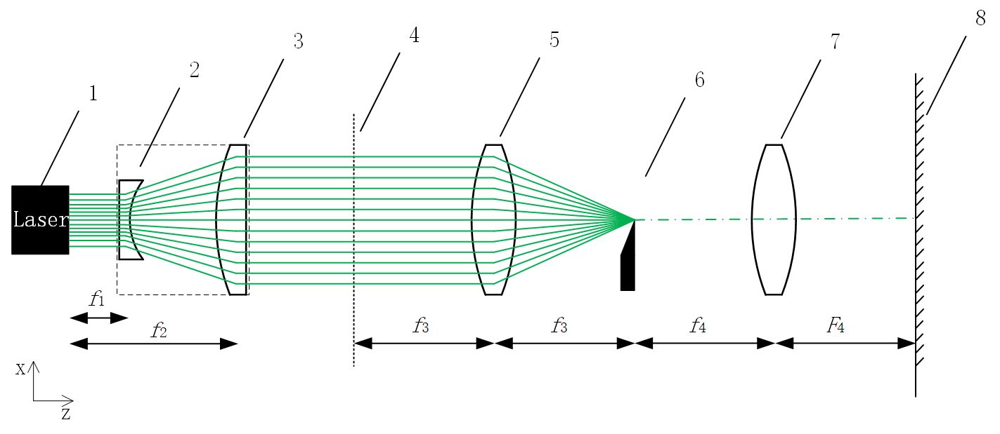

<center><font color="red">图1 没有被测对象的纹影装置示意图</font><cebnter>

> 视觉角度：俯视图；
>
> 图示：1-激光器（532nm），2-扩束透镜组1，3-扩束透镜组2，4-物平面，5-凸透镜，6-刀口（刀口实物图见附录），7-凸透镜，8-像平面。

其中**激光器**的主要作用是产生光强均匀的激光束；**扩束透镜组**的主要作用是获得更大直径的激光束，并且保证获得光束强度均匀，其后面的是一个传统的光学4F系统（光学4F系统见工具箱）；**物平面**主要放置的是被测对象，其距离光学元件5的距离为凸透镜的焦距 *f*<sub>3</sub> ,这里还涉及使用高速摄像机采集图像的景深问题（景深问题见附录）；光学元件5**凸透镜**的主要作用是将光束汇聚于刀口的位置，也即 *f*<sub>3</sub> 的距离的位置；**刀口**放置于光学元件的焦点位置，刀口的方向为世界坐标系的垂直方向；光学元件7**凸透镜**的焦距可以不与光学元件5相等，如果不相等，则会出现像平面对应的放大或缩小 *f*<sub>4</sub>/ *f*<sub>3</sub> 。

在图1的基础上，增加测试对象之后，可以看到其光线传播图，如下图2所示：

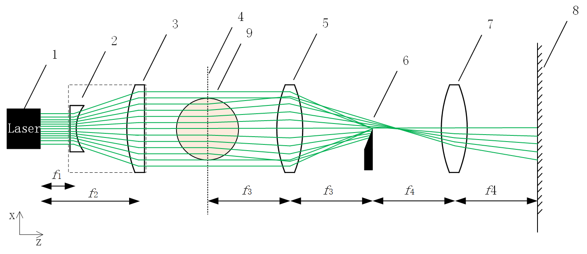

<center><font color="red">图2 含被测对象的纹影装置示意图</font><cebnter>

> 视觉角度：俯视图；
>
> 图示：1-激光器（532nm），2-扩束透镜组1，3-扩束透镜组2，4-物平面，5-凸透镜，6-刀口（刀口实物图见附录），7-凸透镜，8-像平面，9-被测对象。

上图中的**测试对象**，理论上可以是一个任意的透明的物体，但是其折射率需要与空气（测试环境）的折射率不同。在实验中，测试对象是半导体桥火工品爆轰产生的等离子体，暂且将其抽象理解为圆柱形状，上图是在俯视的的角度进行分析，所以被测对象只能看到起切面图。

当光线通过被测对象之后，由于等离子体的密度小于空气（环境）的空气密度，此时光线会进行相应的偏转，可以将圆柱形等离子体当作离焦透镜。向上偏转的光线将通过刀口的边缘上方，这就是最终获得的图像信号，也就是需要分析的内容，等离子体区域的直径就是图像上明亮区域的直径。向下偏转的光线将被刀口完全阻挡。

从**射线光学仿真**的角度来看，我们在像平面是看不到任何信号的，因为刀口在光学元件5凸透镜的焦点处，此时阻断了射线的传播。但由于**衍射**和**透镜像差**，其实只是阻挡了一半的焦点（或焦斑），此时我们可以在像平面上看到均匀但减弱的光斑。


## Shadowgraphy（阴影法）

阴影法，其作为一个与纹影法类似的技术，经常作为不同折射率的物体成像测试研究。

### Setup（装置）

阴影法与纹影法的**不同之处**在于，其不需要刀片，并且光线的偏转直接投射到像平面上。如果想要获得精确地结果，就需要使用较小散度的激光束。

典型的阴影成像装置示意图，见图3所示：

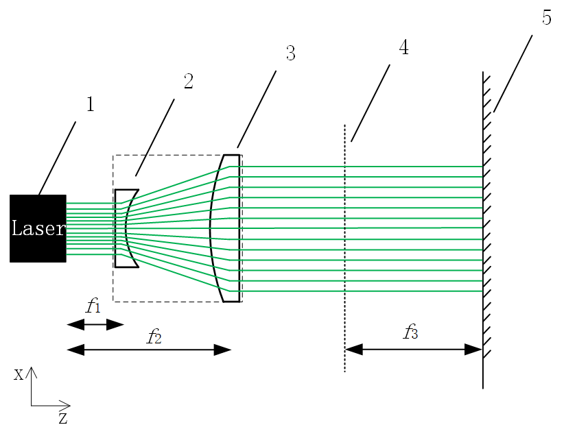

<center><font color="red">图3 没有被测对象的阴影装置示意图</font><cebnter>

> 视觉角度：俯视图；
>
> 图示：1-激光器（532nm），2-扩束透镜组1，3-扩束透镜组2，4-物平面，5-像平面。

在上图中，可以将被测对象放置于物平面上，在像平面获得测试结果。

当放置被测对象之后，可以得到阴影装置示意图，如图4所示：

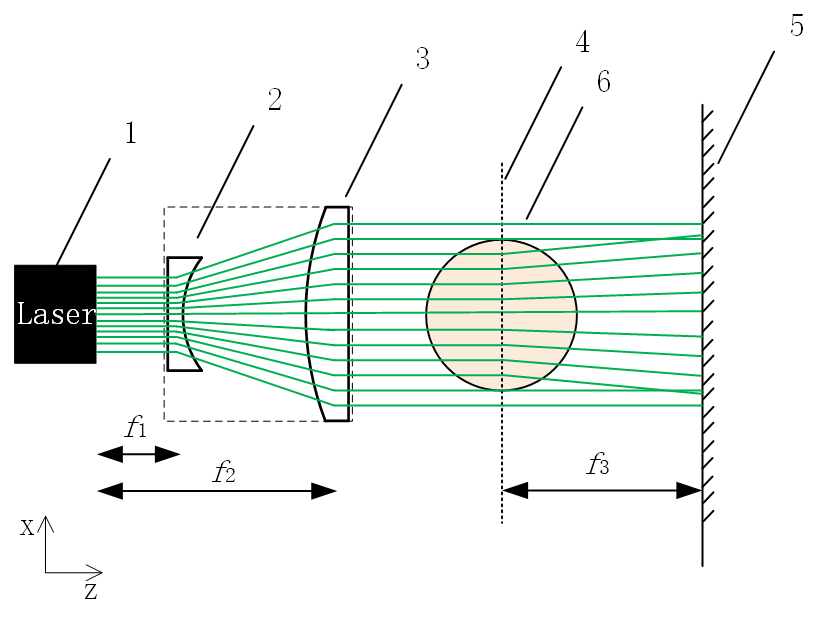

<center><font color="red">图4 含被测对象的阴影装置示意图</font><cebnter>

>视觉角度：俯视图；
>
>图示：1-激光器（532nm），2-扩束透镜组1，3-扩束透镜组2，4-物平面，5-像平面，6-被测对象。

由于**被测对象**（等离子体柱）折射率小于空气（环境）折射率，所以将被测对象作为**离焦透镜**，由于离焦透镜相比聚焦镜头难，所以需要一个中继成像系统（中继成像系统见附录）检测其虚焦点。

为了方便拓展阴影法，故将被测对象作为**聚焦透镜**的实验装置示意图绘制如下图5所示：

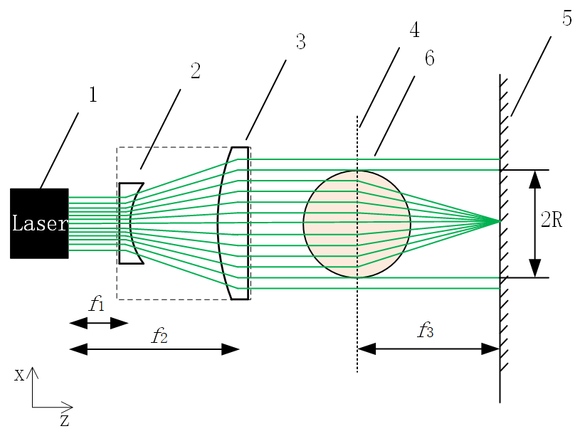

<center><font color="red">图5 含被测对象的阴影装置示意图（聚焦透镜）</font><cebnter>

> 视觉角度：俯视图；
>
> 图示：1-激光器（532nm），2-扩束透镜组1，3-扩束透镜组2，4-物平面，5-像平面，6-被测对象。

从上图中，可以看到在真实的实验测试过程中，可以通过测量像平面上阴影法成像图像中中央明亮焦距线与边缘光线明亮的距离，得到被测对象的直径信息，也即2R的量值。

由于使用聚焦式的被测对象可以获得较好的成像效果，可以获得**被测对象的直径和焦距**信息，但是不可忽略**衍射效应**（言射效应见附录），并且在整个实验与仿真中，衍射效应一直存在。


## Utils(工具箱)

这一大块主要介绍整个模型中需要详细介绍的**小点**，其中主要围绕的是测试装置进行展开，包括[**激光光源**](#Laser Source（激光光源）)，[**光学4F系统**](#Optical 4F System（光学4F系统）)，[刀口衍射理论](#Knife-edge diffraction theory（刀口衍射理论）)，  [**标量衍射理论**](#Scalar Diffraction  Theory（标量衍射理论）)，[**菲涅尔衍射**](#Fresnel Diffrection（菲涅尔衍射）)，[**泰勒展开式线性近似理论**](#Taylor's expansion linear approximation theory（泰勒展开式线性近似理论）)，[**透镜的相位变化理论**](#Lens Phase Change Theory（透镜的相位变化理论）)， [透镜制造方程](#Lensmaker's Equation（透镜制造方程）)，[**透镜的傅里叶特性**](#Fourier Properties of the lens（透镜的傅里叶特性）) ， [透镜傅里叶特性的MATLAB表示](#Fourier Properties of the lens in MATLAB（透镜傅里叶特性的MATLAB表示）)，[MATLAB中的傅里叶变化](#Fourier transform in MATLAB（MATLAB中的傅里叶变化）)等。


### Laser Source（激光光源）

主要介绍仿真的**光源特性**，以及先关的数据计算公式，作为完善纹影法和阴影法装置的一部分。

首先，需要**回顾一下纹影法和阴影法装置**，两个装置都需要将光源扩束准直为**直径大于等离子体半径2R**的光束，而在实际的仿真中，忽略扩束准直的过程，直接设置光源的大小，接着光线进入等离子体内部，可以分别查看下面的装置示意图：


<center><font color="red">图6 纹影法装置示意图（仿真）</font><cebnter>

> 视觉角度：俯视图；
>
> 图示：1-物平面，2-被测对象，3-凸透镜，4-刀口（刀口实物图见附录），5-凸透镜，6-像平面。

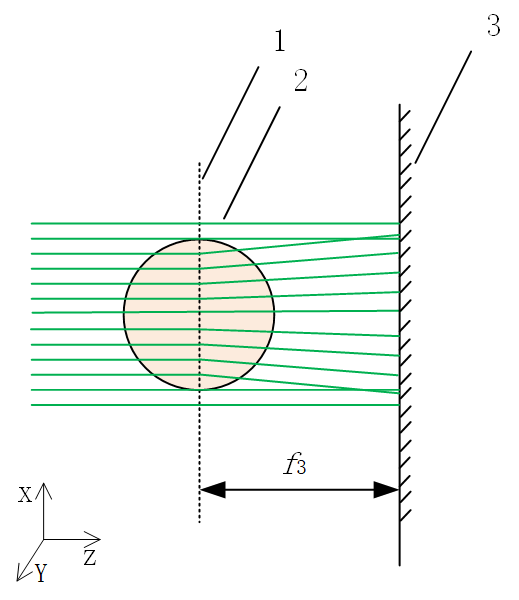

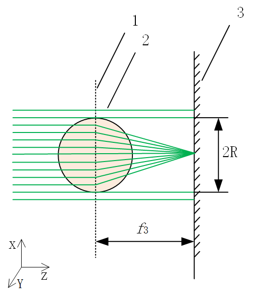

<center><font color="red">图7 阴影法装置示意图（仿真）</font><cebnter>

> 视觉角度：俯视图；
>
> 图示：1-物平面，2-被测对象，3-像平面。

假设我们的**激光束在电场中呈高斯分布**，其光源的表达式如下所示：
$$
g(x,y)=A(- \exp(\frac {(x-x_0)^2} {2 \sigma _x^2} + \frac {(y-y_0)^2} {2 \sigma _y^2}))
$$
其中，`A` 是幅值，$x_0$ ，$y_0$ 是中心点坐标，$\sigma _x$ ， $\sigma _y$ 是激光束的标准差.

当给定参数 ，$x_0 = 0$ ，$y_0 = 0$ ，$\sigma _x = \sigma _y = \sigma _r $时，可以得到光源的表达式如下所示：
$$
g(x,y)=A \exp( - \frac {x^2 + y^2} {2 \sigma _r^2} )
$$
在实际的仿真中，假设 `A = 1` , $\sigma _r= 1 \cdot 10^{-3} m$ ，编写**MATLAB代码**可以得到光源的强度分布图，如下所示：（在实际使用中，光源是否具有高斯光束形状并不重要，只需要找到可以近似描述光源形状的方法即可。）

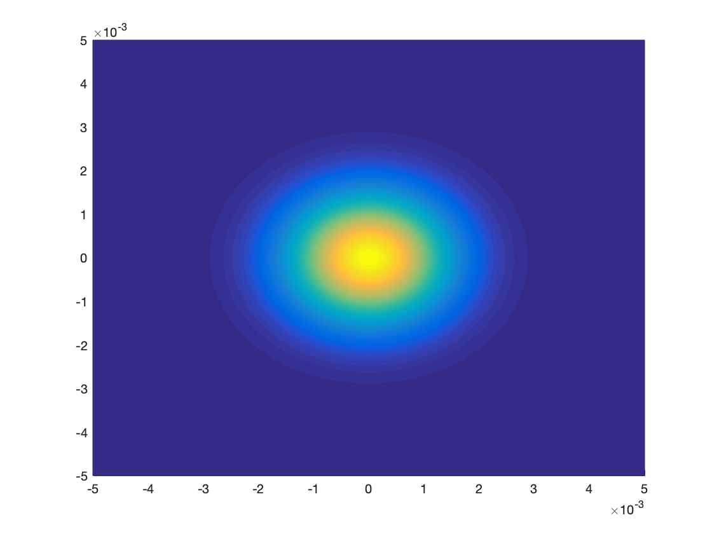

<center><font color="red">图8 光源强度图</font><cebnter>

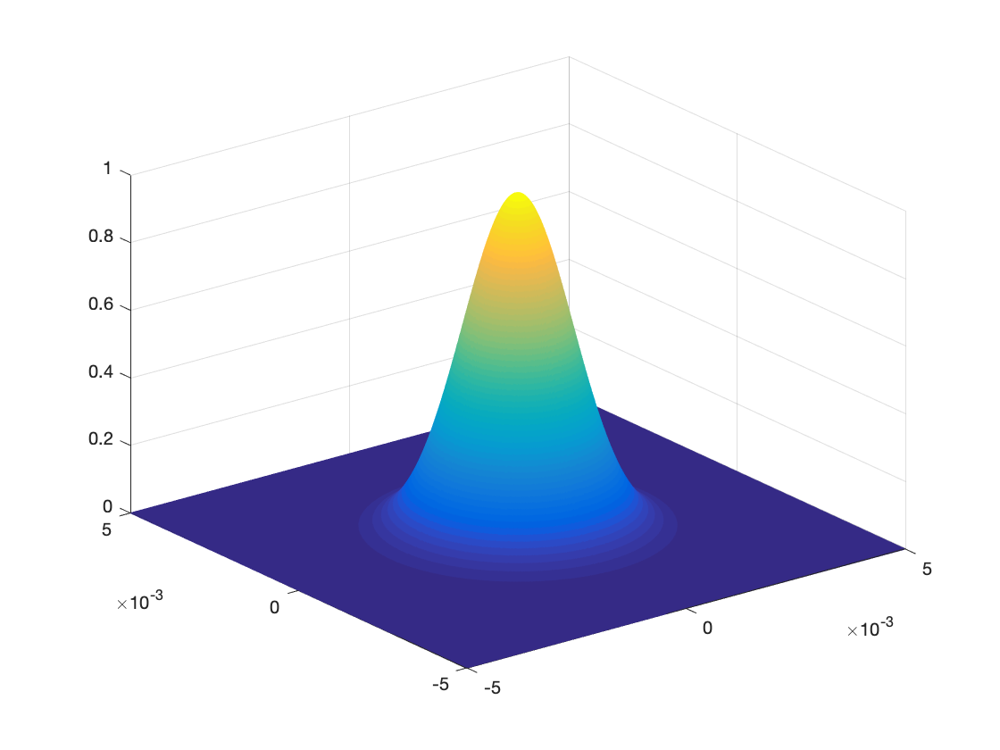

<center><font color="red">图9 光源三维图</font><cebnter>


<center><font color="red">图10 光源曲线图（中心线）</font><cebnter>

> 图示：`A = 1` , $\sigma _r= 1 \cdot 10^{-3} m$ 。
>
> 注：上述实现代码见附录：GaussianBeam.m


### Optical 4F System（光学4F系统）

在介绍纹影法装置的时候，说到**扩束准直镜之后的部分叫做4F系统**。一个经典的纹影光学4F系统，如下图所示：

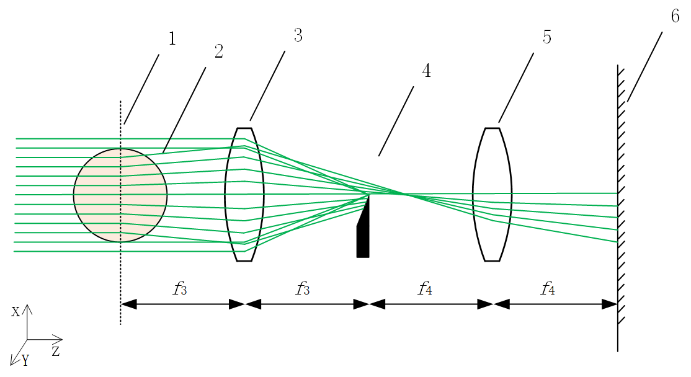

<center><font color="red">图11 光学4F系统</font><cebnter>

>视觉角度：俯视图；
>
>图示：1-物平面，2-被测对象，3-凸透镜，4-刀口（刀口实物图见附录），5-凸透镜，6-像平面。

从上图找那个可以看出，被测对象被精准的放置于第一个凸透镜的焦距位置处，其距离第一个凸透镜的距离为 $f_3$ ，第二个凸透镜与第一个凸透镜之间的距离是 $f_3 + f_4$ ，像平面与第二个凸透镜之间的距离为 $f_4$ ，是第二个凸透镜的焦距。

而我们在后面的模拟中，主要进行的就是这一部分的模拟，即，**被测对象（等离子体），第一个凸透镜，刀口，第二个凸透镜**。


### Knife-edge diffraction theory（刀口衍射理论）

这里主要是介绍纹影法中，**刀口处的电场变化**，以及如何处理的。因为阴影法不需要刀口。

> 想看这里的内容，脑子里面必须清楚的知道电场在整个纹影装置的变化，简言之就是需要先看透镜的傅里叶特性，并且知道光线穿过等离子体之后的电场情况，基于此来看刀口。

我们在[装置](#Setup（装置） ) 中谈过纹影法的装置，并且在[4F系统](#Optical 4F System（光学4F系统）) 中，更加详细的介绍了纹影法测试装置，本质是**光线的传输过程中，由于不同的介质与材料导致的电场的变化**。

在[透镜的傅里叶特性](#Fourier Properties of the lens（透镜的傅里叶特性）) 中，得到结论：**透镜后焦距位置的电场是透镜前焦距位置电场的傅里叶变化。** 其表达式如下所示：
$$
U_2 (x,y) 
=
\frac { 2 \pi}
{f \lambda}
\cdot
\mathcal{F} (U(x,y) )
(\frac {k}{f} x , \frac {k}{f} y )
$$
将[4F系统](#Optical 4F System（光学4F系统）) 中的图像添加上电场的表示，如下图所示：

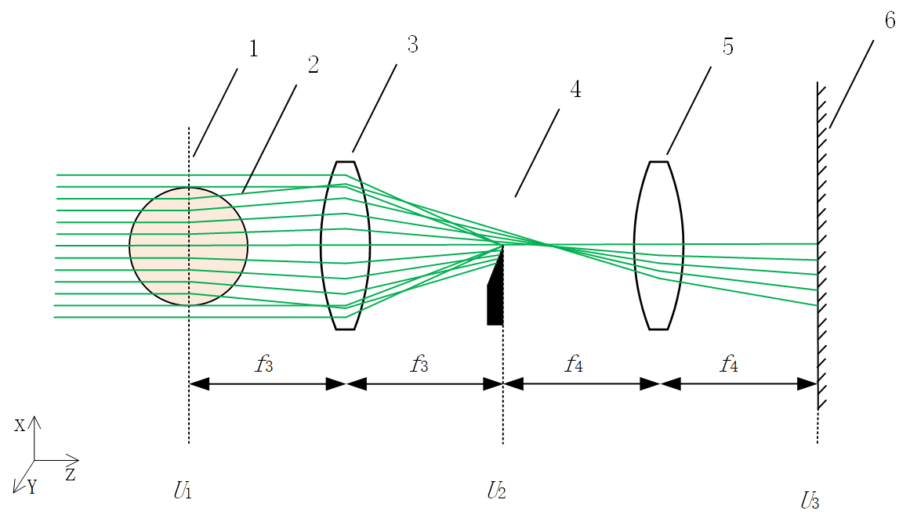

<center><font color="red">图12 纹影装置电场示意图</font><cebnter>

> 视觉角度：俯视图；
>
> 图示：1-物平面，2-被测对象，3-凸透镜，4-刀口（刀口实物图见附录），5-凸透镜，6-像平面。

上图中，被测对象在物平面的电场表示为 $U_1$ ，光线继续穿过凸透镜之后，在刀口处的电场表示为 $U_2 $ ， 最后在相平面的电场表示为 $U_3$ 。

所以，可以得到光线在**刀口前的电场**表达式为：
$$
U_2^- (x,y) 
=
\frac { 2 \pi}
{f_3 \lambda}
\cdot
\mathcal{F} (U_1 (x,y))
(\frac {k}{f_3} x , \frac {k}{f_3} y )
$$
上式中， $k$ 表示的是波数， $f_3$ 表示的是凸透镜3的焦距。

为了更好视觉效果，将纹影法装置中的刀口位置进行放大，见下图：

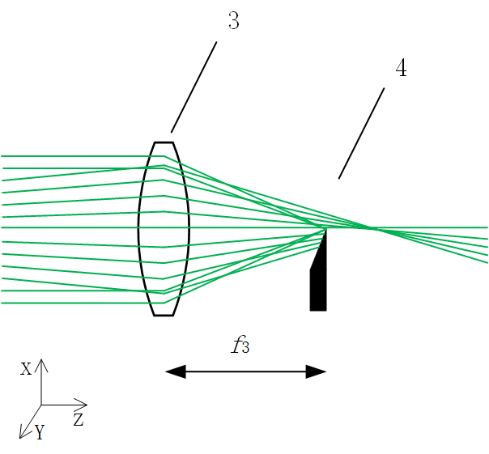

<center><font color="red">图13 刀口局部示意图</font><cebnter>

> 视觉角度：俯视图；
>
> 图示：1-凸透镜，4-刀口。

从上图中可以明显的看出来，在刀口位置的电场被刀口阻挡了一半。从光学的焦点角度来思考，当刀口的尖部放置于焦距位置的时候，我们应该将整个焦点都挡住了，也就是像平面是什么都看不到的，理论上确实是这样，但是因为有**衍射**效应，所以光束的电场正好被阻挡了一半。

基于刀口的作用，我们使用**赫维赛德阶跃( Heaviside step function ) 函数**来描述：
$$
H(x) = 
\begin{cases} 
0  \quad \quad \quad \quad ，x < 0
\\ 
1 \quad \quad \quad \quad ， x \geq 0
\end{cases}
$$
所以，我们可以得到**刀口后的电场**表达式：
$$
U_2^+ (x,y)  = H(x) \cdot U_2^-  (x,y)
$$
对于我们的目标像平面的电场，可以继续使用[透镜的傅里叶特性](#Fourier Properties of the lens（透镜的傅里叶特性）)，则表示为：
$$
U_3 (x,y) 
=
\frac { 2 \pi}
{f_4 \lambda}
\cdot
\mathcal{F} (U_2^+(x,y))
(\frac {k}{f_4} x , \frac {k}{f_4} y )
$$
上面的推导已经将装置中的电场变化计算理论模型展示出来，剩下的就是针对每一块的具体实现。比如：我们的被测对象是如何影响电场的？我们的理论模型如何使用MATLAB表示？.....

> 参考资料：
>
> 1.https://ww2.mathworks.cn/help/symbolic/heaviside.html
>
> 2.[https://blog.csdn.net/yzlh2009/article/details/103937712?ops_request_misc=%7B%22request%5Fid%22%3A%22158314603919725219964287%22%2C%22scm%22%3A%2220140713.130056874..%22%7D&request_id=158314603919725219964287&biz_id=0&utm_source=distribute.pc_search_result.none-task](https://blog.csdn.net/yzlh2009/article/details/103937712?ops_request_misc={"request_id"%3A"158314603919725219964287"%2C"scm"%3A"20140713.130056874.."}&request_id=158314603919725219964287&biz_id=0&utm_source=distribute.pc_search_result.none-task)
>
> 3.https://docs.scipy.org/doc/numpy/reference/generated/numpy.heaviside.html


### Scalar Diffraction  Theory（标量衍射理论）

关于衍射理论的内容，主要是如何使用衍射理论求解问题，最关键的是**菲涅尔衍射**的内容。

光可以看成是一个在三个方向上都有分量的**电磁波**，在解决衍射问题的时候，只需要使用**标量**的方式就足够了。

在**孔径衍射**中，使用衍射积分可以获得电磁波到达衍射孔径的情况，当我们想知道衍射孔后面的情况的时候，需要使用**Maxwell(麦克斯韦)方程组**进行推导。

在文献方面，目前**求解衍射问题的三大理论**是：**第一Rayleigh-Sommerfeld（瑞利-索默菲尔德）衍射理论，第二Rayleigh-Sommerfeld（瑞利-索默菲尔德）衍射理论和Kirchhoff （基尔霍夫）衍射理论**。

针对上述理论，其表现为对于**比波长大得多的孔径和拥有适当的角度**，其衍射的结果是相同的。可以看到孔径衍射经典图如下图所示;

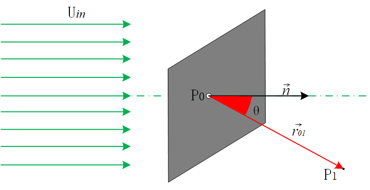

<center><font color="red">图12 孔径衍射示意图</font><cebnter>

使用**第一Rayleigh-Sommerfeld（瑞利-索默菲尔德）衍射理论进行衍射求解**，可以获得经典公式如下：
$$
U(P_1) = 
\frac{1}{i\lambda} 
\iint _{\sum} 
{U(P_0) 
\frac {\exp ({ik \cdot \vec{r_{01}}})}
{\vec {r_{01}}} 
cos(\theta)
} ds
$$
上式中， $\theta$ 是光线的法线向量和向量 $\vec {r_{01}}$ 之间的夹角，余弦夹角因子 $cos(\theta)$ 可以设置为1（也就代表着角度是 $0^\circ$  ​）， $\sum$ 获得的是孔径被光线击中的总和。

在**直角坐标系**使用上述公式，可以表示为：
$$
U(x,y,z) = 
\frac{z}{i\lambda} 
\iint _{\sum}
U(\xi, \eta)
\frac {\exp(ikr)}{r^2}
d \xi d \eta
$$
上式中，$r= \sqrt{z^2 + ( x - \xi)^2 + ( y - \eta)^2 }$ 。

> 参考文献：
>
> 1.Rayleigh–Sommerfeld diffraction formula in k space
>
> 2.On the exact Kirchhoff and Rayleigh-Sommerfeld theories for the focusing of an infinite scalar spherical wave-field


### Fresnel Diffrection（菲涅尔衍射）

一个很关键的公式！

基于**标量衍射理论**给出的直角坐标系公式 $U(x,y,z) = 
\frac{z}{i\lambda} 
\iint _{\sum}
U(\xi, \eta)
\frac {\exp(ikr)}{r^2}
d \xi d \eta$ ，我们使用**一阶泰勒展开式**来近似获得函数值，由[泰勒展开式线性近似理论](#Taylor's expansion linear approximation theory（泰勒展开式线性近似理论）)对应的**函数线性近似表达式**为：
$$
f(a+ \Delta x)
=
f(a)
+
f' (a) \Delta x
$$
所以，当 $b \ll a$ 时，则满足下面的等价公式：
$$
\sqrt {a+b} 
\approx 
\sqrt{a} (1 + \frac {b}{2a})
$$
在标量衍射理论中，当 $z^2 \gg x^2 + y^2$ 时，我们可以的对应的 $r$ 和 $r^2$ 的表达式：
$$
r
\approx 
z(1 + \frac {( x - \xi)^2 + ( y - \eta)^2} {2 z^2} )
$$

$$
r^2 \approx  z^2
$$

注意，上式子中的 $r$ 是根据泰勒级数展开式线性理论得到， $r^2$ 是直接 $z^2 \gg x^2 + y^2$ 条件得到。

使用上述结论，我们可以得到标量直角坐标系的**简化公式**：
$$
U(x,y,z) 
\approx
\frac{z}{i\lambda} 
\iint _{\sum}
U(\xi, \eta)
\frac {\exp(ikz(1 - \frac {( x + \xi)^2 + ( y - \eta)^2} {2 z^2} ))}{z^2}
d \xi d \eta
$$
化简一下可以得到：
$$
U(x,y,z) 
=
\frac{\exp (ikz)}{i\lambda} 
\iint _{\sum}
U(\xi, \eta)
\frac {\exp( \frac {ik } {2 z} (( x - \xi)^2 + ( y - \eta)^2) )}{z}
d \xi d \eta
$$
将孔径 $\sum$ 上的积分使用**光瞳函数** $P(x,y)$ 的无穷积分形式代替，可以得到下面的公式：
$$
U(x,y,z) 
=
\frac{\exp (ikz)}{i\lambda} 
\int _{-\infty}^{+\infty}
\int _{-\infty}^{+\infty}
P(\xi, \eta) U(\xi, \eta)
\frac {\exp( \frac {ik } {2 z} (( x - \xi)^2 + ( y - \eta)^2) )}{z}
d \xi d \eta
$$
上式，也就是基于标量衍射理论得到的**菲涅尔衍射公式**。很关键！！！


### Taylor's expansion linear approximation theory（泰勒展开式线性近似理论）

这里进行泰勒展开式的相关理论推导，主要为了菲涅尔衍射中的公式化简。由于完整的泰勒推导不是我的重点，所以我只会将**使用一阶泰勒展开式近似获取函数值的方法**原型进行推导。

先画一个关于函数 $f(x)$ 的函数图，如下图所示：

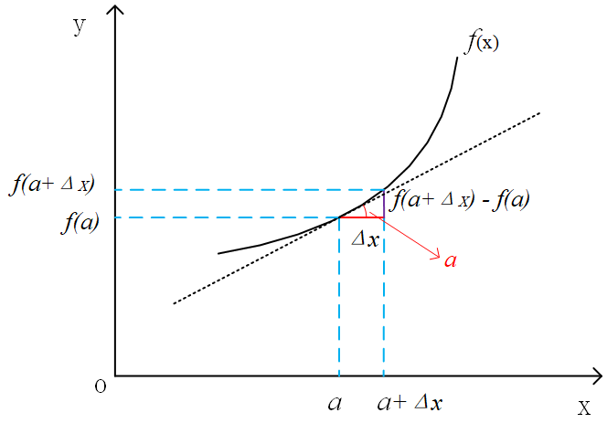

<center><font color="red">图13 <i>f(x)</i>函数图</font><cebnter>

从上图可以看到，想要估计 $a$ 点的函数，我们无法直接带入数值 $a$ 去计算。需要通过 $a+ \Delta x$ 这一点的函数值，使 $\Delta x \rightarrow 0$ 时， $f(a)$ 和 $f(a+ \Delta x)$ 近似相等来计算。

函数在 $a$ 点的斜率为 $tan(\alpha)$ ，其表达式如下所示：
$$
tan (\alpha)
=
\frac{f(a+ \Delta x)} {\Delta x}
$$
由于斜率等于函数的倒数，表示为下式：
$$
tan (\alpha)
=
f' (a)
$$
综合上式可以得到**线性近似表达式**，也就是泰勒一阶展开式：
$$
f(a+ \Delta x)
=
f(a)
+
f' (a) \Delta x
$$
**补充知识**：从上图中可以看出点函数定积分的几何意义，而这也是泰勒展开式是微积分的基本定理的原因。即牛顿莱布尼茨公式通过一系列的换元，转换，最终得到泰勒展开式。


### Lens Phase Change Theory（透镜的相位变化理论）

> 这块的这个名字，我也不知道怎么表达，暂时先使用 *透镜的相位变化理论* 。

这块，需要完成的任务就是搞懂**透镜是怎么工作的**，也就是透镜是怎么影响相位变化的，由于我们的测设装置有透镜，所以，必须弄懂！

在波动光学的世界里面，**光具有振幅和相位**。

我们假设有一个**理想薄透镜**，其不存在反射现象，所有的光束都透射近透镜。**波数**取决于光波传播的介质。

当在**空气**中的时候，光波的波数为 $k = \frac {2 \pi} {\lambda}$ ，在**其他介质**中的时候，光波的波数为 $k_n = k \cdot n$ ， $n$ 为该介质的折射率，对于玻璃透镜的折射率约为 $1.5$ 。

由于上述中不同的波数，我们可以发现：**当光分别穿过空气和玻璃之后，会由于不同的波数，会产生光程差。**

由于我们忽略了反射带来的光强变化，此时光线穿过透镜之后，只会出现**相移**，也就是相位的变化。

当我们使用**薄透镜**和**傍轴光线**组合的时候，我们可以假设光线穿过透镜的入射点和出射点是相同的，具体的透镜示意图如下图所示：

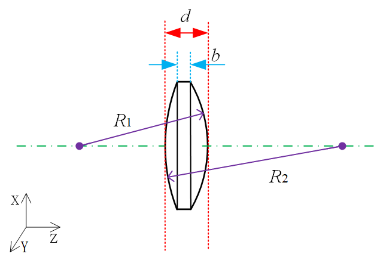

<center><font color="red">图14 薄透镜示意图</font><cebnter>

> 视觉角度：俯视图。
>
> 注：由于透镜的主视图和俯视图效果是一样的，为了与前文装置对应，选择使用俯视图进行描述。

上图中的薄透镜左右两边的**曲率不一样**，分别为 $R1$ 和 $R2$ ，其中 $d$ 为薄透镜的中间厚度， $b$ 为薄透镜的边缘厚度。

从上图可以得到，当光线穿过距离为 $d$ 的空气时，对应的相移如下说示：
$$
\phi = d \cdot k
$$
当光线穿过薄透镜时，对应的**薄透镜两边**分别等效为下面的切面图：

.png)

<center><font color="red">图15 薄透镜示意图(左边)</font><cebnter>

.png)

<center><font color="red">图16 薄透镜示意图(右边)</font><cebnter>

综上，可得光线穿过透镜，对应的相移可以表示为下式：
$$
\phi =
k (\Delta_1 + \Delta_2) 
+
k n (d - \Delta_1 - \Delta_2)
$$
**注** :这里面使用的 $k$ 与 $kn$ 是上面讨论的关于空气和其他介质的波数。

上式中，使用的 $\Delta_1$ 与 $\Delta_2$ 分别是光线穿过薄透镜的时候，透镜左右两边穿过的空气距离，所以可以得到下面的公式：
$$
\Delta_1 = 
R_1 - \sqrt{R_1^2 - h^2}
$$

$$
\Delta_2 = 
R_2 - \sqrt{R_2^2 - h^2}
$$

现在从左视图或者透视图想一下透镜，可以参看下面的图：

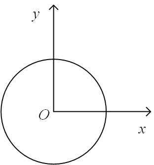

<center><font color="red">图17 薄透镜左（右）视图</font><cebnter>

此时有一点**烧脑**，想象透镜的三维形状，除了在透镜左（右）视图的中心点，其他的点的距离光轴的距离（也就是上式中的 $h$ ）使用的计算公式:
$$
h = \sqrt{x^2 + y^2}
$$
综上 ，可以得到光线通过透镜带来的相移变化公式如下：
$$
\phi =
k \Delta_1 \cdot(1-n)
+
k \Delta_2 \cdot(1-n)
+
knd
\\
= kn \cdot d 
+ k(n-1)(R_1 - \sqrt{R_1^2 - (x^2 + y^2)})
\\
+ k(n-1)(R_2 - \sqrt{R_2^2 - (x^2 + y^2)})
$$
在上式中，可以看到有一个**恒定不便的相移量** $kn \cdot d$ ，此时我们可以不考虑其对于相移的影响。

我们在[菲涅尔衍射](#Fresnel Diffrection（菲涅尔衍射）) 中使用 [泰勒展开式线性近似理论](#Taylor's expansion linear approximation theory（泰勒展开式线性近似理论）) ，当 $b \ll a$ 时，得到了一个公式：
$$
\sqrt {a+b} 
\approx 
\sqrt{a} (1 + \frac {b}{2a})
$$
所以，当 $R_2^2 \gg x^2 + y^2$ 的时候，可以得到：
$$
\sqrt{R_1^2 - (x^2 + y^2)}
\approx 
R_1 (1+ \frac{x^2 + y^2}{2\cdot R_1^2})
$$

$$
\sqrt{R_2^2 - (x^2 + y^2)}
\approx 
R_2 (1+ \frac{x^2 + y^2}{2\cdot R_2^2})
$$

此时，可以带入上面的相移公式，得：
$$
\phi = 
k(n-1) (R_1 - R_1 (1+ \frac{x^2 + y^2}{2\cdot R_1^2}))
+ 
k(n-1) (R_2 - R_2 (1+ \frac{x^2 + y^2}{2\cdot R_2^2}))
$$
继续化简上式：
$$
\phi = 
k(n-1) (- \frac{x^2 + y^2}{2\cdot R_1}))
+ 
k(n-1) (- \frac{x^2 + y^2}{2\cdot R_2}))
\\
=
-k(n-1) \frac{x^2 + y^2}{2} 
\cdot (\frac{1}{R_1} + \frac{1}{R_2})
$$
我们可以通过 [透镜制造方程](#Lensmaker's Equation（透镜制造方程）) 获得薄透镜的焦距方程表达式：
$$
\frac{1}{f}
\approx 
(n-1)[\frac{1}{R_1} - \frac{1}{R_2} ]
$$
由于我们使用的是薄凸透镜，此时Lensmaker’s Equation可以改写为：
$$
\frac{1}{f}
=
(n-1)[- \frac{1}{R_1} - \frac{1}{R_2} ]
$$
也即：
$$
- \frac{1}{f \cdot (n-1)}
=
\frac{1}{R_1} + \frac{1}{R_2}
$$
将上式，代入到我们上面化简之后的相移公式，可以得到：
$$
\phi 
=
-k(n-1) \frac{x^2 + y^2}{2} 
\cdot 
\frac{-1}{f \cdot (n-1)}
$$
化简得到：
$$
\phi 
=
\frac{k}{2 f} 
(x^2 + y^2)
$$
此时可以得到光线通过薄透镜之后，对应的**相位变化**公式：
$$
t(x,y) = \exp (i \frac{k}{2 f} (x^2 + y^2))
$$
上式就是我们这一块的主要任务，得到光线穿过双凸薄透镜之后的相位变化公式。


### Lensmaker’s Equation（透镜制造方程）

> 目前针对这个中文翻译纯属于我的直译，目前还没有找到一个中文版本的翻译，都使用的是Lensmaker’s Equation表示。

如果透镜表面曲率半径 $R_1$ 和 $R_2$ ，和透镜的折射率 $n$ 是已知的，那么透镜的焦距 $f$ 在空气中可以使用Lensmaker’s Equation进行计算，如下：
$$
\frac{1}{f}
=
(n-1)[\frac{1}{R_1} - \frac{1}{R_2} + \frac{(n-1) d} {n \cdot R_1 R_2} ]
$$
其中， $R_1$ 是离物体更近的透镜表面曲率半径， $R_2$ 是离物体更远的透镜表面曲率半径，  $d$ 是在光轴上两个透镜表面之间的距离，也就是透镜的中心厚度。

使用上述公式，可以通过测量透镜的半径，厚度和焦距来确定未知的透镜材料的折射率。

> 透镜曲率半径的符号取决于其表面的形状。具体分析如下：
>
> 如果物体在透镜的左侧，观察者在物体的右侧。那么，曲率中心在透镜的右侧时，曲率半径为正；曲率半径在透镜的左侧时，曲率半径为负。
>
> 如果是一个平面，那么其曲率半径为无穷大。

对于薄透镜的场景，如果透镜的中心厚度 $d$ 远远小于其曲率半径 $R_1$ 和 $R_2$  的时候，那么上面的公式可以变化为：
$$
\frac{1}{f}
\approx 
(n-1)[\frac{1}{R_1} - \frac{1}{R_2} ]
$$
上面的这个公式会在[透镜的相位变化理论](#Lens Phase Change Theory（透镜的相位变化理论）)中使用到。

> 参考资料：
>
> 1.http://dev.physicslab.org/Document.aspx?doctype=3&filename=GeometricOptics_LensMakerEquation.xml
>
> 2.https://www.translatorscafe.com/unit-converter/zh-CN/calculator/lensmaker-equation/?redir=teaser
>
> 3.https://demonstrations.wolfram.com/LensmakersEquation/


### Fourier Properties of the lens（透镜的傅里叶特性）

在这块，主要基于波动光学相关理论，推导光线通过透镜之后，其电场的变化情况。主要解决光学系统的快速数值计算。

得到的最终结论：**透镜后焦距位置的电场是透镜前焦距位置电场的傅里叶变化。**

首先，我们从一个透镜开始看，下图是一个**典型的薄凸透镜**：

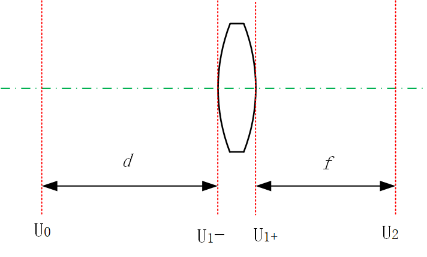

<center><font color="red">图12 薄凸透镜</font><cebnter>

上图中， $U_0$ 是一个在薄凸透镜前面距离为 *d* 的电场，$U_2$ 是我们想通过计算获得的电场，其距离薄凸透镜后面为 *f* ， $U_1^-$ 是薄凸透镜前面的临界区电场， $U_1^+$ 是薄凸透镜后面的临界区电场。

在这里我们需要使用 [菲涅尔衍射](#Fresnel Diffrection（菲涅尔衍射）) 中得到的菲涅尔衍射公式：

$$
U(x,y,z) 
\approx
\frac{\exp (ikz)}{i\lambda} 
\int _{-\infty}^{+\infty}
\int _{-\infty}^{+\infty}
P(\xi, \eta)U(\xi, \eta)
\frac {\exp( \frac {ik } {2 z} (( x - \xi)^2 + ( y - \eta)^2) )}{z}
d \xi d \eta
$$
由上图的薄透镜，可以得到对应的衍射公式中 $z$ 的数值是 $d$ ，所以可以得到**薄凸透镜前面的临界区电场**公式：
$$
U_1^- (x,y) 
\approx
\frac{\exp (ikd)}{i\lambda} 
\int _{-\infty}^{+\infty}
\int _{-\infty}^{+\infty}
P(\xi, \eta)U(\xi, \eta)
\frac {\exp( \frac {ik } {2 d} (( x - \xi)^2 + ( y - \eta)^2) )} {d}
d \xi d \eta
$$
在前面 [透镜的相位变化理论](#Lens Phase Change Theory（透镜的相位变化理论）) 推导，得到了光波通过薄凸透镜的相位变化计算公式如下：
$$
t(x,y) = \exp (i \frac{k}{2 f} (x^2 + y^2))
$$
将上式带入薄凸透镜前面的临界区电场，得到**薄凸透镜后面的临界电场**表达式：
$$
U_1^+ (x,y) 
\approx
\exp (i \frac{k}{2 f} (x^2 + y^2))
\frac{\exp (ikd)}{i\lambda} 
\cdot
\\
\quad \quad \quad \quad \quad \quad \quad
\int _{-\infty}^{+\infty}
\int _{-\infty}^{+\infty}
P(\xi, \eta)U(\xi, \eta)
\frac {\exp( \frac {ik } {2 d} (( x - \xi)^2 + ( y - \eta)^2) )} {d}
d \xi d \eta
$$
如果，我们的薄凸透镜足够到，就可以忽略**光瞳函数** $P(x,y)$ ，化简得到：
$$
U_1^+ (x,y) 
=
\exp (i \frac{k}{2 f} (x^2 + y^2))
\frac{\exp (ikd)}{i\lambda} 
\cdot
\\
\quad \quad \quad \quad \quad \quad \quad
\int _{-\infty}^{+\infty}
\int _{-\infty}^{+\infty}
U(\xi, \eta)
\frac {\exp( \frac {ik } {2 d} (( x - \xi)^2 + ( y - \eta)^2) )} {d}
d \xi d \eta
$$
此时，我们继续使用菲涅尔衍射，可以得到距离薄凸透镜为 $f$ 的位置的电场 $U_2$ 公式：
$$
U_2 (x,y) 
\approx
\frac{\exp (ikf)}{i\lambda} 
\int _{-\infty}^{+\infty}
\int _{-\infty}^{+\infty}
U_1^+(\nu, \tau)
\frac {\exp( \frac {ik } {2 f} (( x - \nu)^2 + ( y - \tau)^2) )} {f}
d \nu d \tau
$$

> **Warning**：下面的化简十分复杂，做好心理准备！(我会在推导的是一步一步来，一是为了自己下次看可以看懂，而是为了阅读对象可以看懂。)

进行（乘与合并）化简可以得到：
$$
U_2 (x,y) 
=
\exp (i \frac{k}{2 f} (x^2 + y^2))
\frac{\exp (ik(d + f))}{i^2 \lambda^2} 
\cdot
\\
\iiiint _{-\infty}^{+\infty}
U(\xi, \eta)
\frac {\exp( \frac {ik } {2 d} (( \nu - \xi)^2 + ( \tau - \eta)^2) )} {d}
\frac {\exp( \frac {ik } {2 f} (( x - \nu)^2 + ( y - \tau)^2))} {f}
d \xi d \eta d \nu d \tau
$$
进行（展开，消除积分中的平方项）化简可以得到：
$$
U_2 (x,y) 
=
\exp (i \frac{k}{2 f} (x^2 + y^2))
\frac{\exp (ik(d + f))}{i^2 \lambda^2} 
\cdot
\\
\iiiint _{-\infty}^{+\infty}
U(\xi, \eta)
\frac {\exp( \frac {ik } {2 d} (( \nu - \xi)^2 + ( \tau - \eta)^2) )} {d}
\frac {\exp( -  \frac  {ik } {f} ( x \nu +  y \tau ))}
{f}
d \xi d \eta 
d \nu d \tau
$$

> 由于进行了两次菲涅尔衍射，所以进行化简的时候，需要将透镜的平方项抵消。

在接下来的化简主要是针对电场 $U2$ 公式中的**积分项的分子**的化简，可以提出来如下所示：
$$
s = 
\iint _{-\infty}^{+\infty}
\exp( \frac {ik } {2 d} (( \nu - \xi)^2 + ( \tau - \eta)^2) )
\exp( -  \frac  {ik } {f} ( x \nu +  y \tau ))
d \nu d \tau
$$
这里使用一个技巧，将公式中的平方项内部的内容进行替换，如下形式：
$$
\nu' =\nu - \xi
\\
\tau' = \tau - \eta
$$
我们可以得到替换之后的公式：
$$
s = 
\iint _{-\infty}^{+\infty}
\exp( \frac {ik } {2 d} (\nu’ ^2 + \tau ’^2) )
\exp( -  \frac  {ik } {f} ( x (\nu'+\xi) +  y (\tau' + \eta) ))
d \nu' d \tau'
$$
继续化简，得到：
$$
s = 
\exp( -  \frac  {ik } {f} ( x \xi +  y  \eta) ))
\iint _{-\infty}^{+\infty}
\exp( \frac {ik } {2 d} (\nu’ ^2 + \tau ’^2) )
\exp( -  \frac  {ik } {f} ( x \nu' +  y \tau' ))
d \nu' d \tau'
$$
我们对**二维高斯函数的傅里叶变化**与上式中的积分项类似，可以进行引用化简，其二维高斯傅里叶变化的公式如下：
$$
\iint _{-\infty}^{+\infty}
\exp( \frac {i c } {2} (t_1 ^2 + t_2^2) )
\exp( - i ( t_1 \omega_1 +  t_2 \omega_2 ))
d t_1 d t_2
=
\frac {2 \pi i} {c} \exp ( - \frac{i}{2c} (\omega_1^2 + \omega_2^2))
$$

> 参考：https://blog.csdn.net/majinlei121/article/details/46745359

基于上面的傅里叶变化公式，可以继续化简，化掉积分项：
$$
s = 
\exp( -  \frac  {ik } {f} ( x \xi +  y  \eta) )
\cdot
\frac{2 \pi i d} {k} 
\exp(- \frac {i d} {2 k} \cdot  \frac {k^2} {f^2} (x^2 + y^2))
$$

> 备注：在等效计算的时候，将傅里叶变化中的 $c$ 等效为 $\frac {k}{d}$ ，二次积分之后原式中的 $\frac {k}{f}$ 变成 $\frac{k^2}{f^2}$ 。

继续化简，得到：
$$
s = 
\exp( -  \frac  {ik } {f} ( x \xi +  y  \eta) )
\cdot
\frac{2 \pi i d} {k} 
\exp(- \frac {i d k} {2 f^2} \cdot  (x^2 + y^2))
$$
在 [透镜的相位变化理论](#Lens Phase Change Theory（透镜的相位变化理论）) 中，我们知道波数 $k$ 的表达式为：
$$
k = \frac {2 \pi} {\lambda}
$$
所以，上式还可以化简：
$$
s = 
\exp( -  \frac  {ik } {f} ( x \xi +  y  \eta) )
\cdot
 i d \lambda
\cdot
\exp(- \frac {i d k} {2 f^2} \cdot  (x^2 + y^2))
$$
此时我们将提取出来的积分部分，代回原来的函数中，可以的得到：
$$
U_2 (x,y) 
=
\exp (i \frac{k}{2 f} (x^2 + y^2))
\frac{\exp (ik(d + f))}{i^2 \lambda^2} 
\cdot
\\
\iint _{-\infty}^{+\infty}
U(\xi, \eta)
\frac {
\exp( -  \frac  {ik } {f} ( x \xi +  y  \eta) )
\cdot
 i d \lambda
\cdot
\exp(- \frac {i d k} {2 f^2} \cdot  (x^2 + y^2))} 
{df}
d \xi d \eta
$$
进行化简得到：
$$
U_2 (x,y) 
=
\frac {\exp (i \frac{k}{2 f} (x^2 + y^2) (1- \frac {d}{f} )) 
\exp (ik(d + f))}
{f i \lambda}
\cdot
\\
\iint _{-\infty}^{+\infty}
U(\xi, \eta)
\exp( -  \frac  {ik } {f} ( x \xi +  y  \eta) )
{f}
d \xi d \eta
$$

> 这次化简的操作比较多，首先进行积分项中化简，包括：消去 $d$ ， 将非 $\xi$ 和 $\eta$ 的积分项移出。接着就是正常的约分换算了。

由于，上式中的 $i$ ，$\exp (ik(d + f)) $ 属于常数项，可以进行忽略，得到：
$$
U_2 (x,y) 
=
\frac {\exp (i \frac{k}{2 f} (x^2 + y^2) (1- \frac {d}{f} )) }
{f \lambda}
\cdot
\\
\iint _{-\infty}^{+\infty}
U(\xi, \eta)
\exp( -  \frac  {ik } {f} ( x \xi +  y  \eta) )
{f}
d \xi d \eta
$$

> 上面的式子已经是对于薄凸透镜，在距离透镜后面 $f$ 位置的电场最简的形式。

上面的所有推导，是基于薄凸透镜前面距离为 $d$ 的电场，求距离透镜后面距离为 $f$  的电场。但是在我们的装置中，其实使用的透镜前的距离与透镜后的距离是相等的，都等于焦距 $f$  .

当 $d =f$ 的时候，可以将上面的式子更改为：
$$
U_2 (x,y) 
=
\frac { 1}
{f \lambda}
\cdot
\iint _{-\infty}^{+\infty}
U(\xi, \eta)
\exp( -  \frac  {ik } {f} ( x \xi +  y  \eta) )
{f}
d \xi d \eta
$$
继续简化，得到：
$$
U_2 (x,y) 
=
\frac { 2 \pi}
{f \lambda}
\cdot
\mathcal{F} (U (x,y) )
(\frac {k}{f} x , \frac {k}{f} y )
$$
上面的式子是一个精确的傅里叶变化，也就是说上面公式反映了透镜的傅里叶性质，表现为**后一个焦平面的输出场是前一个焦平面输入场的傅里叶变换**。

> 注意：这里获得的结论对于后面进行编写MATLAB程序很有帮助。


### Fourier transform in MATLAB（MATLAB中的傅里叶变化）

> 这块主要将MATLAB中的傅里叶变化应用到[透镜的傅里叶特性](#Fourier Properties of the lens（透镜的傅里叶特性）) ，最终反应在MATLAB中。
>
> 注：另一个烧脑的地方开始了，我会尽量详细一点。

在[透镜的傅里叶特性](#Fourier Properties of the lens（透镜的傅里叶特性）) 中，我们得到公式：
$$
U_2 (x,y) 
=
\frac { 1}
{f \lambda}
\cdot
\iint _{-\infty}^{+\infty}
U(\xi, \eta)
\exp( -  \frac  {ik } {f} ( x \xi +  y  \eta) )
{f}
d \xi d \eta
$$
如果将 $k$ 变为 $k = \frac{2 \pi n}{\lambda}$ ,此时可以得到：
$$
U_2 (x,y) 
=
\frac { 1}
{f \lambda}
\cdot
\iint _{-\infty}^{+\infty}
U(\xi, \eta)
\exp( - 2 \pi i \frac  { n } {f \lambda} ( x \xi +  y  \eta) )
{f}
d \xi d \eta
$$
在**傅里叶积分（Fourier integral）及傅里叶变换（Fourier Transform）**中，若函数 $f(\xi, \eta)$ 在整个无限 $\xi $, $\eta $ 平面上满足狄里赫利条件，且绝对可积， $f(\xi, \eta)$ 可以使用叠加积分表示：
$$
\mathcal{F}  (x,y) 
=
\iint _{-\infty}^{+\infty}
f(\xi, \eta)
\exp [ -  2 \pi i  ( x \xi +  y  \eta) ]
d \xi d \eta
$$
此时我们只看上式子中的积分部分（暂时不考虑常数项部分），将公式中的 $\frac  { n } {f \lambda} $ 表示为 $b$ ，得到：
$$
\mathcal{F}  (x,y) 
=
\iint _{-\infty}^{+\infty}
f(\xi, \eta)
\exp [ -  2 \pi i b ( x \xi +  y  \eta) ]
d \xi d \eta
$$
也就是：
$$
\mathcal{F}  (x,y) 
=
\iint _{-\infty}^{+\infty}
f(\xi, \eta)
\exp [ -  2 \pi i  ( b x \xi + b y  \eta) ]
d \xi d \eta
$$
将上式转换一个形式，使用 $x' = bx$ 和 $y' = by$ ，此时可以得到：
$$
\mathcal{F}    (x' , y' ) 
=
\iint _{-\infty}^{+\infty}
f(\xi, \eta)
\exp [ -  2 \pi i  ( x' \xi +  y'  \eta) ]
d \xi d \eta
$$
所以，我们的最终计算，一定会使用到**傅里叶变化**，目前编程语言中有相应的实现，我们只需要发挥**拿来主义**，但是我们还需要更深入的了解一下MATLAB内部是基于什么方式实现的。

目前MATLAB实现的是快速傅里叶变换（FFT），其中**二维傅里叶变化（2D-FFT）**定义为：
$$
\mathcal{F}    (k_x , k_y ) 
=
\sum _{a=1}^{n}
\sum _{b=1}^{n}
f(a, b)
\exp [ -  2 \pi i \frac {(a-1) (k_x -1)} {n} ]
\exp [ -  2 \pi i \frac {(b-1) (k_y -1)} {n} ]
$$
上式中，表示的是长度为 $n$ 的向量。

在真实的计算中，需要将上面的 $\mathcal{F}    (x' , y' ) $ 公式转换成为 $\mathcal{F}    (k_x , k_y ) $ 的形式。所以，我们使用**黎曼和求积分**方式，进行 $N$ 步积分，可得：
$$
\xi = \frac {L n}{N}
\\
\eta = \frac {L m}{N}
$$
也即：
$$
\mathcal{F}    (x' , y' ) 
=
\sum _{n = \frac {-N}{2}} ^{\frac {N}{2} -1}
\sum _{m = \frac {-N}{2}} ^{\frac {N}{2} -1}
f(\frac {L n }{N} , \frac {L m }{N})
\exp [ -  2 \pi i  ( x' \frac {L n }{N}+  y'  \frac {L m }{N} ) ]
(\frac {L }{N}) ^2
$$
我们需要计算的是光通过特定的孔径时发生的衍射现象，假设 $f(\frac {L n }{N} , \frac {L m }{N}) =0$  在 $\left [  - \frac {L n}{2}, \frac {L n}{2}   \right] \times \left [  - \frac {L m}{2}, \frac {L m}{2}   \right] $ 之外。

上式中的 $x'$ 和 $y'$ 原来是是连续频域上的变量，由于进行傅里叶变化，所以这些变量也被**离散化**了，所以最终的到的 $\mathcal{F}    (x' , y' ) $ 是一个与输入数组 $f(\frac {L n }{N} , \frac {L m }{N})$ 大小相等的数组。

> 简单地说就是之前的连续积分变成了一个个小块拼起来的，也叫做离散了，想一下最初学习积分的时候，进行的无限等分。

由于采样输入数据点（离散点）之间的距离是 $\Delta \xi = \frac {L}{N} $ ，所以我们可以根据**内奎斯特频率（Nyquist frequency）**，得到最大空间频率表达式：
$$
|f_{max}| = \frac {1}{2 \Delta \xi}
$$
由于我们有n个数据点（离散点），我们通过快速傅里叶变换（FFT）获得 $n$ 个频率，将整个空间频率等距之后，表示如下：
$$
\{   
-\frac {1}{2 \Delta \xi},
-\frac {1}{2 \Delta \xi}+ \frac {1}{L},
-\frac {1}{2 \Delta \xi}+ \frac {2}{L},
...,
-\frac {1}{2 \Delta \xi}+ \frac {\frac {N}{2}}{L},
...,
\frac {1}{2 \Delta \xi}- \frac {2}{L},
\frac {1}{2 \Delta \xi}- \frac {1}{L},
\}
$$

或者：
$$
\{   
-\frac {1}{2 \Delta \xi},
-\frac {1}{2 \Delta \xi}+ \frac {1}{L},
-\frac {1}{2 \Delta \xi}+ \frac {2}{L},
...,
\frac {1}{2 \Delta \xi}+ - \frac {\frac {N}{2}}{L},
...,
\frac {1}{2 \Delta \xi}- \frac {2}{L},
\frac {1}{2 \Delta \xi}- \frac {1}{L},
\}
$$
或者：
$$
\{   
-\frac {1}{2 \Delta \xi},
-\frac {1}{2 \Delta \xi}+ \frac {1}{L},
-\frac {1}{2 \Delta \xi}+ \frac {2}{L},
...,
0,
...,
\frac {1}{2 \Delta \xi}- \frac {2}{L},
\frac {1}{2 \Delta \xi}- \frac {1}{L},
\}
$$


> 上面的表示详解，上表达式是基于最大空间频率得到的，由于最大空间频率的限制，必然出现了一个区间 $[ - \frac {1}{2 \Delta \xi} , \frac {1}{2 \Delta \xi}  ]$ ，将$\Delta \xi = \frac {L}{N} $ 代入，得到：$[ - \frac {N}{2 L} , \frac {N}{2 L}  ]$ 。

将整个区间等分为 $N$ 块，那么就是上述的是三种表示形式，如果准确的说应该是奇数个采样点，偶数个区间，这也就表明了我们的**采样点需要设置为奇数**。

现在回到上面的 $\mathcal{F}    (x' , y' ) $ 公式中，我们的 $x'$ 和 $y'$ 取值 ，需要取上面空间频率的等距区间值。使用 $P$ 与 $Q$ 分别表示在 $x$ 和 $y$ 上的点，则得到：
$$
x' = bx  = \frac {P}{L}
 \\
 y' = by = \frac {Q}{L}
$$
将其带入使用**黎曼和求积分**方式，进行 $N$ 步积分的公式，得到：
$$
\mathcal{F}    (P , Q ) 
=
\sum _{n = \frac {-N}{2}} ^{\frac {N}{2} -1}
\sum _{m = \frac {-N}{2}} ^{\frac {N}{2} -1}
f(\frac {L n }{N} , \frac {L m }{N})
\exp [ -  2 \pi i  ( \frac {P n }{N}+   \frac {Q m }{N} ) ]
(\frac {L }{N}) ^2
$$
然后我们可以知道，输入一个尺寸为 $L $ 的电场，输出的是一个长度为 $\frac {N} {L b}$ 的电场，其中 $ b = \frac  { n } {f \lambda}$ 由上文得到，在其他文献中表示：
$$
b = \frac  { 1 } {z \lambda}
$$
其中，$z $ 是透镜的焦距的距离（原文：z is the distance from aperture to screen. 翻译之后总感觉不对，备注于此）。

所以基于上式，可以得到输出的电场尺寸：
$$
L_x= L_y= \frac{N z \lambda}{L}
$$
从公式 $\mathcal{F}    (P , Q ) $ 可以得到，在数值计算的时候，我们选择的**数据范围不同**，在MATLAB内部使用的是 $[1,N]$ ，所以我们在计算的时候需要进行数据范围的移动，使用的是ifftshift和fftshift。

> ifftshift和fftshift执行的都是圆周位移的操作。
>
> fftshift是将数组或矩阵按正方向（向右和向下）做圆周位移，而ifftshift是按负方向（向左和向上）做圆周位移。
>
> 圆周位移的步长等于数组或矩阵长度的一半，对于偶数是$N/2$ ，对于奇数是 $(N-1)/2$ 。这也就是为什么对于偶数长的数组，fftshift和ifftshift的结果相同，而对于奇数长的数组，两者结果却不一样的原因。

下面就是相关资料。


> 参考资料：
>
> 1.《高等数学》
>
> 2.二维傅里叶变换.pdf
>
> 3.https://ww2.mathworks.cn/help/matlab/math/two-dimensional-fft.html
>
> 4.https://ww2.mathworks.cn/help/matlab/ref/fft2.html
>
> 5.https://ww2.mathworks.cn/help/matlab/math/fourier-transforms.html
>
> 6.https://ww2.mathworks.cn/help/matlab/ref/fftw.html
>
> 7.http://xueshu.baidu.com/usercenter/paper/show?paperid=a90ae128ceb12a99aecb5b089fe67ba3&site=xueshu_se


### Fourier Properties of the lens in MATLAB（透镜傅里叶特性的MATLAB表示）

> 主要完成的任务：使用MATLAB语言实现透镜傅里叶特性。

我们基于[透镜的傅里叶特性](#Fourier Properties of the lens（透镜的傅里叶特性）) ，在 [MATLAB中的傅里叶变化](#Fourier transform in MATLAB（MATLAB中的傅里叶变化）) 中得：
$$
\mathcal{F}    (P , Q ) 
=
\sum _{n = \frac {-N}{2}} ^{\frac {N}{2} -1}
\sum _{m = \frac {-N}{2}} ^{\frac {N}{2} -1}
f(\frac {L n }{N} , \frac {L m }{N})
\exp [ -  2 \pi i  ( \frac {P n }{N}+   \frac {Q m }{N} ) ]
(\frac {L }{N}) ^2
$$
而，最终需要计算的输出电场公式为：
$$
U_2 (x,y) 
=
\frac { 1}
{f \lambda}
\cdot
\iint _{-\infty}^{+\infty}
U(\xi, \eta)
\exp( - 2 \pi i \frac  { n } {f \lambda} ( x \xi +  y  \eta) )
{f}
d \xi d \eta
$$
其中，积分部分表示为 $\mathcal{F}    (P , Q ) $ 。

> 1.**输出电场的傅里叶变化**：上式子中 $\mathcal{F}    (P , Q ) $ 表示的是**输出电场的傅里叶变化**。
>
> 2.**输出电场**：上式中 $U_2 (x,y) $ 表示的是输出电场。公式中的积分部分等于输出电场的傅里叶变化。
>
> 3.**MATLAB中的 `fft2`** : 在运算的时候，将 $\sum _{n = \frac {-N}{2}} ^{\frac {N}{2} -1}
> \sum _{m = \frac {-N}{2}} ^{\frac {N}{2} -1}
> f(\frac {L n }{N} , \frac {L m }{N})
> \exp [ -  2 \pi i  ( \frac {P n }{N}+   \frac {Q m }{N} ) ]$ 使用**MATLAB中的傅里叶变化** `fft2​` 代替。
>
> 4.**输入电场尺寸**：公式中的 $(\frac {L }{N}) ^2$ 表示为 $\frac {L_x }{N} \frac {L_y }{N}  $ 。其中，$L_x$ 和 $L_y$ 分别是输入电场在 $x$ 和 $y$ 方向的尺寸。

由 [MATLAB中的傅里叶变化](#Fourier transform in MATLAB（MATLAB中的傅里叶变化）) 得：
$$
L_x= L_y= \frac{N z \lambda}{L}
$$

> 5.**输出电场尺寸**：上式子中 $L_x, L_y$ 表示的是**输出电场** $x$ 和 $y$ 方向上的**尺寸**。

所以我们的代码可以表示为： [lenProperties.m](#lenProperties.m) 。


## Plasma Model and Simulation（等离子体模型和仿真）

本块主要介绍等离子体的一些仿真模型，也就是将等离子体等效为一些形状，其中包括：

- **圆柱形等离子体**（即，标准的实现圆柱体，纹影法装置与阴影法装置内部的被测对象是以此为基础进行的绘制）；
- **模糊圆柱形等离子体**（即，将圆柱形等离子体与环境（空气）之间的界限模糊，具体使用的是插值的方式进行展现模糊区域）；
- **毛细血管形等离子体**（即，等离子体与环境（空气）之间还存在类似于中间层的物质)。

从这一块开始，后面的各种公式与推导，都是基于**波动光学**的相关理论完成。


### Plasma Cylinder（圆柱形等离子体）

我们假设被测对象等离子体可以等效为一个**圆柱体**（当然实验中是不可能出现的），并且此时的等离子体柱表面不会反射大量的光线（保证足够的光可以进入柱体内部），当光线通过等离子体柱的时候，其相位才会发生变化。

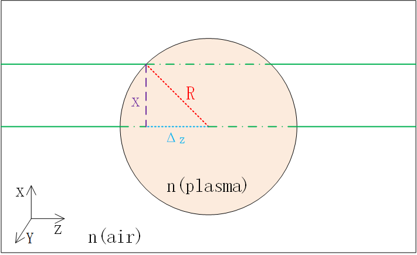

<center><font color="red">图13 圆柱形等离子体</font><cebnter>


> 视觉角度：俯视图；
>
> 图示：z轴正方向为光线传播方向，x轴正方向为世界坐标系的水平方向，y轴为世界坐标系的垂直方向。

在上图中，我们可以看到，当光线通过等离子体柱之后，会发生一个**与x轴方向相关的相移**，并且假设等离子体柱贯穿整个激光光束区域（想象为等离子体柱的高度很长很长，光束没法将整个等离子体包含）。

所以，我们可以得到下面公式的关系：
$$
\Delta z (x) = \sqrt {R^2 - x^2}
$$
上式中，R为等离子体柱的半径， $\Delta z$ 为距离主光轴为`x`的光线穿过等离子体柱的一半距离。

所以，可以将**完整的相移变化**表示为下面的分段函数形式：
$$
\Delta \Phi (x)=
\begin{cases} 
k(air) \cdot 2R
\quad \quad \quad\quad \quad \quad\quad \quad \quad\quad \quad \quad\quad \quad \quad\quad \quad \quad \quad \quad   ,|x|>R 
\\ 
\\
k(air) \cdot (2R - 2 \cdot \Delta z(x)) + k(plasma) \cdot 2 \cdot \Delta  z(x)  
\quad \quad \quad \quad   ,|x| \leq R
\end{cases}
$$

上式中， $k(air) = \frac{2 \pi n(air)}{\lambda}$ ， $k(plasma) = \frac{2 \pi n(plasma)}{\lambda}$ 。

当激光束与光轴之间的距离大于圆柱形等离子体半径 `R` 时，激光束的相移取决于传播 `2R` 距离的空气介质；

当激光束与光轴之间的距离小于圆柱形等离子体半径`R` 时，激光束的相移取决于传播 $2R - 2 \cdot \Delta z(x)$ 距离的圆柱外部的空气介质和传播 $\Delta z(x)$ 距离的圆柱内部等离子体介质。

此时，基于波动光学知识，可以得到**通过等离子体柱后的电场**，为初始激光束乘以等离子柱引起的相移，公式如下所示：
$$
U(x,y) = g(x,y)\cdot t(x,y)= g(x,y) \cdot \exp(i \cdot \Delta \Phi(x))
$$
上式中， `g(x,y)` 表示激光束在电场中呈高斯分布的光源，由 [激光光源](#Laser Source（激光光源）) 得到。 $t(x,y)$ 反应的是等离子体柱影响光源的相位量。 


#### Main Logic（主逻辑）

基于纹影法装置，按照光的传播方向，将已经知道的**整体内容**整理如下：

- 光源的模型表达式，由 [激光光源](#Laser Source（激光光源）) 得到：$g(x,y)=A(- \exp(\frac {(x-x_0)^2} {2 \sigma _x^2} + \frac {(y-y_0)^2} {2 \sigma _y^2}))$ 。
- 光线经过等离子体柱之后的电场公式，由[圆柱形等离子体](#Plasma Cylinder（圆柱形等离子体）) 得到： $U(x,y) = g(x,y)\cdot t(x,y)= g(x,y) \cdot \exp(i \cdot \Delta \Phi(x))$ 。
- 光线经过第一个凸透镜的之后，在到达刀口前的电场，由[透镜的傅里叶特性](#Fourier Properties of the lens（透镜的傅里叶特性）) 得到： $U_2^- (x,y) 
  =
  \frac {\exp (i \frac{k}{2 f} (x^2 + y^2) (1- \frac {d}{f} )) }
  {f \lambda}
  \cdot
  \iint _{-\infty}^{+\infty}
  U(\xi, \eta)
  \exp( -  \frac  {ik } {f} ( x \xi +  y  \eta) )
  {f}
  d \xi d \eta$ ，其中积分部分使用傅里叶变化结算，详细参看 [透镜傅里叶特性的MATLAB表示](#Fourier Properties of the lens in MATLAB（透镜傅里叶特性的MATLAB表示）) 。
- 光线经过刀口之后的电场，由[刀口衍射理论](#Knife-edge diffraction theory（刀口衍射理论）)  得到： $U_2^+ (x,y)  = H(x) \cdot U_2^-  (x,y)$ 。
- 光线经过第二个凸透镜，到达像平面的电场，由[透镜的傅里叶特性](#Fourier Properties of the lens（透镜的傅里叶特性）) 得到： $U_3 (x,y) 
  =
  \frac { 2 \pi}
  {f_4 \lambda}
  \cdot
  \mathcal{F} (U_2^+(x,y))
  (\frac {k}{f_4} x , \frac {k}{f_4} y )$ ，详细参看 [透镜傅里叶特性的MATLAB表示](#Fourier Properties of the lens in MATLAB（透镜傅里叶特性的MATLAB表示）) 。

> 上面所述中，涉及的**辅助量**如下所示：
>
> 1.圆柱形等离子体引起的相移变化，由[圆柱形等离子体](#Plasma Cylinder（圆柱形等离子体）) 得到：$\Delta \Phi (x)=
> \begin{cases} 
> k(air) \cdot 2R
> \quad \quad \quad\quad \quad \quad\quad \quad \quad\quad \quad \quad\quad \quad \quad\quad \quad \quad \quad \quad   ,|x|>R 
> \\ 
> \\
> k(air) \cdot (2R - 2 \cdot \Delta z(x)) + k(plasma) \cdot 2 \cdot \Delta z(x)  
> \quad \quad \quad \quad  ,|x| \leq R
> \end{cases}$ 
>
> 2.刀口对电场的影响，由[刀口衍射理论](#Knife-edge diffraction theory（刀口衍射理论）)  得到： $H(x) = 
> \begin{cases} 
> 0  \quad \quad \quad \quad ，x < 0
> \\ 
> 1 \quad \quad \quad \quad ， x \geq 0
> \end{cases}$ 

接着进行**编码验证**环节，但是我们需要了解MATLAB中的傅里叶变化实现与原理，具体内容查看[MATLAB中的傅里叶变化](#Fourier transform in MATLAB（MATLAB中的傅里叶变化）) 。


#### Main Code (主代码)

综合上述内容，我们可以进行相应的编码：

- 主代码（SchlierenPlasmaCylinder.m）：

  ```matlab
  %%%%%%%%%%%%%%%%%%%%%%%%%%%%%%%%%%%%%%%%%%%%%%%%%%%%%%%%%%%%%%%%%%%%%%%%%%%
  %
  % Schlieren MATLAB code
  % 
  % %%%%%%%%%%%%%%%%%%%%%%%%%%%%%%%%%%%%%%%%%%%%%%%%%%%%%%%%%%%%%%%%%%%%%%%%%
  
  clear; 
  clc;  
  clf;
  close all;
  
  %% Gaussian beam 
  % Field size and sampling
  % Set 5 * 5 mm field
  % Sampling 1024+ pixel
  L0 = 5e-3;
  Nx = 1024 + 1;
  Ny = 4096 + 1;
  x = L0 * linspace(-1, 1, Nx);  
  y = L0 * linspace(-1, 1, Ny);
  [X, Y] = meshgrid(x, y); 
  
  
  % Laser Standard deviation 
  % Set 1 mm
  % Variable sigma_r
  sigma_r = 1e-3;
  
  % Wave length
  % Green
  % Variable lambda
  lambda = 532e-9;
  
  % Gaussian function with a = A, b = x-scale, c = y-scale, d = laser standard deviation
  f_gauss2D = @(a,b,c,d) (a .* exp(- ((b.^2 + c.^2) / (2 * ((d).^2)))));
  U0 = f_gauss2D( 1, X, Y, sigma_r );
  
  % Figure
  figure(1);
  mesh(X, Y, U0);
  
  if (mod(Nx, 2)==0)
  	halfNx = Nx / 2;
  else
  	halfNx = (Nx + 1) / 2;
  end
  figure(2);
  plot(x, U0(halfNx, :), 'c');
  grid on;
  
  %% Plasma Cylinder
  
  % Plasma Cylinder diameter
  % Set 0.8 mm
  % Variable r
  r = 0.8e-3;
  
  % Air（n1） and Plasma Refractive（n2）
  % n2 < n1
  % Variable n2
  n1 = 1;
  n2 = 1 - 4 * 10^(-3);
  
  U1 = plasmaCylinder( U0, X, Y, r, n1, n2, lambda );
  
  
  
  % Figure
  % for i = 1: size(U1, 1)
  %     ComplexDouble = U1(i, :);
  %     ComplexDouble(imag(ComplexDouble) ~= 0) = abs(ComplexDouble(imag(ComplexDouble)~=0));
  %     U1(i, :) = ComplexDouble;
  % end 
  % figure(11);
  % mesh(X, Y, U1);
  
  
  %% First Len Properties
  
  % Focal length of lens
  % Variable d, f
  d = 100e-3;
  f = 100e-3;
  
  [ U2, Lx2, Ly2 ] = firstLenProperties( U1, L0, L0, X, Y, lambda, f, d );
  
  
  % Figure
  % for i = 1: size(U2, 1)
  %     ComplexDouble = U2(i, :);
  %     ComplexDouble(imag(ComplexDouble) ~= 0) = abs(ComplexDouble(imag(ComplexDouble)~=0));
  %     U2(i, :) = ComplexDouble;
  % end    
  % figure(21);
  % mesh(X, Y, U2);
  
  
  %% Knife Edge
  
  % knife edge position
  % Variable p
  % Default p = 0, expression the knife edge in the focal position
  p = 0;
  
  [ U3 ] = knifeEdge( U2, X, Y, p );
  
  % Figure
  % for i = 1: size(U3, 1)
  %     ComplexDouble = U3(i, :);
  %     ComplexDouble(imag(ComplexDouble) ~= 0) = abs(ComplexDouble(imag(ComplexDouble)~=0));
  %     U3(i, :) = ComplexDouble;
  % end    
  % figure(31);
  % mesh(X, Y, U3);
  
  
  %% Second Len Properties
  
  % Focal length of lens
  % Variable z
  z = 100e-3;
  
  [ U4, Lx2, Ly2 ] = secondLenProperties( U3, Lx2, Ly2, lambda, z );
  
  % Figure
  for i = 1: size(U4, 1)
      ComplexDouble = U4(i, :);
      ComplexDouble(imag(ComplexDouble) ~= 0) = abs(ComplexDouble(imag(ComplexDouble)~=0));
      U4(i, :) = ComplexDouble;
  end    
  figure(41);
  mesh(X, Y, U4);
  
  figure(42);
  imagesc(U4);
  
  if (mod(Nx, 2)==0)
  	halfNx = Nx / 2;
  else
  	halfNx = (Nx + 1) / 2;
  end
  figure(43);
  plot(x, U4(halfNx, :), 'c');
  grid on;
  
  figure(44);
  plot(x, U4(halfNx, :), 'b');
  hold on;
  axis([-2e-3, 2e-3, 0, 1.2e-3]);
  grid on;
  
  ```

- 圆柱形等离子体柱代码，参看 [plasmaCylinder](#plasmaCylinder.m)：

- 第一个凸透镜代码，参见 [firstLenProperties](#firstLenProperties.m)：

-  刀口代码，参见 [knifeEdge](#knifeEdge.m)：

-  第二个凸透镜代码，参见 [secondLenProperties](#secondLenProperties.m)：


#### Main Setup（主装置）  

基于主逻辑，主代码和纹影图，将所有信息合成一张图，方便理解，如下图所示：

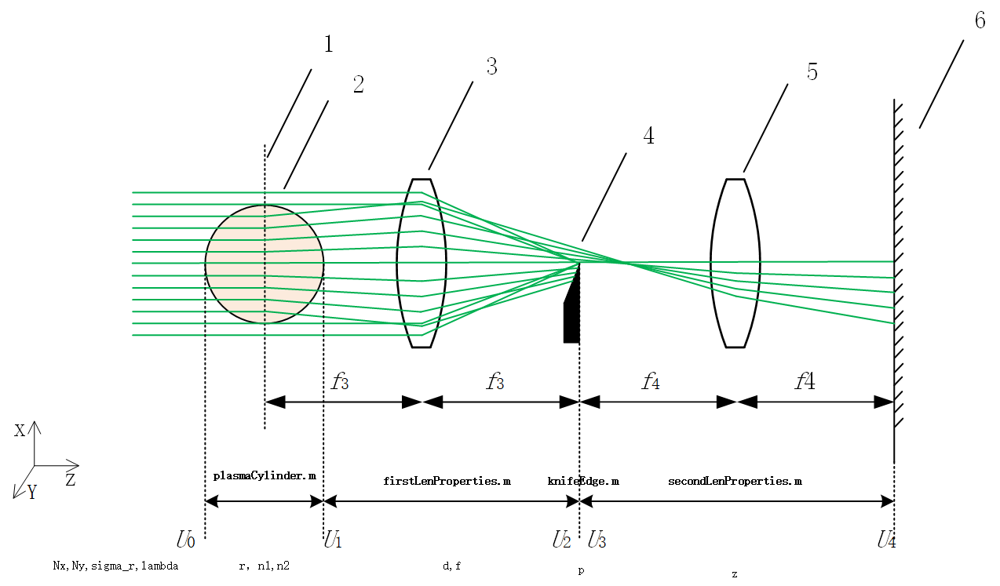

<center><font color="red">图14 纹影法主装置</font><cebnter>

> 视觉角度：俯视图；
>
> 图示：1-物平面，2-被测对象，3-凸透镜，4-刀口（刀口实物图见附录），5-凸透镜，6-像平面。
>
> 电场：U0，U1，U2，U3，U4。
>
> 函数：xxx.m 。
>
> 变量：Nx，Ny，sigma_r，lambda，r，n1，n2，d，f，p，z。


#### Main Result（主结果）

在仿真的时候，设置**光源的信息**如下：

```matlab
L0 = 5e-3;  % 光源电场范围 5 m x 5mm
Nx = 4096 + 1;  % x 方向采样 4097个点，奇数点有利于ifftshift
Ny = 1024 + 1;  % y 方向采样 1025个点
sigma_r = 1e-3;  % 激光束标准差
lambda = 532e-9;  % 激光束为绿光
```

**等离子柱的信息**如下：

```matlab
r = 0.8e-3;  % 等离子体柱的半径
n1 = 1;  % 空气的折射率
n2 = 1 - 4 * 10^(-3);  % 等离子体的折射率
```

**第一个凸透镜的信息**如下：

```matlab
d = 100e-3;  % 等离子体距离透镜的前距离
f = 100e-3;  % 透镜的后焦距
```

**刀口的信息**如下：

```matlab
p = 0;  % 刀口与主光轴之间的垂直距离
```

**第二个透镜的信息**如下：

```matlab
z = 100e-3;  % 透镜的焦距（假设的是相平面刚好在焦平面上）
```

**光源图像**：


<center><font color="red">图15 光源三维图像</font><cebnter>


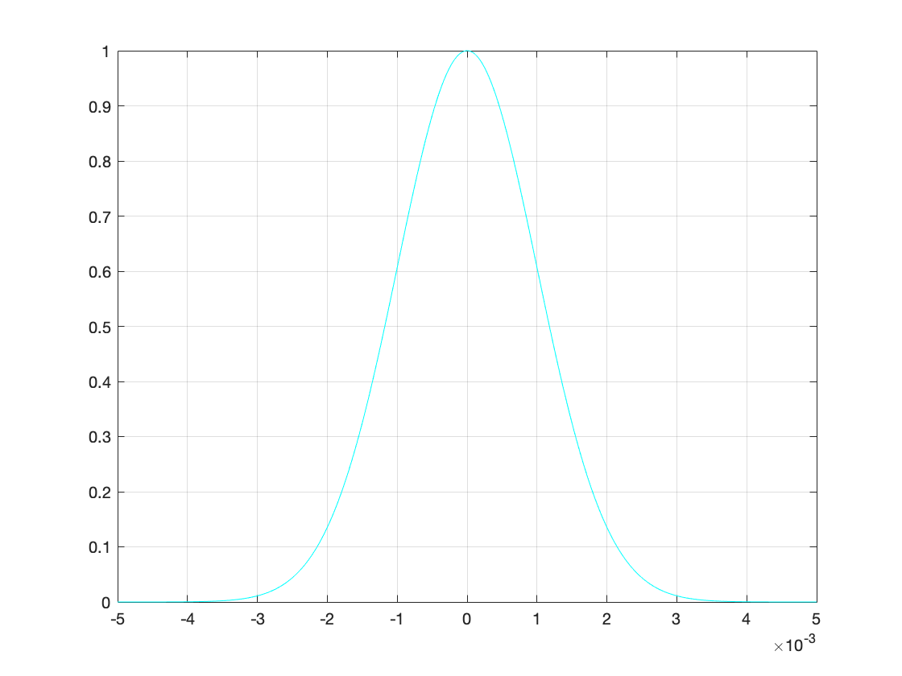

<center><font color="red">图16 光源中心线强度图</font><cebnter>


**纹影图像**：


<center><font color="red">图17 纹影图</font><cebnter>


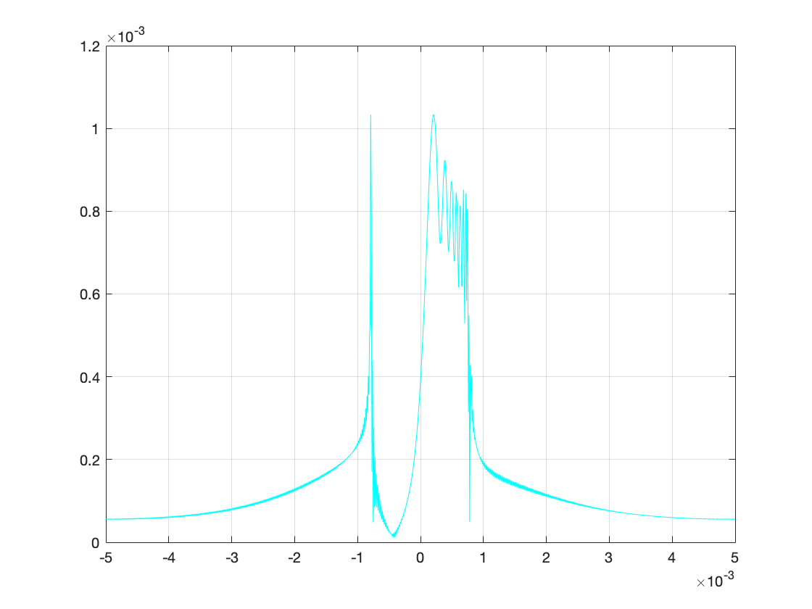

<center><font color="red">图18 纹影中心曲线图</font><cebnter>


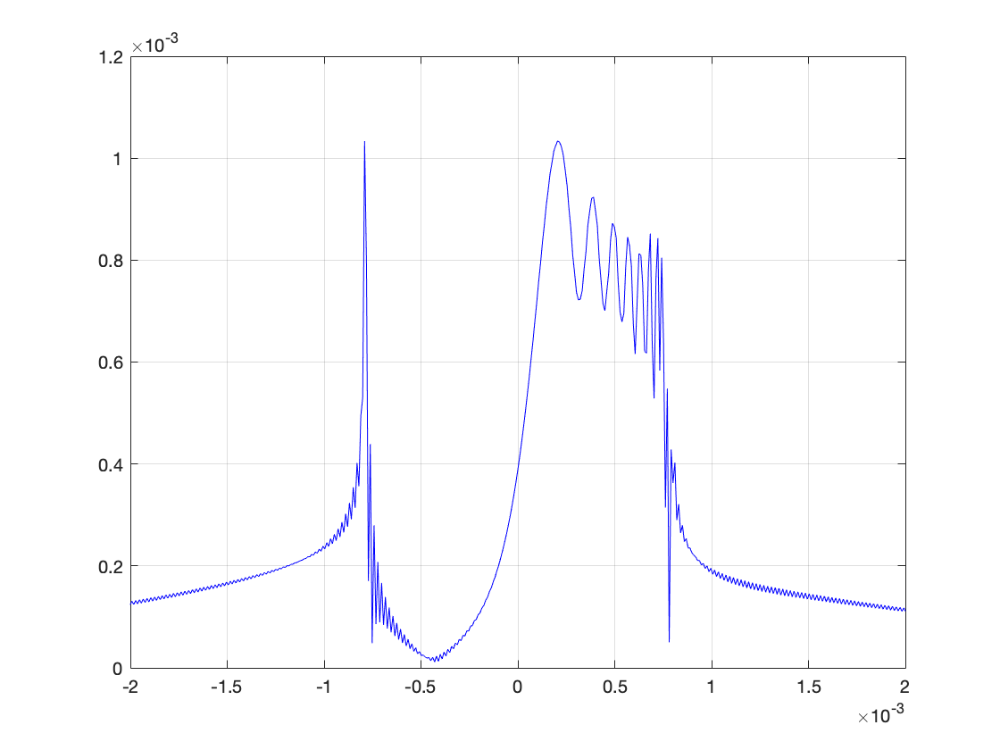

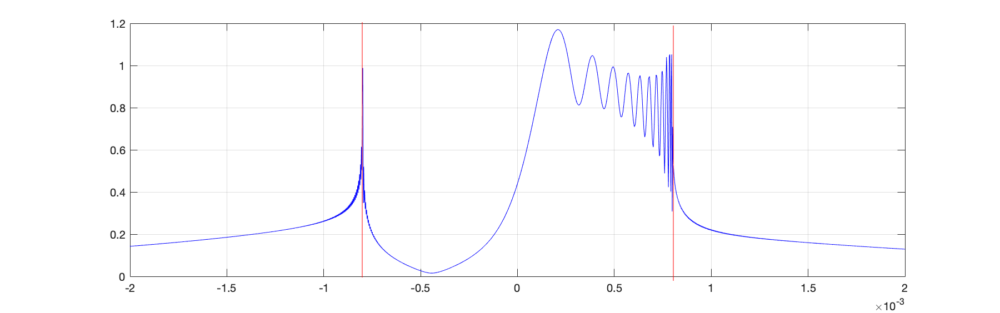

<center><font color="red">图18 纹影中心曲线图（放大版）</font><cebnter>


**分析结果**：

从纹影图可以看到，左半部分的强度为0，右半部分的强度为常数，与**射线光学**相似，参考 [Main Setup（主装置）](Main Setup（主装置）) 。

从纹影中心曲线图可以看到，在右半部分，存在一个明显的**振荡**，其产生的原因是刀口的**衍射效应**。

影响振荡的参数有：激光的波长lambda，等离子体半径r，刀片的位置p。（在这里将光源的激光束标准差，光束大小，空气折射率，透镜焦距作为一个系统的不变量。）

从纹影中心曲线图(放大版)可以看到，在左半部分，$x \approx 0.8$ 位置也会有强大，其是由于刀口周围的衍射弯曲光导致的。

我们可以看到，**等离子体柱的直径**等于纹影中心曲线图中右边振荡减缓区域与左边红线之间的距离。


#### Variable n2(变量n2)

基于基本参数，改变等离子体的折射率，看最终的纹影图变化。

**基本参数**：

设置**光源的信息**如下：

```matlab
L0 = 5e-3;  % 光源电场范围 5 m x 5mm
Nx = 4096  + 1;  % x 方向采样 4096 个点，奇数点有利于ifftshift
Ny = 1024 + 1;  % y 方向采样 1025个点
sigma_r = 1e-3;  % 激光束标准差
lambda = 532e-9;  % 激光束为绿光
```

**等离子柱的信息**如下：

```matlab
r = 0.8e-3;  % 等离子体柱的半径
n1 = 1;  % 空气的折射率
% n2 = 变量;  % 等离子体的折射率
```

**第一个凸透镜的信息**如下：

```matlab
d = 100e-3;  % 等离子体距离透镜的前距离
f = 100e-3;  % 透镜的后焦距
```

**刀口的信息**如下：

```matlab
p = 0;  % 刀口与主光轴之间的垂直距离
```

**第二个透镜的信息**如下：

```matlab
z = 100e-3;  % 透镜的焦距（假设的是相平面刚好在焦平面上）
```

当改变等离子体的折射率之后，我们可以得到**对应的图像**，如下所示：

当 $n2 = 1 - 4 * 10^{-4}$ 时：

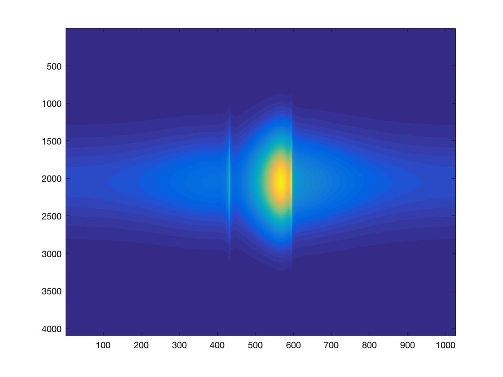

<center><font color="red">图19 纹影图像（0.9996）</font><cebnter>

当 $n2 = 1 - 4 * 10^{-3}$ 时：

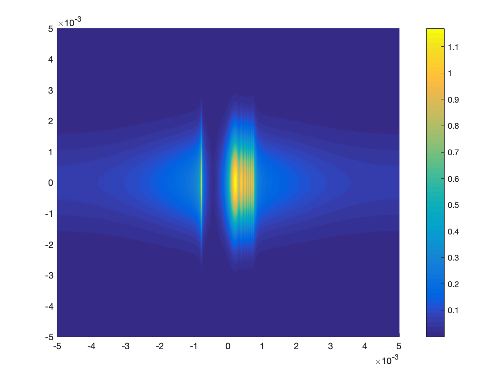

<center><font color="red">图20 纹影图像（0.9960）</font><cebnter>

当 $n2 = 1 - 4 * 10^{-2}$ 时：

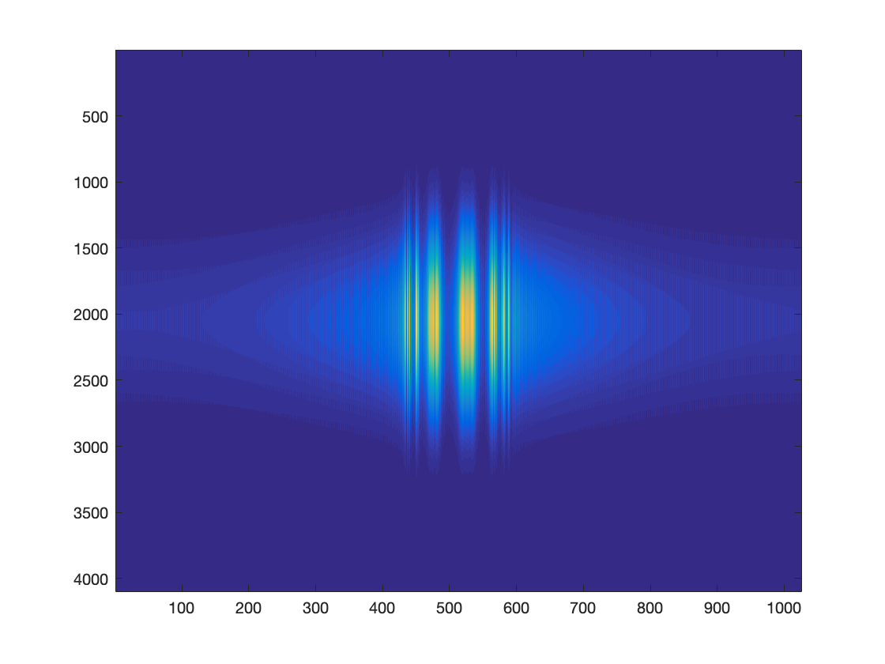

<center><font color="red">图21 纹影图像（0.9600）</font><cebnter>

**分析**：

观察上图中衍射图像的变化，知道等离子体的折射率与空气的折射率越接近，刀口的阻挡作用越明显。

随着等离子体折射率的降低，最终可以在图像上看到完整的信息，但是左右两端的信号减弱区域之间的距离一直没有变化，而这个变化就是我们的等离子体直径。


#### Variable r（变量r）

设置**光源的信息**如下：

```matlab
L0 = 5e-3;  % 光源电场范围 5 m x 5mm
Nx = 4096  + 1;  % x 方向采样 4096 个点，奇数点有利于ifftshift
Ny = 1024 + 1;  % y 方向采样 1025个点
sigma_r = 1e-3;  % 激光束标准差
lambda = 532e-9;  % 激光束为绿光
```

**等离子柱的信息**如下：

```matlab
% r = 0.8e-3;  % 等离子体柱的半径 % 变量
n1 = 1;  % 空气的折射率
n2 = 1 - 4 * 10^(-3);  % 等离子体的折射率
```

**第一个凸透镜的信息**如下：

```matlab
d = 100e-3;  % 等离子体距离透镜的前距离
f = 100e-3;  % 透镜的后焦距 
```

**刀口的信息**如下：

```matlab
p = 0;  % 刀口与主光轴之间的垂直距离
```

**第二个透镜的信息**如下：

```matlab
z = 100e-3;  % 透镜的焦距（假设的是相平面刚好在焦平面上）
```

当改变等离子体的半径之后，我们可以得到的图像如下所示：

当 $r = 0.6 e-3$ 时：

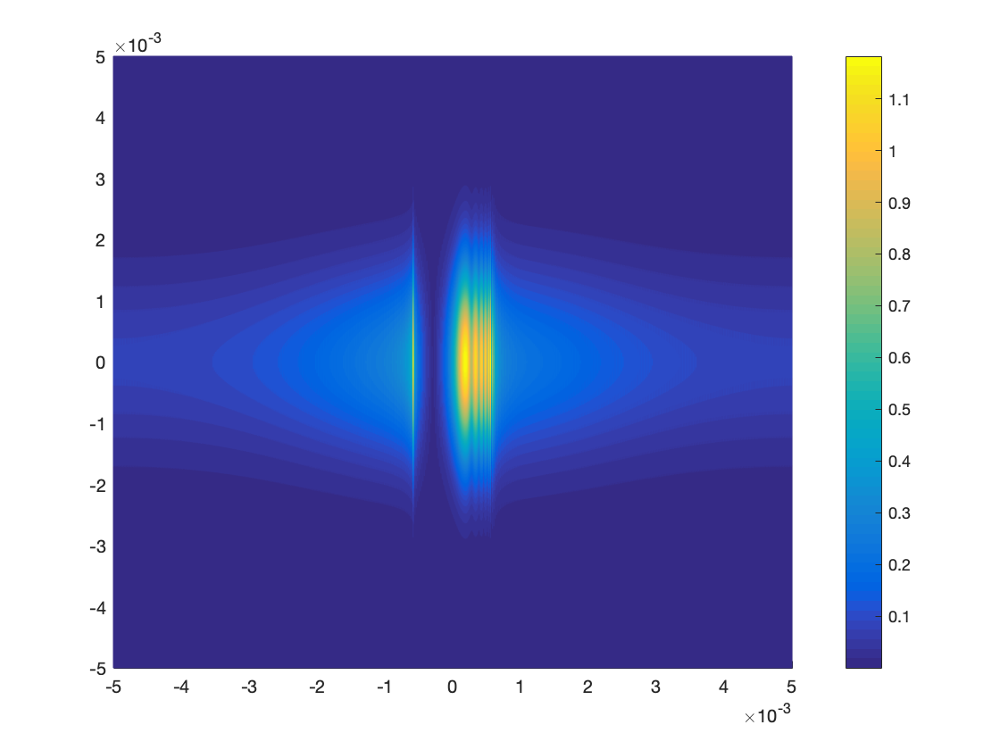

<center><font color="red">图22 纹影图像（0.6）</font><cebnter>

当 $r = 0.8  e-3$ 时：


<center><font color="red">图23 纹影图像（0.8）</font><cebnter>

当 $r = 1 e-3$ 时：

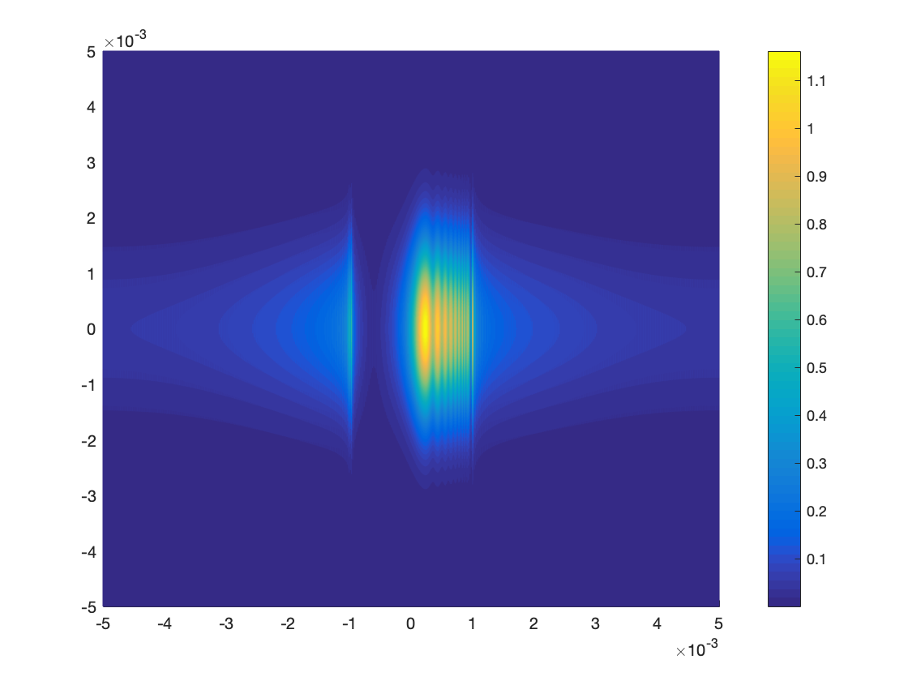

<center><font color="red">图24 纹影图像（1）</font><cebnter>

**分析**：

等离子体的半径的增大，导致两端信号减弱区域的增大。

图中右半部分的振荡区域，随着半径的增大，振荡幅度也相应增大。


#### Photoconductive Detector Result（光电探测器的结果）

光电探测器是平方强度探测器件，记录的强度信号正比于光电场强度和其复共轭乘积的时
间平均量。 

根据 [主逻辑](#Main Logic（主逻辑）) 中，光线经过第二个凸透镜，到达像平面的光电场，其表示为 $U_3 (x,y) $ ，

所以，可以得到光电探测器的强度信号为：
$$
I(x,y) = <U_3 (x,y) \cdot U_3^* (x,y) >
$$
其中， $ < \cdot > $ 表示时间平均，也可以表示为：
$$
I(x,y)= 
\lim_{T \rightarrow \infty} 
\frac{1}{2T}
\int_{-T}^{+T} 
U_3 (x,y)  U_3^* (x,y)dt
$$


> 参考资料：
>
> 1.基于时域和频域的光学相干层析成像系统的研究_邹恒
>
> 2.https://blog.csdn.net/Reborn_Lee/article/details/83511762
> 复共轭函数：conj(a) = real(a) - i*imag(a);


### Fuzzy Plasma Cylinder（模糊圆柱形等离子体）

在实际的实验中与生活中，我们不可能遇到完全规整的圆柱形等离子体，那么我们可以更进一步**假设**我们使用的等离子体是模糊圆柱形等离子体，那么就正式开始介绍了。

由于，模糊圆柱形等离子体柱不会与空气有明显的界限，在模型中，使用**波数**表示波在传播方向上不同区域的波的周期数目。

假设距离中心点**大于** $r_a$  的位置就全部是空气，其波数为 $k_a$ ；距离中心点**小于** $r_p$ 的位置就全是等离子体，其波数为 $k_p$ ；还剩下一个**距离区间** $[r_p , r_a]$ 的位置是等离子体和空气的混合，使用线性插值方式表示波数。

可以得到**模糊圆柱形等离子体的模型图**：

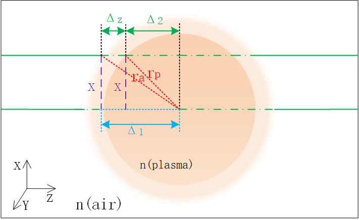

<center><font color="red">图25 模糊圆柱形等离子体的模型图</font><cebnter>

基于模型图，可以得到**波数的分段函数**表示：
$$
\Delta k_f(z, x) =
\begin{cases} 
k_a \quad \quad \quad \quad \quad \quad \quad \quad \quad ，\sqrt {z^2 + x^2} \geq r_a
\\ 
\\
m \cdot \sqrt {z^2 + x^2} + t \quad \quad \quad ， r_p \leq \sqrt {z^2 + x^2} < r_a
\\
\\
k_p \quad \quad \quad \quad \quad \quad \quad\quad \quad  ，\sqrt {z^2 + x^2} < r_p
\end{cases}
$$
其中**线性插值的参数**表示为：
$$
m  = \frac {k_a - k_p}{r_a - r_p}
\\
t  = k_a - m \cdot r_a
$$
基于模糊圆柱形等离子体的模型图，从光线的传播方向看，从左到右，可以看作总共穿过了三层，分别解释如下：

**第一层**，光线在空气中的传播，其传播距离为：
$$
s_{air} = 2 r_a - 2 \Delta_1 (x) = 2 r_a - 2 \sqrt {r_a^2 - x^2}
$$
所以，其引起的相位偏移为：
$$
\Delta \Phi_{air} (x) = k_a \cdot s_{air}
= k_a \cdot (2 r_a - 2 \sqrt {r_a^2 - x^2})
$$
**第二层**，光线在等离子体中的传播，其传播距离为：
$$
s_{plasma} = 2 \Delta_2 (x) =  2 \sqrt {r_p^2 - x^2}
$$
所以，其引起的相位偏移为：
$$
\Delta \Phi_{plasma} (x) = k_a \cdot s_{plasma}= k_a \cdot 2 \sqrt {r_p^2 - x^2}
$$
**第三层**，光线在空气和等离子体之间的传播，其传播距离为：
$$
s_{air, plasma} = 2 \Delta_1 (x) - 2 \Delta_2 (x) = 2 \sqrt {r_a^2 - x^2} - 2 \sqrt {r_p^2 - x^2}
$$
由于没有恒定的波数表示，使用其在光轴 $z $  方向上的无穷小相移 $dz$ 表示：
$$
d(\Delta \Phi_{air, plasma} (x, z) ) =  (m \cdot \sqrt {z^2 + x^2} + t ) dz
$$
我们可以使其表示为积分形式：
$$
\Delta \Phi_{air, plasma} (x)  =  2 z (m \cdot \sqrt {z^2 + x^2} + t) |_{z1}^{z2}
$$
继续化简得到：
$$
\Delta \Phi_{air, plasma} (x)  =  2 z t + 2 z  m \cdot \sqrt {z^2 + x^2}  |_{z1}^{z2} 
\\
= 2 z t +  z  m \cdot \sqrt {z^2 + x^2} +  mx^2 log(z + \sqrt {z^2 + x^2})   |_{z1}^{z2}
$$
其中， $0$ ， $z_2 = \Delta_1 (x) $ 。

基于上述，我们可以看到光线穿过等离子体的**三种情况**，详细介绍如下：

**第一种**情况，当 $ |x| \geq r_a$ 时，也就是光线不经过等离子体区域，此时的相移变化可以表示为：
$$
\Delta \Phi (x) =  k_a \cdot 2r_a
$$
**第二种**情况，当 $  r_a > |x| \geq r_p $ 时，也就是光线只穿过空气和模糊区域的等离子体，不穿过全部是等离子体的区域，此时的相移变化可以表示为：
$$
\Delta \Phi (x) = \Delta \Phi_{air} (x) + \Delta \Phi_{air, plasma} (x) 
\\
= k_a \cdot (2 r_a - 2 \sqrt {r_a^2 - x^2}) + [2 z t +  z  m \cdot \sqrt {z^2 + x^2} + mx^2 log(z + \sqrt {z^2 + x^2})   |_{z1}^{z2}]
$$
**第三种**情况，当 $  r_p > |x| $ 时，也就是光线只穿过等离子体区域，此时的相移变化可以表示为：
$$
\Delta \Phi (x) =  \Delta \Phi_{plasma} (x) + \Delta \Phi_{air} (x) + \Delta \Phi_{air, plasma} (x) 
\\
= 
k_a \cdot 2 \sqrt {r_p^2 - x^2} 
+
k_a \cdot (2 r_a - 2 \sqrt {r_a^2 - x^2}) 
+ 
[2 z t +  z  m \cdot \sqrt {z^2 + x^2} + mx^2 log(z + \sqrt {z^2 + x^2})   |_{z1}^{z2}]
$$
综上，可以得到光线经过模糊圆柱形等离子体，其对于**电场的相移表达式**：
$$
\Delta \Phi (x)=
\begin{cases} 
k_a \cdot 2r_a 
\quad \quad \quad \quad \quad \quad \quad \quad \quad \quad \quad \quad \quad \quad \quad \quad \quad 
,  |x| \geq r_a
\\
\\
\Delta \Phi_{air} (x) + \Delta \Phi_{air, plasma} (x)
\quad \quad \quad \quad \quad \quad \quad \quad \quad 
,  r_a > |x| \geq r_p 
\\
\\
\Delta \Phi_{plasma} (x) + \Delta \Phi_{air} (x) + \Delta \Phi_{air, plasma} (x) 
\quad \quad 
,  r_p > |x| 
\end{cases}
$$
此时，基于波动光学知识，可以得到**通过模糊圆柱形等离子体后的电场**，为初始激光束乘以等离子柱引起的相移，公式如下所示：
$$
U(x,y) = g(x,y)\cdot t(x,y)= g(x,y) \cdot \exp(i \cdot \Delta \Phi(x))
$$
上式中， `g(x,y)` 表示激光束在电场中呈高斯分布的光源，由 [激光光源](#Laser Source（激光光源）) 得到。 $t(x,y)$ 反应的是等离子体柱影响光源的相位量。 


#### Main Logic（主逻辑）

基于纹影法装置，按照光的传播方向，将已经知道的**整体内容**整理如下：

- 光源的模型表达式，由 [激光光源](#Laser Source（激光光源）) 得到：$g(x,y)=A(- \exp(\frac {(x-x_0)^2} {2 \sigma _x^2} + \frac {(y-y_0)^2} {2 \sigma _y^2}))$ 。
- 光线经过等离子体柱之后的电场公式，由[模糊圆柱形等离子体](#Fuzzy Plasma Cylinder（模糊圆柱形等离子体）) 得到： $U(x,y) = g(x,y)\cdot t(x,y)= g(x,y) \cdot \exp(i \cdot \Delta \Phi(x))$ 。
- 光线经过第一个凸透镜的之后，在到达刀口前的电场，由[透镜的傅里叶特性](#Fourier Properties of the lens（透镜的傅里叶特性）) 得到： $U_2^- (x,y) 
  =
  \frac {\exp (i \frac{k}{2 f} (x^2 + y^2) (1- \frac {d}{f} )) }
  {f \lambda}
  \cdot
  \iint _{-\infty}^{+\infty}
  U(\xi, \eta)
  \exp( -  \frac  {ik } {f} ( x \xi +  y  \eta) )
  {f}
  d \xi d \eta$ ，其中积分部分使用傅里叶变化结算，详细参看 [透镜傅里叶特性的MATLAB表示](#Fourier Properties of the lens in MATLAB（透镜傅里叶特性的MATLAB表示）) 。
- 光线经过刀口之后的电场，由[刀口衍射理论](#Knife-edge diffraction theory（刀口衍射理论）)  得到： $U_2^+ (x,y)  = H(x) \cdot U_2^-  (x,y)$ 。
- 光线经过第二个凸透镜，到达像平面的电场，由[透镜的傅里叶特性](#Fourier Properties of the lens（透镜的傅里叶特性）) 得到： $U_3 (x,y) 
  =
  \frac { 2 \pi}
  {f_4 \lambda}
  \cdot
  \mathcal{F} (U_2^+(x,y))
  (\frac {k}{f_4} x , \frac {k}{f_4} y )$ ，详细参看 [透镜傅里叶特性的MATLAB表示](#Fourier Properties of the lens in MATLAB（透镜傅里叶特性的MATLAB表示）) 。

> 上面所述中，涉及的**辅助量**如下所示：
>
> 1.圆柱形等离子体引起的相移变化，由[模糊圆柱形等离子体](#Fuzzy Plasma Cylinder（模糊圆柱形等离子体）) 得到：$\Delta \Phi (x)=
> \begin{cases} 
> k_a \cdot 2r_a 
> \quad \quad \quad \quad \quad \quad \quad \quad \quad \quad \quad \quad \quad \quad \quad \quad \quad 
> ,  |x| \geq r_a
> \\
> \\
> \Delta \Phi_{air} (x) + \Delta \Phi_{air, plasma} (x)
> \quad \quad \quad \quad \quad \quad \quad \quad \quad 
> ,  r_a > |x| \geq r_p 
> \\
> \\
> \Delta \Phi_{plasma} (x) + \Delta \Phi_{air} (x) + \Delta \Phi_{air, plasma} (x) 
> \quad \quad 
> ,  r_p > |x| 
> \end{cases}$ 
>
> 2.刀口对电场的影响，由[刀口衍射理论](#Knife-edge diffraction theory（刀口衍射理论）)  得到： $H(x) = 
> \begin{cases} 
> 0  \quad \quad \quad \quad ，x < 0
> \\ 
> 1 \quad \quad \quad \quad ， x \geq 0
> \end{cases}$ 

接着进行**编码验证**环节，但是我们需要了解MATLAB中的傅里叶变化实现与原理，具体内容查看[MATLAB中的傅里叶变化](#Fourier transform in MATLAB（MATLAB中的傅里叶变化）) 。


#### Main Code (主代码)

综合上述内容，我们可以进行相应的编码：

- 主代码（SchlierenFuzzyPlasmaCylinder.m）：

  ```matlab
  %%%%%%%%%%%%%%%%%%%%%%%%%%%%%%%%%%%%%%%%%%%%%%%%%%%%%%%%%%%%%%%%%%%%%%%%%%%
  %
  % Schlieren MATLAB code
  % 
  % %%%%%%%%%%%%%%%%%%%%%%%%%%%%%%%%%%%%%%%%%%%%%%%%%%%%%%%%%%%%%%%%%%%%%%%%%
  
  clear; 
  clc;  
  clf;
  close all;
  
  %% Gaussian beam 
  % Field size and sampling
  % Set 5 * 5 mm field
  % Sampling 1024+ pixel
  L0 = 5e-3;
  Nx = 4096 + 1;
  Ny = 1024 + 1;
  x = L0 * linspace(-1, 1, Nx);  
  y = L0 * linspace(-1, 1, Ny);
  [X, Y] = meshgrid(x, y); 
  
  
  % Laser Standard deviation 
  % Set 1 mm
  % Variable sigma_r
  sigma_r = 1e-3;
  
  % Wave length
  % Green
  % Variable lambda
  lambda = 532e-9;
  
  % Gaussian function with a = A, b = x-scale, c = y-scale, d = laser standard deviation
  f_gauss2D = @(a,b,c,d) (a .* exp(- ((b.^2 + c.^2) / (2 * ((d).^2)))));
  U0 = f_gauss2D( 1, X, Y, sigma_r );
  
  % Figure
  figure(1);
  mesh(X, Y, U0);
  
  if (mod(Ny, 2)==0)
  	halfNy = Ny / 2;
  else
  	halfNy = (Ny + 1) / 2;
  end
  figure(2);
  plot(x, U0(halfNy, :), 'c');
  grid on;
  
  figure(3);
  imagesc(U0);
  
  %% Plasma Cylinder
  
  % Plasma Cylinder diameter
  % Set ra = 0.8 mm, rp = 0.7 * ra
  % Variable ra rp
  ra = 0.8e-3;
  rp = 0.7 * ra;
  
  % Air（n1） and Plasma Refractive（n2）
  % n2 < n1
  % Variable n2
  n1 = 1;
  n2 = 1 - 4 * 10^(-3);
  
  U1 = FuzzyPlasmaCylinder( U0, X, Y, ra, rp, n1, n2, lambda );
  
  
  % Figure
  % for i = 1: size(U1, 1)
  %     ComplexDouble = U1(i, :);
  %     ComplexDouble(imag(ComplexDouble) ~= 0) = abs(ComplexDouble(imag(ComplexDouble)~=0));
  %     U1(i, :) = ComplexDouble;
  % end 
  % figure(11);
  % mesh(X, Y, U1);
  
  
  %% First Len Properties
  
  % Focal length of lens
  % Variable d, f
  d = 100e-3;
  f = 100e-3;
  
  [ U2, Lx2, Ly2 ] = firstLenProperties( U1, L0, L0, X, Y, lambda, f, d );
  
  
  % Figure
  % for i = 1: size(U2, 1)
  %     ComplexDouble = U2(i, :);
  %     ComplexDouble(imag(ComplexDouble) ~= 0) = abs(ComplexDouble(imag(ComplexDouble)~=0));
  %     U2(i, :) = ComplexDouble;
  % end    
  % figure(21);
  % mesh(X, Y, U2);
  
  
  %% Knife Edge
  
  % knife edge position
  % Variable p
  % Default p = 0, expression the knife edge in the focal position
  p = 0;
  
  [ U3 ] = knifeEdge( U2, X, Y, p );
  
  % Figure
  % for i = 1: size(U3, 1)
  %     ComplexDouble = U3(i, :);
  %     ComplexDouble(imag(ComplexDouble) ~= 0) = abs(ComplexDouble(imag(ComplexDouble)~=0));
  %     U3(i, :) = ComplexDouble;
  % end    
  % figure(31);
  % mesh(X, Y, U3);
  
  
  %% Second Len Properties
  
  % Focal length of lens
  % Variable z
  z = 100e-3;
  
  [ U4, Lx2, Ly2 ] = secondLenProperties( U3, Lx2, Ly2, lambda, z );
  
  % Figure
  for i = 1: size(U4, 1)
      ComplexDouble = U4(i, :);
      ComplexDouble(imag(ComplexDouble) ~= 0) = abs(ComplexDouble(imag(ComplexDouble)~=0));
      U4(i, :) = ComplexDouble;
  end    
  figure(41);
  mesh(X, Y, U4);
  
  figure(42);
  imagesc(U4);
  
  if (mod(Ny, 2)==0)
  	halfNy = Ny / 2;
  else
  	halfNy = (Ny + 1) / 2;
  end
  figure(43);
  plot(x, U4(halfNy, :), 'c');
  grid on;
  
  figure(44);
  plot(x, U4(halfNy, :), 'b');
  hold on;
  axis([-2e-3, 2e-3, 0, 1.2]);
  grid on;
  
  ```

- 圆柱形等离子体柱代码，参看 [FuzzyPlasmaCylinder](#FuzzyPlasmaCylinder.m)：

- 第一个凸透镜代码，参见 [firstLenProperties](#firstLenProperties.m)：

- 刀口代码，参见 [knifeEdge](#knifeEdge.m)：

- 第二个凸透镜代码，参见 [secondLenProperties](#secondLenProperties.m)：


#### Main Setup（主装置）  

基于主逻辑，主代码和纹影图，将所有信息合成一张图，方便理解，如下图所示：


<center><font color="red">图26 纹影法主装置</font><cebnter>
> 视觉角度：俯视图；
>
> 图示：1-物平面，2-被测对象，3-凸透镜，4-刀口（刀口实物图见附录），5-凸透镜，6-像平面。
>
> 电场：U0，U1，U2，U3，U4。
>
> 函数：xxx.m 。
>
> 变量：Nx，Ny，sigma_r，lambda，ra，rp，n1，n2，d，f，p，z。


#### Main Result（主结果）

在仿真的时候，设置**光源的信息**如下：

```matlab
L0 = 5e-3;  % 光源电场范围 5 m x 5mm
Nx = 4096 + 1;  % x 方向采样 4097个点，奇数点有利于ifftshift
Ny = 1024 + 1;  % y 方向采样 1025个点
sigma_r = 1e-3;  % 激光束标准差
lambda = 532e-9;  % 激光束为绿光
```

**等离子柱的信息**如下：

```matlab
ra = 0.8e-3;  % 等离子体 和 等离子体和空气的混合部分 的半径，当大于此半径之后，就可以全部认为是空气
rp = 0.7 * ra;  % 等离子体 的半径，小于此半径的区域，认为全部是等离子体，目前取等离子体 和 等离子体和空气的混合部分 的半径 的0.7。
n1 = 1;  % 空气的折射率
n2 = 1 - 4 * 10^(-3);  % 等离子体的折射率
```

**第一个凸透镜的信息**如下：

```matlab
d = 100e-3;  % 等离子体距离透镜的前距离
f = 100e-3;  % 透镜的后焦距
```

**刀口的信息**如下：

```matlab
p = 0;  % 刀口与主光轴之间的垂直距离
```

**第二个透镜的信息**如下：

```matlab
z = 100e-3;  % 透镜的焦距（假设的是相平面刚好在焦平面上）
```


**光源图像**：


<center><font color="red">图27 光源三维图像</font><cebnter>


<center><font color="red">图28 光源中心线强度图</font><cebnter>


**纹影图像**：

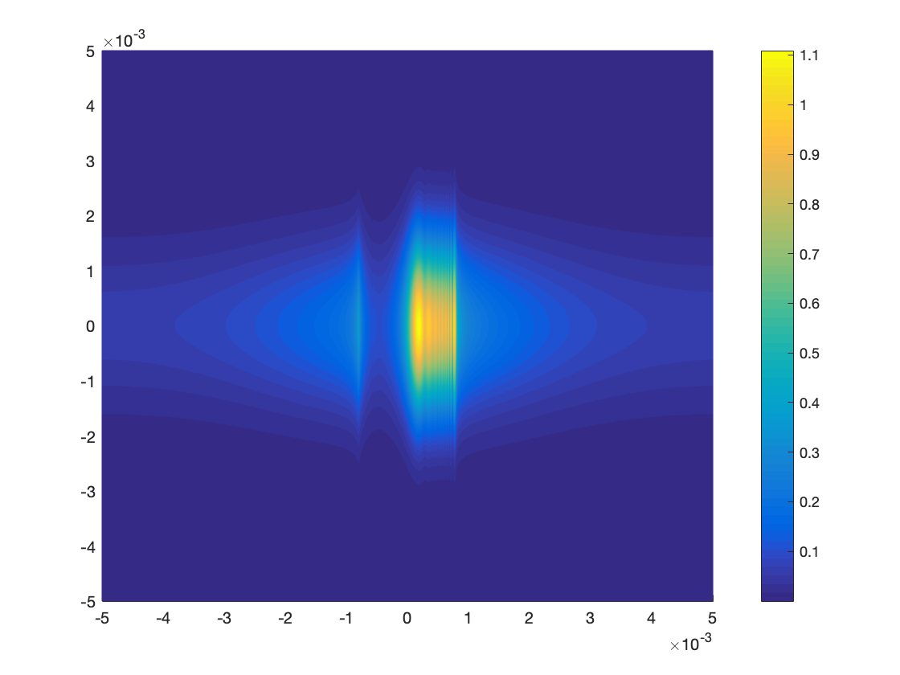

<center><font color="red">图29 纹影图</font><cebnter>


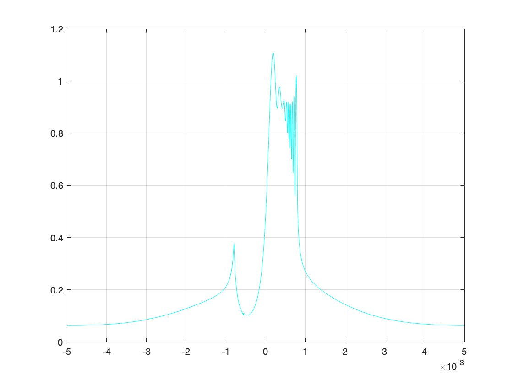

<center><font color="red">图30 纹影中心曲线图</font><cebnter>


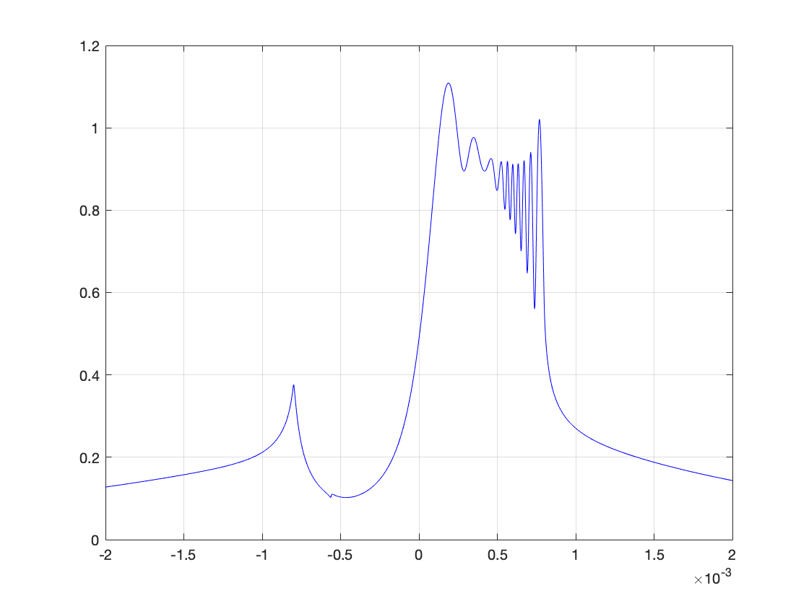


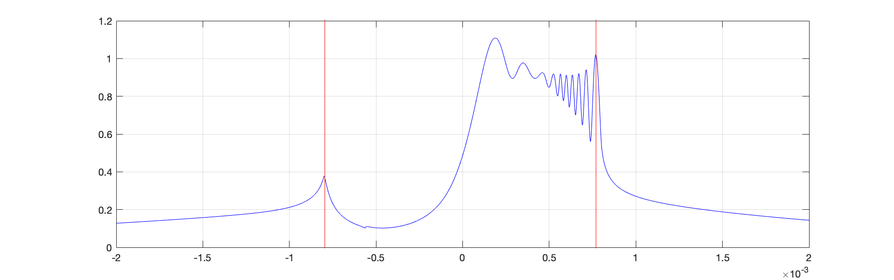

<center><font color="red">图31 纹影中心曲线图（放大版）</font><cebnter>


**分析结果**：

对比[圆柱形等离子体](#Plasma Cylinder（圆柱形等离子体）) 和 [模糊圆柱形等离子体](#Fuzzy Plasma Cylinder（模糊圆柱形等离子体）) 中的纹影中心曲线图，可以发现刀口放置位置处的峰值，在模糊圆柱形等离子体中降低了大约三分之二的高度。

在模糊圆柱形等离子体的模拟情况下，更加贴近真实的实验场景，但是实验中的等离子体柱也并不会完全是我们模糊圆柱形等离子体所描述的那样，还需要进一步探讨。


### Plasma Capillary（毛细血管形等离子体）


## Experimental(实验)

这一块，主要的任务是进行光学实验，并获得被测对象的**折射率**信息。


## Reference Data（参考数据）

> 本部分的内容主要是对于主体内容的补充，并且也会包括很多原理性的推导。
>
> 注：所有的公式推导都是在这一部分展示，主体中只会直接进行引用。

### 刀口实物图

刀口作为纹影装置的一个关键器件，一般的文献中会介绍相应的变体形状，如：单刀片，双刀口，四刀口，栅格刀口，圆孔刀口等。

下面展示的是一部分网络上刀口的图片。

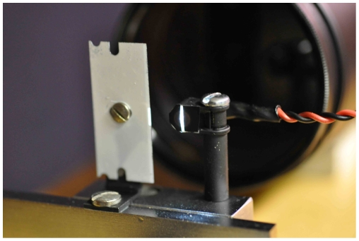

<center><font color="red">刀口1</font><cebnter>

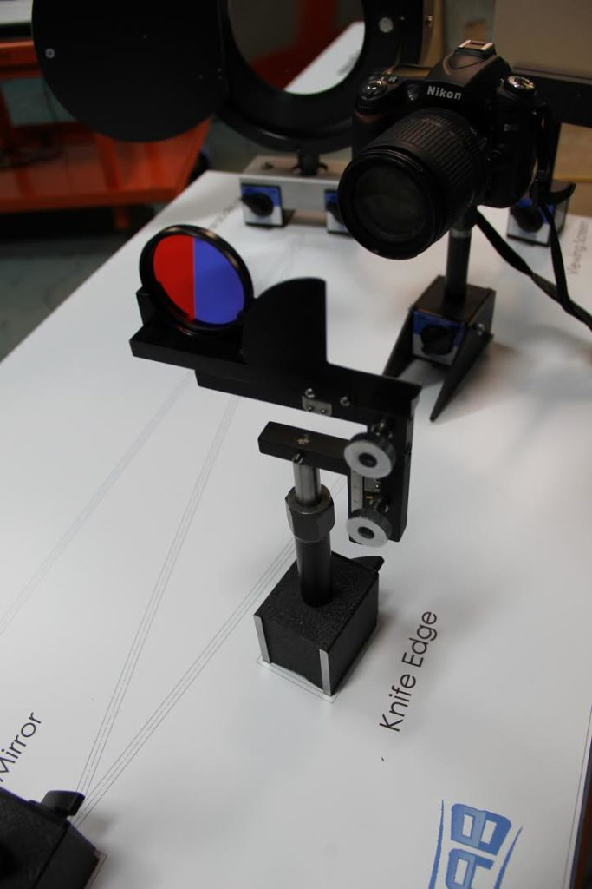

<center><font color="red">刀口2</font><cebnter>

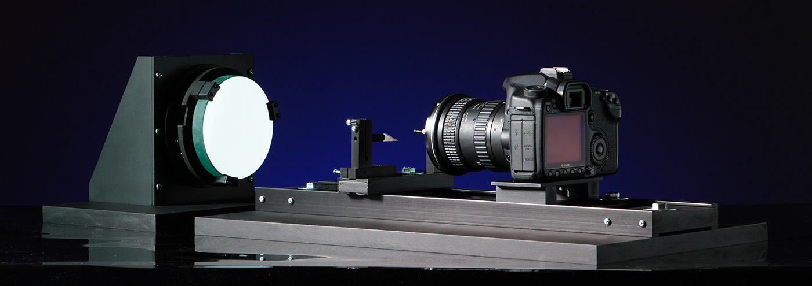

<center><font color="red">刀口3</font><cebnter>


### 摄像相机镜头的景深

这里需要详细的解释景深这个概念，等等内容。


### 中继成像系统

需要介绍什么是中继成像系统，目前知道的参考资料是一个专利：一种中继成像系统。


### 衍射效应

介绍相关概念，结合实验与仿真图进行解释。


### GaussianBeam.m

本示例代码实现了高斯光源的仿真。

详细原理描述见**Laser Source（激光光源）**。

```matlab
%% Gaussian beam 
clear; 
clc;  
clf;
close all;


% Field size and sampling
% Set 5 * 5 mm field
L0 = 5e-3;
Nx = 1000;
Ny = 1000;
x = L0 * linspace(-1, 1, Nx);  % linspace 均分计算指令，用于产生x1,x2之间的N 等分点
y = L0 * linspace(-1, 1, Ny);
[X, Y] = meshgrid(x, y);  % meshgrid 生成网格采样点的函数


% Standard deviation 
% Set 1 mm
sigma_r = 1e-3;


% Gaussian function with a=I0, b=x-scale, c=y-scale, d=standard deviation
% @是用于定义函数句柄的操作符
% 高斯光源
f_gauss2D = @(a,b,c,d) (a .* exp(-((b.^2+c.^2)/(2*((d).^2)))));
U0 = f_gauss2D(1, X, Y, sigma_r);

% Figure
figure(1);
mesh(X, Y, U0);

figure(2);
meshc(X, Y, U0);

figure(3);
imagesc(U0);

figure(4);
plot(x, U0(Nx/2, :), 'c');
grid on;
```


### 像素知识

借用摄影知识内容的像素补充这一块的知识。


### lenProperties.m

这个示例代码，实现了光线在透镜前焦平面的电场经过透镜，得到透镜后焦平面的电场。

详细内容参看：[透镜傅里叶特性的MATLAB表示](#Fourier Properties of the lens in MATLAB（透镜傅里叶特性的MATLAB表示）) 。

```matlab
function [ U2, Lx2, Ly2 ] = lenProperties( U1, Lx1, Ly1, lambda, z )
%%%%%%%%%%%%%%%%%%%%%%%%%%%%%%%%%%%%%%%%%%%%%%%%%%%%%%%%%%%%%%%%%%%%%%%%%%%
%
% Fourier Properties of the lens in MATLAB
% 
% %%%%%%%%%%%%%%%%%%%%%%%%%%%%%%%%% input  %%%%%%%%%%%%%%%%%%%%%%%%%%%%%%%%
% U1: 输入电场
% Lx1: 输入电场x方向尺寸
% Ly1: 输入电场y方向尺寸
% lambda: 激光波长 
% 
% %%%%%%%%%%%%%%%%%%%%%%%%%%%%%%%%% output  %%%%%%%%%%%%%%%%%%%%%%%%%%%%%%%
% U2: 输出电场
% Lx2: 输出电场x方向尺寸
% Ly2: 输出电场y方向尺寸
% 
% %%%%%%%%%%%%%%%%%%%%%%%%%%%%%%%%% warning：ifftshift and fftshift  %%%%%%
% ifftshift是按负方向（向左和向上）做圆周位移；
% fftshift 是将数组或矩阵按正方向（向右和向下）做圆周位移；
% 圆周位移的步长 等于数组或矩阵长度的一半，对于偶数是N/2，对于奇数是（N-1）/2；
% 对于偶数长的数组，fftshift和ifftshift的结果相同，而对于奇数长的数组，两者结果却不一样；
% 所以需要将N 设置为奇数。
% 
% %%%%%%%%%%%%%%%%%%%%%%%%%%%%%%%%% warning：1i  %%%%%%%%%%%%%%%%%%%%%%%%%%
% 常量中使用1i，表示为矩阵的行向量，也就是：  0.0000 + 1.0000i
% 
%%%%%%%%%%%%%%%%%%%%%%%%%%%%%%%%%%%%%%%%%%%%%%%%%%%%%%%%%%%%%%%%%%%%%%%%%%%

    [N, M] = size(U1);
    
    dx = Lx1 / N;
    dy = Ly1 / M;
    
    Lx2 = lambda * z / dx;
    Ly2 = lambda * z / dy;
    
    constant = 1 / (1i * lambda * z);
    
    U2 = constant * fftshift(fft2(ifftshift(U1))) * dx * dy;

end


```


### plasmaCylinder.m

这个代码是 [Plasma Cylinder（圆柱形等离子体）](#Plasma Cylinder（圆柱形等离子体）) 中，关于等离子体的数据模型表示。

```matlab
function [ U1 ] = plasmaCylinder( U0, X, Y, r, n1, n2, lambda )
%%%%%%%%%%%%%%%%%%%%%%%%%%%%%%%%%%%%%%%%%%%%%%%%%%%%%%%%%%%%%%%%%%%%%%%%%%%
%
% Plasma Cylinder
% 
% %%%%%%%%%%%%%%%%%%%%%%%%%%%%%%%%% input  %%%%%%%%%%%%%%%%%%%%%%%%%%%%%%%%
% U0: 平行光的电场（未进入圆柱形等离子体柱的电场）
% X: x 方向数据
% Y: y 方向数据
% r: 圆柱形等离子体柱的半径
% n1: 空气的折射率
% n2: 圆柱形等离子体柱的折射率
% lambda: 激光的波长
% 
% %%%%%%%%%%%%%%%%%%%%%%%%%%%%%%%%% output  %%%%%%%%%%%%%%%%%%%%%%%%%%%%%%%
% U1: 通过等离子体柱后的电场
% 
% %%%%%%%%%%%%%%%%%%%%%%%%%%%%%%%%% warning  %%%%%%%%%%%%%%%%%%%%%%%%%%%%%%%
% size(U0, 1) 表示取出的是Ny的大小
% size(U0, 2) 表示取出的是Nx的大小
% U0(:, i) 表示的是第i列的全部数据
% U0(i, :) 表示的是第i行的全部数据
% U0(a, b) 表示的是第a行第b行的数据点
% 
%%%%%%%%%%%%%%%%%%%%%%%%%%%%%%%%%%%%%%%%%%%%%%%%%%%%%%%%%%%%%%%%%%%%%%%%%%%

U1 = U0;

kAir = 2 * pi * n1 / lambda;
kPlasma = 2 * pi * n2 / lambda;

for i = 1 : size(U0, 2)
    if abs(X(1, i)) >= r
        U1(:, i) = U0(:, i) .* exp(1i * kAir * 2 * r);

    else
        Delta = sqrt(r^2 - X(1, i)^2);
        U1(:, i) = U0(:, i) .* exp(1i * (kAir * 2 * ( r - Delta) + kPlasma * 2 * Delta));

    end
end


```


### FuzzyPlasmaCylinder.m

这个代码是 [模糊圆柱形等离子体](#Fuzzy Plasma Cylinder（模糊圆柱形等离子体）) 中，关于等离子体的数据模型表示。

```matlab
function [ U1 ] = FuzzyPlasmaCylinder( U0, X, Y, ra, rp, n1, n2, lambda )
%%%%%%%%%%%%%%%%%%%%%%%%%%%%%%%%%%%%%%%%%%%%%%%%%%%%%%%%%%%%%%%%%%%%%%%%%%%
%
% Fuzzy Plasma Cylinder
% 
% %%%%%%%%%%%%%%%%%%%%%%%%%%%%%%%%% input  %%%%%%%%%%%%%%%%%%%%%%%%%%%%%%%%
% U0: 平行光的电场（未进入模糊圆柱形等离子体的电场）
% X: x 方向数据
% Y: y 方向数据
% ra: 等离子体的半径, 表示的是大于这个值之后就全是空气, 包含等离子体 和 等离子体与空气混合 部分。
% rp: 表示的是小于这个值之后就全是等离子体
% n1: 空气的折射率
% n2: 圆柱形等离子体柱的折射率
% lambda: 激光的波长
% 
% %%%%%%%%%%%%%%%%%%%%%%%%%%%%%%%%% output  %%%%%%%%%%%%%%%%%%%%%%%%%%%%%%%
% U1: 通过模糊圆柱柱形等离子体后的电场
%  
% %%%%%%%%%%%%%%%%%%%%%%%%%%%%%%%%% warning  %%%%%%%%%%%%%%%%%%%%%%%%%%%%%%%
% size(U0, 1) 表示取出的是Ny的大小
% size(U0, 2) 表示取出的是Nx的大小
% U0(:, i) 表示的是第i列的全部数据
% U0(i, :) 表示的是第i行的全部数据
% U0(a, b) 表示的是第a行第b行的数据点
% m, t  表示的是等离子体与空气混合部分的波数 的线性插值的参数
% 
%%%%%%%%%%%%%%%%%%%%%%%%%%%%%%%%%%%%%%%%%%%%%%%%%%%%%%%%%%%%%%%%%%%%%%%%%%%

U1 = U0;

kAir = 2 * pi * n1 / lambda;
kPlasma = 2 * pi * n2 / lambda;

m = (kAir - kPlasma) / (ra - rp);
t = kAir - m * ra;
p = @(z , x) z * t + 0.5 * z * m * sqrt(z^2 + x^2) + 0.5 * m * x^2 * log(z + sqrt(z^2 + x^2));

for i = 1 : size(U0, 2) 

	if (abs(X(1, i)) >= ra)
		U1(:, i) = U0(:, i) .* exp(1i * kAir * 2 * ra);

	elseif (abs(X(1, i)) >= rp)
		x = abs(X(1, i));
		z1 = sqrt(ra^2 - x^2);
		z2 = 0;

		DeltaPhiAir = kAir * (2 * ra - 2 * (sqrt(ra^2 - x^2)));
		DeltaPhiAirPlasma = 2 * ( p(z1, x) - p(z2, x) );
		
		U1(:, i) = U0(:, i) .* exp(1i * (DeltaPhiAir + DeltaPhiAirPlasma));

	else
		x = abs(X(1, i));
		z1 = sqrt(ra^2 - x^2);
		z2 = sqrt(rp^2 - x^2);

		if x ~= 0
			HalfDeltaAirPlasma = p(z1, x) - p(z2, x);
		else
			HalfDeltaAirPlasma = p(z1, 1e-15) - p(z2, 1e-15);
		end


		DeltaPhiAir = kAir * (2 * ra - 2 * (sqrt(ra^2 - x^2)));
		DeltaPhiAirPlasma = 2 * HalfDeltaAirPlasma;
		DeltaPhiPlasma = kPlasma * (2 * (sqrt(rp^2 - x^2)));

		U1(:, i) = U0(:, i) .* exp(1i * (DeltaPhiAir + DeltaPhiAirPlasma + DeltaPhiPlasma));

	end
end


```


### firstLenProperties.m

这个代码表示的是，穿过等离子体之后的光线电场，经过第一个凸透镜之后，在透镜后焦点位置的电场数据模型表示。

详细内容参看：[透镜傅里叶特性的MATLAB表示](#Fourier Properties of the lens in MATLAB（透镜傅里叶特性的MATLAB表示）) 。

```matlab
function [ U2, Lx2, Ly2 ] = firstLenProperties( U1, Lx1, Ly1, X, Y, lambda, f, d )
%%%%%%%%%%%%%%%%%%%%%%%%%%%%%%%%%%%%%%%%%%%%%%%%%%%%%%%%%%%%%%%%%%%%%%%%%%%
%
% Fourier Properties of the lens in MATLAB 
% 
% %%%%%%%%%%%%%%%%%%%%%%%%%%%%%%%%% input  %%%%%%%%%%%%%%%%%%%%%%%%%%%%%%%%
% U1: 输入电场
% Lx1: 输入电场x方向尺寸
% Ly1: 输入电场y方向尺寸
% X: x 方向数据
% Y: y 方向数据
% lambda: 激光波长 
% f: 透镜后电场距离（焦距）
% d: 透镜前电场距离（表示一定的距离，特例是等于焦距）
% 注：此时的输入的电场是一个距离透镜为d的，刚刚经过等离子体区域的电场
% 
% %%%%%%%%%%%%%%%%%%%%%%%%%%%%%%%%% output  %%%%%%%%%%%%%%%%%%%%%%%%%%%%%%%
% U2: 输出电场
% Lx2: 输出电场x方向尺寸
% Ly2: 输出电场y方向尺寸
% 
% %%%%%%%%%%%%%%%%%%%%%%%%%%%%%%%%% warning：ifftshift and fftshift  %%%%%%
% ifftshift是按负方向（向左和向上）做圆周位移；
% fftshift 是将数组或矩阵按正方向（向右和向下）做圆周位移；
% 圆周位移的步长 等于数组或矩阵长度的一半，对于偶数是N/2，对于奇数是（N-1）/2；
% 对于偶数长的数组，fftshift和ifftshift的结果相同，而对于奇数长的数组，两者结果却不一样；
% 所以需要将N 设置为奇数。
% 
% %%%%%%%%%%%%%%%%%%%%%%%%%%%%%%%%% warning：1i  %%%%%%%%%%%%%%%%%%%%%%%%%%
% 常量中使用1i，表示为矩阵的行向量，也就是：  0.0000 + 1.0000i
% 
%%%%%%%%%%%%%%%%%%%%%%%%%%%%%%%%%%%%%%%%%%%%%%%%%%%%%%%%%%%%%%%%%%%%%%%%%%%

    [N, M] = size(U1);
    
    dx = Lx1 / N;
    dy = Ly1 / M;
    
    Lx2 = lambda * f / dx;
    Ly2 = lambda * f / dy;
    
    k = 2 * pi / lambda;
    constant = 1 / (1i * lambda * f);

    U2 = exp(1i .* k ./ 2 ./ f .* (1 - d/f) .* (X.^2 + Y.^2)) ...
        .* constant .* fftshift(fft2(ifftshift(U1))) .* dx .* dy;

end


```


### knifeEdge.m

这个代码表示的是，第一个凸透镜后焦点位置的电场，经过刀口之后的电场数据模型表示。

详细内容参看：[刀口衍射理论](#Knife-edge diffraction theory（刀口衍射理论）) 。

```matlab
function [ U2 ] = knifeEdge( U1, X, Y, p )
%%%%%%%%%%%%%%%%%%%%%%%%%%%%%%%%%%%%%%%%%%%%%%%%%%%%%%%%%%%%%%%%%%%%%%%%%%%
%
% Knife Edge
% 
% %%%%%%%%%%%%%%%%%%%%%%%%%%%%%%%%% input  %%%%%%%%%%%%%%%%%%%%%%%%%%%%%%%%
% U1: 刀口之前的电场
% X: x 方向数据
% Y: y 方向数据
% p: 刀口与光轴之间的垂直距离
% 
% %%%%%%%%%%%%%%%%%%%%%%%%%%%%%%%%% output  %%%%%%%%%%%%%%%%%%%%%%%%%%%%%%%
% U2: 通过刀口之后的电场
% 
% %%%%%%%%%%%%%%%%%%%%%%%%%%%%%%%%% warning  %%%%%%%%%%%%%%%%%%%%%%%%%%%%%%%
% zeros(size(num)) 表示获得一个与num一样维度的全0数组
% find(X < p) 表示找到X数组中小于给定刀口位置的数据
% 注：这里使用的思想是同级矩阵的点乘，一方为零就为零
% 
%%%%%%%%%%%%%%%%%%%%%%%%%%%%%%%%%%%%%%%%%%%%%%%%%%%%%%%%%%%%%%%%%%%%%%%%%%%

    zeroU1 = zeros(size(Y));
    zeroU1(find(X < p)) = 1;
   
    U2 = U1 .* zeroU1;

end


```


### secondLenProperties.m

这个示例代码，基于光线在凸透镜前焦距位置的电场，得到凸透镜后焦平面上的电场。

详细内容参看：[透镜傅里叶特性的MATLAB表示](#Fourier Properties of the lens in MATLAB（透镜傅里叶特性的MATLAB表示）) 。

```matlab
function [ U2, Lx2, Ly2 ] = secondLenProperties( U1, Lx1, Ly1, lambda, z )
%%%%%%%%%%%%%%%%%%%%%%%%%%%%%%%%%%%%%%%%%%%%%%%%%%%%%%%%%%%%%%%%%%%%%%%%%%%
%
% Fourier Properties of the lens in MATLAB
% 
% %%%%%%%%%%%%%%%%%%%%%%%%%%%%%%%%% input  %%%%%%%%%%%%%%%%%%%%%%%%%%%%%%%%
% U1: 输入电场
% Lx1: 输入电场x方向尺寸
% Ly1: 输入电场y方向尺寸
% lambda: 激光波长
% z: 第二个透镜的焦距
% 
% %%%%%%%%%%%%%%%%%%%%%%%%%%%%%%%%% output  %%%%%%%%%%%%%%%%%%%%%%%%%%%%%%%
% U2: 输出电场
% Lx2: 输出电场x方向尺寸
% Ly2: 输出电场y方向尺寸
% 
% %%%%%%%%%%%%%%%%%%%%%%%%%%%%%%%%% warning：ifftshift and fftshift  %%%%%%
% ifftshift是按负方向（向左和向上）做圆周位移；
% fftshift 是将数组或矩阵按正方向（向右和向下）做圆周位移；
% 圆周位移的步长 等于数组或矩阵长度的一半，对于偶数是N/2，对于奇数是（N-1）/2；
% 对于偶数长的数组，fftshift和ifftshift的结果相同，而对于奇数长的数组，两者结果却不一样；
% 所以需要将N 设置为奇数。
% 
% %%%%%%%%%%%%%%%%%%%%%%%%%%%%%%%%% warning：1i  %%%%%%%%%%%%%%%%%%%%%%%%%%
% 常量中使用1i，表示为矩阵的行向量，也就是：  0.0000 + 1.0000i
% 
%%%%%%%%%%%%%%%%%%%%%%%%%%%%%%%%%%%%%%%%%%%%%%%%%%%%%%%%%%%%%%%%%%%%%%%%%%%

    [N, M] = size(U1);
    
    dx = Lx1 / N;
    dy = Ly1 / M;
    
    Lx2 = lambda * z / dx;
    Ly2 = lambda * z / dy;
    
    constant = 1 / (1i * lambda * z);
    
    U2 = constant * fftshift(fft2(ifftshift(U1))) * dx * dy;

end


```


