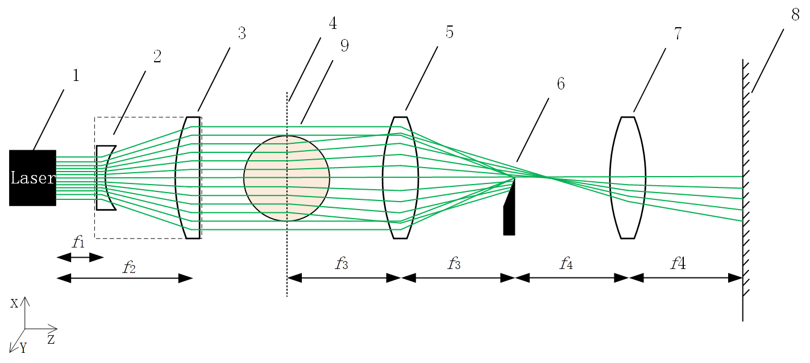

# Simple Model

> 进行纹影装置模型的公式推导。

## Set up(装置)

纹影装置，可以简化为下图所示：

图1 含被测对象的纹影装置示意图<cebnter>

> 视觉角度：俯视图；
>
> 图示：1-激光器（532nm），2-扩束透镜组1，3-扩束透镜组2，4-物平面，5-凸透镜，6-刀口（刀口实物图见附录），7-凸透镜，8-像平面，9-被测对象。

## Model(模型)

